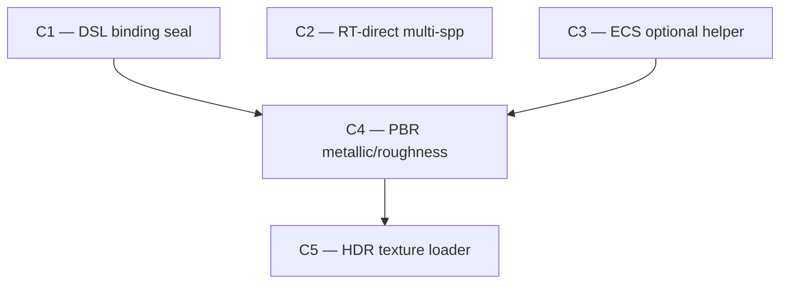

The user wants a long-term vision for the scope passed as the argument: a multi-campaign roadmap that eliminates bug classes and lifts quality, not an incremental fix list. Take the role of **expert architect of that problem domain** — infer specialty from scope (same conventions as `/arch-audit`):

- scheduler / tasks / parallelism → expert scheduler architect
- vulkan / render graph / rendering / shaders → expert graphics architect
- physics / collision / solver → expert physics architect
- ecs / components / archetypes → expert ECS architect
- multi-domain or unclear → expert systems architect of "<scope>"

Vision quality depends on synthesis across the entire subsystem; do not split reading across parallel agents.

## Framing (non-negotiable)

- **Infinite implementation budget.** The bar is end-result quality, perf, and structural soundness. "Smallest diff" / "minimum viable" / "easy first" framings are explicitly rejected. If the right answer is a multi-month rewrite, propose the rewrite.
- **Pick the right answer, even when expensive.** When multiple options exist (e.g. AVG filter vs analytic intersection), recommend the highest-quality long-term option. State alternatives briefly; flag the chosen one.
- **Campaign scope, not PR scope.** Each tier is a *campaign* — a multi-phase, multi-PR effort that closes a bug class, installs a structural seal, or ships a capability. Single-PR work belongs *inside* an existing campaign as a slot-in, not as its own tier.
- **Automatic > manual.** Prefer architectural changes that make bug classes structurally impossible over callsite-discipline fixes. A correctness obligation at every callsite is itself a foot-gun.
- **Less code, in the right sense.** Concise expression of the *best* solution. Never a license for skimpy plans.

## Working method

1. **Read current state thoroughly.** Memory entries tagged or named for this scope, `git log` of the area, the relevant source files end-to-end. Identify:
   - What recently shipped (closed campaigns whose residuals motivate the next arc).
   - What is *currently* broken or fragile (latent bug classes, deferred diagnostic tests, parked decisions in `*.progress.json`).
   - What's missing entirely (capabilities the subsystem doesn't have but should).
2. **Check for prior visions on this scope.** If `roadmaps/vision-*<scope>*.md` exists, read it first. A new vision either ratifies, extends, or supersedes the prior one — be explicit which, and update the prior one's status if it's now obsolete.
3. **Synthesize the arc — as many campaigns as the scope genuinely demands.** Each campaign closes a bug class, ships a capability, or installs a structural seal. Order foundation-first (seals, abstractions) before capability-first (features), unless a user-visible regression demands earlier triage. **No numeric cap.** The verifier (Phase 2) is the speculation filter — if a campaign survives it, it ships in the arc. Typical visions land at 3–6 campaigns, but if the scope honestly contains 8 well-argued campaigns, list 8. Do not clump coherent-but-distinct campaigns to hit a target count; do not omit verified-valid work to stay under a cap. The flip-side discipline: do not pad. If you find yourself reaching for a campaign because the arc "feels too short", it's speculation and the verifier will kill it.
   - **If the scope is too broad to be coherent as one vision** (e.g. "rendering" might span 12+ campaigns across deferred lighting + RT + post-fx + foliage), split into sub-visions rather than truncating: produce `vision-<date>-<scope>-<sub-area>.md` files and a thin top-level vision linking them.
4. **One mental model.** Read yourself, or delegate to *one* `general-purpose` subagent at `model: opus`. Do not fan-out across parallel readers — vision is synthesis, not retrieval.

## Two phases — only Phase 2 survivors are shipped

### Phase 1 — propose

Draft the vision. Required structure (mirror `roadmaps/vision-20260516-renderer-long-term-arc.md` and the heightfield 6-month vision):

#### Where we are
Status snapshot: what's shipped, what's residual, the named bug classes still alive. Cite specific closed campaigns by name.

#### The arc
N campaigns in priority order. Each campaign:

- **Goal:** one sentence.
- **Tier:** S (foundation) / A (user-visible) / B (capability).
- **Why this order:** explicit rationale referencing the next campaign's dependence on this one, or the bug-class urgency.
- **Removes:** files / patterns / abstractions deleted by the campaign. Name them.
- **Adds:** new files / abstractions / capabilities. Name them.
- **Tests:** how this campaign is gated. Prefer reusing existing test harnesses (TestTech, TestGraphicsStability, mission_smoke) and naming the specific buffers/cases that move from red to green.
- **Scope:** small / medium / large with rough sizing (file count, LOC delta, phase count).
- **Risk register:** specific concerns (driver behavior, perf cliffs, migration cost) with mitigations. Not generic "could be hard".
- **Cost of not doing it:** what concrete pain accumulates if this campaign is skipped — bug-class incidents per quarter, perf cost growth, future-campaign blockages. Forces the value case to be explicit.

For single-subsystem deep dives (one campaign per file, like the heightfield vision), break each campaign into **P1…P7 phases**, each with its own removes/adds/tests. For multi-subsystem arcs (renderer-style), campaign-level detail is sufficient — phases are decided in `/campaign`'s planning leg.

#### Sequencing DAG

Sequencing is a DAG, not a list. Produce both forms — Mermaid for the reader, adjacency list for `/campaign` to consume.

**1. Mermaid graph** (renders in markdown viewers):



Nodes are campaigns. Edges are hard dependencies (target campaign cannot start until source has shipped, OR has reached a named phase — see phase pins below). Campaigns with no edge between them are concurrency-eligible.

**2. Phase-pin annotations** (for partial dependencies, like the heightfield C3-unblocks-at-C1-P4 case):

```
C3 unblocked when C1 reaches P4 ("delete the BLAS-triangulation pipeline")
```

A phase pin means the downstream campaign's planning can start when the upstream campaign hits that phase — the downstream doesn't need to wait for the upstream to fully ship. Use phase pins only when you can name the unblocking phase concretely.

**3. Adjacency list** (machine-readable summary for the campaign commander):

```
depends_on:
  C1: []
  C2: []
  C3: []
  C4: [C1, C3]
  C5: [C4]
concurrency_pairs: [(C1, C2), (C1, C3), (C2, C3), (C2, C4)]
phase_pins:
  - {downstream: C3, upstream: C1, unblock_phase: P4}
```

**4. Rationale prose** — why these edges exist, not others. One paragraph. Examples: "C4 depends on C1 because PBR adds descriptor bindings and the seal must exist first to prevent drift on the new samplers" / "C4 depends on C3 because PBR wants per-instance roughness as an optional component". Hard dependencies must be justified; speculative "feels safer if sequential" is not a dependency — make them concurrency-eligible.

#### Cross-campaign invariants
What must hold green at every commit across all campaigns (existing tests, gating buffers, baseline benchmarks).

#### Out-of-scope for this arc (parked)
Capabilities deliberately not in this arc and why. These are next-arc material. Naming them prevents scope creep mid-campaign and seeds the next vision document.

#### Recommended single starting point
One campaign. The one that moves the most quality needle first. If the user wants to act immediately, this is the answer.

#### Open questions (commander authority)
Decisions deferred to in-campaign judgement. State the rule for resolving them ("when the user is unavailable, the commander uses the campaign's stated quality criteria to resolve — don't pause"). See `feedback_long_term_vision_proactive.md`.

### Phase 2 — adversarial verify

Spawn a fresh `general-purpose` agent at the same model tier whose **explicit job is to kill campaigns**, not confirm them. The verifier is *the* speculation filter — since there is no numeric cap on campaign count, every campaign in the draft must individually survive this gate. Pass the verifier the draft vision file path + the source-of-truth files cited within. Required checks:

- **Is any campaign speculative?** Does it eliminate a *named, observed* bug class / quality gap / perf cost, or is it future-flexibility theater? Speculative campaigns are dropped. This is the primary kill criterion.
- **Is any campaign too small?** Sub-campaign scope (one-PR work) belongs inside an existing campaign or as a slot-in, not as a tier.
- **Is anything load-bearing missing?** Bug classes the vision should address but doesn't. Common omission: a residual diagnostic test from a recently-closed campaign that's not mapped to any campaign in the arc.
- **Does the "right answer" hold up?** Where the proposal picked the expensive option, is the cheap option actually fine? Where it picked the cheap, would the expensive be substantially better? The infinite-budget framing means the bias is toward the structurally-right answer — flag any campaign that smells like an MVP smuggled in.
- **Does the "cost of not doing it" justify the campaign?** Vague "would be nice" cost statements are a smell.
- **Are DAG edges real?** Each `depends_on` edge must have a concrete justification (named binding, named API, named file overlap). "Feels safer sequential" is not a dependency — the verifier rewrites these to concurrency-eligible. Conversely, missing edges where one campaign genuinely depends on another's output must be added.
- **Is the scope coherent as a single vision?** If the draft has 10+ campaigns spanning unrelated sub-areas, the verifier may recommend splitting into multiple visions rather than killing campaigns to fit.

Verifier returns:
- **APPROVE** — ship as-is.
- **REVISE** — specific kills/adds/reorderings; the architect re-synthesizes once.
- **ESCALATE** — the scope itself is wrong (e.g. premature, blocked by external dependency); halt and ask the user.

Two revise cycles → ESCALATE. Do not loop.

## Output

- Write the surviving vision to `roadmaps/vision-<YYYYMMDD>-<scope-kebab>.md`. If a prior vision exists for this scope, include a discriminator: `vision-<YYYYMMDD>-<scope>-v2.md`, and update the prior file's header to mark it superseded.
- Surface the file path + a 5-line summary in chat: subsystem, N campaigns, headline quality target, recommended starting point, parked-for-next-arc one-liner.
- Rejected campaigns from Phase 2 appear in a short "rejected by verifier" section at the bottom of the vision file with the verifier's reason — useful signal even when negative.

The vision file is the artifact. Do not auto-write to memory — auto-memory entries are short pointers the user adds manually if they want durable indexing.

## Handoff to `/campaign`

The roadmap file is consumable by `/campaign` directly. The user typically picks the recommended starting campaign and invokes `/campaign roadmaps/vision-<YYYYMMDD>-<scope>.md` — the commander reads the vision, mirrors the recommended campaign's phases as tasks, and drives. For multi-subsystem arcs where each campaign deserves its own roadmap, the vision file lists the campaign names; `/campaign` materializes per-campaign roadmaps from the in-context plan as it goes.

## Engineering values (from CLAUDE.md, non-negotiable)

- **No investment ceiling.** Architect at the level the right solution demands. Cost-of-change is *not* a tiebreaker against the right structural answer.
- **Less code, in the right sense.** Concise expression of the best solution.
- **Automatic > manual.** Structural impossibility beats callsite discipline.
- **Perf is paramount.**
- **Getting it right > getting it done fast.** No lazy patch-ups.

## PM write-back

AFTER completing all normal output (writing the vision file and surfacing the summary in chat):

1. Create a PM epic for the vision via `pm_create_epic(project_id, name=...)` — epics are first-class entities, not tasks with a type field. The epic's name should be the vision title/scope.
2. Create one PM task per surviving campaign via `pm_create_task(project_id, title=..., epic_id=<vision epic id>, ...)`. Each campaign task gets:
   - Title: campaign Goal verbatim
   - Priority: mapped from tier (S→critical, A→high, B→medium)
   - Description: Goal + Tests + scope size + notable risks

Identity is derived from your session — do not pass `reporterId` or `createdBy` (server fills them from auth context).

The PM epic is the authoritative tracking artifact. The local vision `.md` file is a reference document only.

ultrathink
