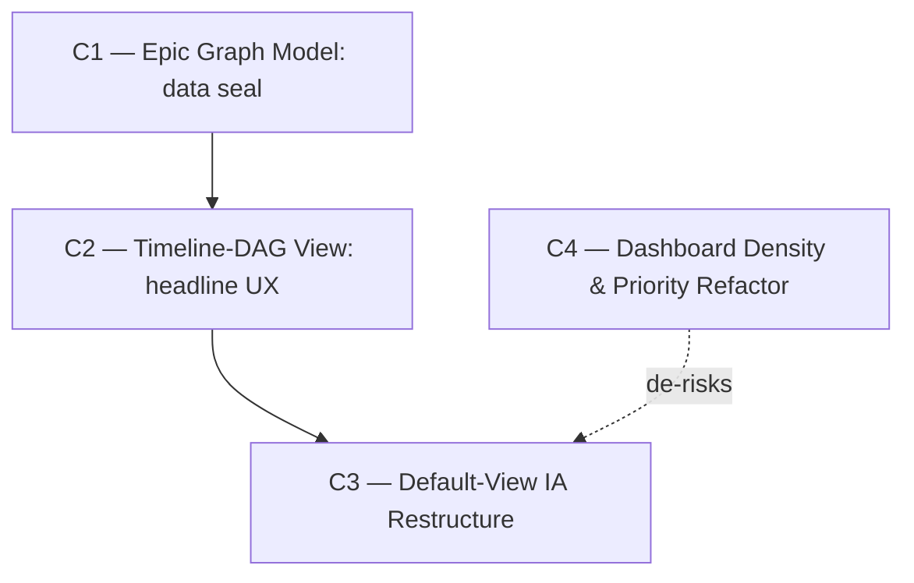

# Vision — Epic-Centric Timeline/DAG Visualization

**Date:** 2026-06-02
**Scope:** Replace task-level board views as the default project surface with an epic-centric, time-anchored dependency graph. Foreground active work, recede stale epics, make epic dependencies legible, kill the "two infinite lists" failure mode.
**Architect role:** Information-architecture / data-visualization systems architect.
**Status:** ACTIVE (Phase-2 verified).

---

## Where we are

The project-management web app today exposes work through **task-level surfaces** that do not scale with project age:

- **The default project landing is the Dashboard** (`router.tsx` → `projectIndexRoute` → `DashboardPage`). It shows aggregate counters (total tasks, done, epic _count_, proposal count), a "Tasks by Status" stacked bar, recent activity, my-tasks, active AI agents, proposal pipeline, attention-needed. It never renders the **epics themselves** — only a number. There is no place in the product that shows _what the epics are, how far along each is, and how they depend on each other._
- **The Board** (`/board`, `board-page.tsx`) is the user's working surface and the named pain point: five status columns (`backlog / ready / in_progress / in_review / done`) populated with **every task in the project** (capped at `perPage: 100`). Over a project's life this degrades into the described failure mode — `backlog` and `done` become unbounded enumerations of every task that has ever existed. The optional "Group by Epic" swimlane mode helps but still enumerates tasks and still has no time or dependency structure.
- **The Epic list** (`/epics`, `epic-list-page.tsx`) is the closest existing thing to what we want: a flat card grid where each card already shows a **completion progress bar + `{done}/{total}` + `%`** (server-provided). But it is _flat_ — no time ordering, no recency recede, no dependency edges, no notion of which epics are active vs. ancient history.

### What the data model already gives us (verified)

- **Per-epic completion is already computed server-side.** `epic.service.ts:getTaskSummary()` returns `{ total, done, byStatus }` for every epic; the web `Epic` type carries `taskSummary`. The completion-visualization _data_ is a solved problem — we are not inventing it, we are relocating it onto graph nodes.
- **Epics carry time anchors:** `created_at`, `updated_at`, nullable `target_date`, plus `milestone_id`. Milestones carry their own `target_date`. Nothing in the product positions epics on a time axis.
- **Epic status semantics exist:** `EPIC_STATUSES = draft | active | completed | cancelled`; `priority`; `assignee_id` (claim holder).

### The load-bearing gap

- **There is no epic→epic dependency.** Dependencies exist _only_ at task granularity (`task-dependency.ts` / `task_dependencies`: `task_id → depends_on_task_id`, `dependency_type ∈ {blocks, relates_to}`). Tasks carry `epic_id`. So the user's "dependency edges between epics" has **no backing data** today. It can be _derived_ (roll up cross-epic task `blocks` deps to epic granularity) — but a **planning-time** epic dependency expressed before any task exists (the whole point of a roadmap view) has nowhere to live. Closing this is the foundation the entire vision stands on.

### Named problems this arc kills

1. **Unbounded enumeration** — `backlog`/`done` columns that grow without limit and bury active work. (Board, today.)
2. **No project-altitude view** — nowhere shows the epics as a portfolio with progress and structure; the human has to reconstruct "where is this project" by scanning task columns.
3. **Invisible dependencies** — epic-level sequencing exists only in humans' heads; nothing renders "Epic B is blocked until Epic A ships."
4. **No recency model** — completed/ancient epics have the same visual weight as this week's active work.

---

## The arc

Four campaigns. Foundation-first: a data seal (epic graph model) → the headline view (timeline-DAG) → the information-architecture restructure that makes it the default and demotes raw task surfaces → a dashboard density/priority refactor that ships immediate relief in parallel. The arc is deliberately tight — see _Out-of-scope (parked)_ for the speculative work the verifier and I removed rather than pad the count.

> **Design north-star (user-set, 2026-06-02):** _"The DAG view is the single most important information on the dashboard; everything else is extra dressing."_ The default project surface centers the epic-DAG as the **hero** element. Action signals (attention-needed) and personal work (my-tasks) are a **thin secondary rail** that collapses to nothing when empty — never equal-weight widgets competing with the hero. C3 realizes this end-state once the timeline exists; C4 builds the collapse-aware, action-first widgets that slot around it (and delivers them to today's dashboard immediately).

---

### C1 — Epic Graph Model (the data seal)

- **Goal:** Make epic→epic dependencies and per-epic roadmap state a first-class, queryable contract — derived automatically from the task graph where possible, authorable explicitly for planning-time intent, served as one `epic-graph` payload.
- **Tier:** S (foundation).
- **Why this order:** C2 (the view) renders exactly what this endpoint returns; nothing downstream can exist without it. "Automatic > manual": deriving edges from existing task `blocks` deps means humans don't hand-maintain the edges the task graph already implies — they only author the ones the task graph can't yet know (planning-time, pre-task).
- **Removes:** nothing (purely additive — no regression risk to existing surfaces).
- **Adds:**
  - `epic_dependencies` table (migration): `{ id, project_id, epic_id, depends_on_epic_id, dependency_type ∈ {blocks, relates_to}, created_at, created_by }` — for **explicit** planning-time edges.
  - `epic-graph.service.ts`: a **derivation** query that rolls cross-epic task `blocks` dependencies up to epic granularity (epic A blocks epic B iff ∃ task∈B that `blocks`-depends on a task∈A), unioned with explicit edges, each edge tagged with **provenance** (`derived | explicit`).
  - **Node enrichment** on the same payload: `completion` (reuse `taskSummary`), `health` (`not_started | on_track | at_risk | blocked | done`, where _at_risk_ = `target_date` passed AND incomplete, _blocked_ = has an incomplete `blocks` prerequisite), `activity_recency` (`max(task.updated_at)` for the epic, falling back to `epic.updated_at`), and a `time_window` (`start = created_at`/first-started, `end = target_date`/null).
  - **Cycle detection** (Kahn's) over `blocks` edges; cycles surfaced as a flag on the payload (never silently dropped) so the view can warn.
  - Shared Zod schema `selectEpicDependencySchema` + `epicGraphSchema` (canonical Zod-3 in `@pm/shared` + route-local mirror, per the established split); `GET /api/v1/projects/{id}/epic-graph`.
  - MCP worker tool `pm_link_epic_dependency` / `pm_unlink_epic_dependency` (AI agents plan epic sequencing) — additive, mirrors the task-dependency tools.
- **Tests:** server unit tests for the roll-up (multi-task cross-epic cases → single epic edge, dedup), provenance union (derived+explicit on the same pair collapses with explicit winning), cycle detection (A→B→A flagged), health derivation truth table (at_risk/blocked/done), recency fallback. Reuse the in-memory SQLite harness. Schema round-trip tests in `@pm/shared`.
- **Scope:** Medium. ~6–9 files (migration, schema, service, route, MCP tool, tests). LOC ~600–900. 4 phases.
  - **P1** — `epic_dependencies` table + migration + `@pm/shared` schemas (contract definition).
  - **P2** — `GET epic-graph` endpoint returning nodes+edges (derived only) + route-local Zod mirror. _(Contract is stable at end of P2 — C2 unblocks here.)_
  - **P3** — explicit edges (table-backed) unioned with provenance + cycle detection + MCP tools.
  - **P4** — node enrichment (health, recency, time_window) + full test suite.
- **Risk register:**
  - _Derived edges are noisy / wrong-grained_ — a single stray cross-epic task dep could imply a misleading epic edge. **Mitigation:** only `blocks` (not `relates_to`) produces epic edges; expose provenance so the view can visually distinguish derived (dashed) from explicit (solid) and let the user suppress derived edges.
  - _Derivation cost on large task graphs_ — roll-up is a join over `task_dependencies × tasks`. **Mitigation:** it's a per-project bounded set; index `task_dependencies(depends_on_task_id)` and `tasks(epic_id)`; the endpoint is read-mostly and cacheable. Measure on game_one's real graph before optimizing.
  - _Explicit + derived divergence_ (human says A→B, tasks say B→A) — **Mitigation:** surface both with provenance; a contradiction that forms a cycle is flagged, not hidden.
- **Cost of not doing it:** The dependency-edge half of the user's request is **impossible** without it — there is no epic-edge data. Skipping it caps the vision at a flat completion grid (which already exists). Every quarter the project ages, the absence of a planning-time epic-sequencing model forces humans to track epic order out-of-band (in their heads / external docs), which is exactly the legibility failure this arc exists to kill.

---

### C2 — The Timeline-DAG View (the headline UX)

- **Goal:** A time-anchored, dependency-aware epic graph: epics positioned on a horizontal time axis (active work near "today," ancient work receding and faded), each node visualizing completion + health, dependency edges drawn as arrows, with pan/zoom and click-to-drill into the epic.
- **Tier:** A (user-visible — this is the artifact the user asked for).
- **Why this order:** Consumes C1's `epic-graph` contract. It is the centerpiece; C3 (making it the default) is meaningless until it exists.
- **Removes:** nothing yet (new route `/projects/{id}/roadmap`). The board/list stay untouched until C3 deliberately re-scopes them.
- **Adds:**
  - `epic-timeline-page.tsx` (new route `/roadmap`).
  - `lib/epic-graph-layout.ts` — a **deterministic hybrid layout**: x-position from `time_window` (NOW pinned near the right edge; future `target_date`s extend right; past epics recede left and collapse into a faded "Past" rail once older than the active window); y-position from a dependency-respecting lane assignment (a prerequisite never sits to the right of its dependent). Pure function, unit-testable.
  - **Rendering on ReactFlow (`@xyflow/react`)** — the right long-term answer for interactive node-graphs (pan/zoom/edge routing/viewport control) — with node positions computed by _our_ layout module (ReactFlow does not impose a layout when positions are supplied). Custom node component: the node body **fills left→right with completion**, colored by `health`; shows `{done}/{total}` + `%`; a thin `byStatus`-segmented underline for detail on hover. Custom edge: arrows prerequisite→dependent, **dashed for derived / solid for explicit**, the hovered/selected epic's full dependency chain highlighted and the rest dimmed.
  - A **"focus active" default viewport** that opens centered on in-flight + upcoming epics, with completed-and-old collapsed behind an expandable "+N older epics" affordance.
  - **Milestone guides:** vertical lines on the time axis at each milestone `target_date` (data already exists, currently unused in any roadmap context).
- **Tests:** layout unit tests (deterministic node positions; no overlap; prerequisite-left-of-dependent invariant; past-rail collapse threshold). Component tests (node renders completion fill + ratio; derived vs explicit edge styling; chain highlight on select). E2E (`epic-timeline.spec`): roadmap route renders nodes, edges visible, clicking a node drills to epic detail, "show older" expands the past rail.
- **Scope:** Large. ~5–8 new files + 1 dependency (`@xyflow/react`). LOC ~900–1400. 6 phases.
  - **P1** — route scaffold + fetch the `epic-graph` payload + render bare nodes at naive positions (vertical list) to prove the data path.
  - **P2** — `epic-graph-layout.ts` time-x + dependency-lane-y, unit-tested in isolation.
  - **P3** — ReactFlow integration: custom node (completion fill, health color, ratio), pan/zoom, click-to-drill.
  - **P4** — edges: derived/explicit styling, arrowheads, chain highlight/dim on hover/select.
  - **P5** — recency recede + "Past" rail collapse + "focus active" default viewport.
  - **P6** — milestone vertical guides + empty/loading/cycle-warning states + E2E.
- **Risk register:**
  - _Time-axis + DAG-layering conflict_ — a strict topological layering can fight a strict time axis (a prerequisite authored with a _later_ `target_date` than its dependent). **Mitigation:** time wins on x; dependency order is expressed by **lane (y) + edge direction**, not by overriding x. When an edge points "backwards" in time (data contradiction) it's rendered curved + flagged — making the contradiction visible is a feature.
  - _Layout determinism / jitter_ — node positions must be stable across refetches or the view "jumps." **Mitigation:** layout is a pure function of `(epic id, time_window, dependency rank)`; ties broken by stable sort on id. No randomness.
  - _ReactFlow as a dependency_ — adds bundle weight + an API surface. **Mitigation:** it is the established best-in-class for this exact problem; we use it for rendering/interaction only, owning layout ourselves, so it's replaceable. Evaluated against hand-rolled SVG (rejected: pan/zoom/edge-routing is months of reinvention) and dagre/elk-as-renderer (rejected: they own layout, which fights our time axis).
- **Cost of not doing it:** This _is_ the deliverable. Without it the user keeps reconstructing project state by scrolling unbounded task columns — the daily friction that motivated the request.

---

### C3 — Default-View Information-Architecture Restructure (demote tasks, promote the roadmap)

- **Goal:** Make the epic timeline the default project surface — **the DAG as the hero element**, with action signals and personal work as a thin collapsible rail (per the north-star) — and restructure navigation so individual tasks are a **drill-down**, never a default enumeration, structurally eliminating the "two infinite lists."
- **Tier:** A (user-visible; this is the second explicit thrust of the request — "don't want to see tasks by default in any view").
- **Why this order:** Promoting a view that doesn't exist is impossible, so it follows C2. The board-re-scope portions can begin earlier (phase pin below) since they don't depend on the timeline rendering.
- **Removes:**
  - The **project-wide, unbounded Board as a default working surface.** `board-page.tsx` is re-scoped: the board is reachable **only by drilling into an epic** (`/epics/{id}/board` or a tab on epic detail), so its columns are bounded-by-construction to one epic's tasks. The project-wide all-tasks board route is retired (or kept behind an explicit "all tasks" power-user affordance, defaulted closed).
  - The task-list's "everything, unfiltered" default — it defaults to excluding `done`/`cancelled` and is reached as a drill-down, not a primary nav item.
- **Adds:**
  - Default project route change: `projectIndexRoute` renders (or redirects to) the roadmap timeline instead of the counter dashboard. The dashboard's still-valuable widgets (attention-needed, my-tasks, active AI agents) are kept as a secondary "pulse" panel or folded beside the roadmap.
  - Epic-scoped board/task views (the drill-down target).
  - Navigation/sidebar restructure: "Roadmap" becomes the primary project entry; "Board"/"Tasks" demoted to within-epic or power-user.
- **Tests:** routing tests (default project route → roadmap; epic drill → epic-scoped board with only that epic's tasks). E2E updated: the setup/board/task flows re-pointed; a new assertion that the project landing shows the roadmap and that no view enumerates the full task set by default.
- **Scope:** Medium. ~4–7 files (router, sidebar, board-page re-scope, dashboard fold, tests). LOC ~400–700. 4 phases.
  - **P1** — introduce epic-scoped board/task drill-down routes (additive; board logic reused, filter pinned to one epic).
  - **P2** — flip the default project route to the roadmap; relocate the dashboard "pulse" widgets.
  - **P3** — retire/gate the project-wide unbounded board; re-point navigation + sidebar.
  - **P4** — update E2E + routing tests; verify no default surface enumerates all tasks.
- **Risk register:**
  - _Muscle-memory disruption_ — existing users (the 1–3 humans + agents) rely on the board as home. **Mitigation:** keep the board fully reachable (one click, epic-scoped); ship behind nothing destructive — re-scope, don't delete; the AI-agent task workflows are unaffected (agents use MCP, not the web board).
  - _Dashboard widget loss_ — attention-needed/blocked-task signals are genuinely useful and must not be lost in the flip. **Mitigation:** explicitly relocate them, don't drop them; P2 is "relocate," not "remove."
- **Cost of not doing it:** C1+C2 ship a beautiful roadmap that nobody lands on by default, while the board keeps degrading into infinite lists. The root complaint ("the board default view is useless… two lists of infinite length") is _only_ closed by this campaign — C1/C2 add the good thing; C3 removes the bad default.

---

### C4 — Dashboard Density & Priority Refactor (the immediate-relief slice)

- **Goal:** Reorganize today's default dashboard around **action-first priority, collapse-to-nothing empty sections, and intrinsic-height flow** — and establish the "DAG-as-hero, everything-else-is-dressing" hierarchy that C3 completes once the timeline exists.
- **Tier:** A (user-visible; directly fixes named, daily friction).
- **Why this order:** It refactors the dashboard that **exists today**, so it depends on nothing — **concurrency-eligible with C1** and shippable for immediate relief before C2/C3 land. It also **de-risks C3**: it produces the compact, collapse-aware widget components (attention rail, my-work, agents, pipeline) that C3 relocates _around_ the DAG hero, so C3 inherits ready-made parts.
- **Removes:** the forced equal-height widget pairs (`grid lg:grid-cols-2` stretching `ActiveAIAgentsSection`/`ProposalPipelineSection` to the taller, wasting space under the shorter); the always-rendered half-width `MyTasksSection` card (empty most of the time for a 1–3 person team); `AttentionSection`'s full-width **bottom** placement (highest-signal widget, first to scroll out of view).
- **Adds:**
  - Action-first ordering: `AttentionSection` lifted to the **top**, compact, collapsing to a slim one-line "all clear" notice (not a full card) when nothing needs attention.
  - **Collapse-when-empty** for every secondary section (`MyTasksSection` renders **null** when there's no work — reserving zero space).
  - **Masonry/intrinsic-height flow** (CSS multi-column) for the secondary "dressing" widgets so short or collapsed widgets leave no dead space and uneven heights reflow naturally.
  - A reserved **hero slot** at the top of the surface for the compact epic-DAG preview — populated once C2 ships; until then it holds the epic-progress summary (this is the seam where C4 hands off to C3).
- **Tests:** component tests (empty `MyTasksSection` → not rendered; `AttentionSection` all-clear → slim line, not card; secondary widgets don't force equal height). E2E assertion that an empty section reserves no vertical space and that attention sits above activity.
- **Scope:** Small. ~2–4 files (`dashboard-page.tsx` + extracted widget components + tests). LOC ~250–450. 3 phases.
  - **P1** — reorder action-first (attention to top) + collapse-empty (`MyTasks` → null, `Attention` all-clear → slim line). _(Ships immediately — this is the quick win.)_
  - **P2** — masonry/intrinsic-height flow for secondary widgets; extract them as standalone collapse-aware components C3 can reuse verbatim.
  - **P3** — reserve the hero slot (epic-progress summary placeholder) + tests; document the C2→hero handoff.
- **Risk register:**
  - _Polishing soon-to-be-replaced work_ — C3 rebuilds this surface around the DAG hero, so over-investing in the transitional grid is waste. **Mitigation:** keep the refactor to **behavior** that survives into the hero layout (collapse-empty, action-first order, intrinsic height) and **extract widgets as standalone components** C3 reuses; do not gold-plate the grid geometry.
  - _Masonry reading-order oddness_ — CSS multi-column flows top-to-bottom then wraps, which can scramble visual priority. **Mitigation:** keep the high-signal attention rail **outside** the masonry (above it); masonry holds only co-equal "dressing" widgets where order doesn't carry meaning.
- **Cost of not doing it:** Every day until C2/C3 land, the dashboard wastes ~half its estate on an empty My-Tasks card and dead column space, and buries the one action-oriented widget at the bottom — months of daily friction for a one-week fix that also de-risks C3.

---

## Sequencing DAG



**Phase pins (partial dependencies):**

```
C2 unblocked when C1 reaches P2 ("GET epic-graph endpoint, derived nodes+edges — contract stable")
C3's board-rescope (P1) unblocked when C2 reaches P1 ("roadmap route exists"); C3's default-flip (P2) needs C2 fully shipped
C4 has no upstream — runs in parallel from day one; its extracted collapse-aware widgets feed C3 (soft enabler, not a hard block)
```

**Adjacency list (machine-readable):**

```
depends_on:
  C1: []
  C2: [C1]
  C3: [C2]
  C4: []
concurrency_pairs: [(C1, C4), (C2, C4)]
soft_enables: [{from: C4, to: C3, note: "C4's extracted collapse-aware widgets are reused by C3's hero-rail; not a hard dependency"}]
phase_pins:
  - {downstream: C2, upstream: C1, unblock_phase: P2}
  - {downstream: C3, upstream: C2, unblock_phase: P1, note: "C3.P1 board-rescope only; C3.P2 default-flip needs C2 shipped"}
```

**Rationale.** C1→C2→C3 is intentionally linear because each consumes the prior's primary artifact: C2 renders the `epic-graph` payload C1 defines (the dependency is the contract itself), and C3 promotes the view C2 builds. The two phase pins reclaim the obvious parallelism: C2's frontend can build against C1's _contract_ (stable at C1.P2) while C1 finishes derivation internals; C3's board-re-scope is independent of timeline _rendering_ and can start once C2's route shell exists. **C4 is genuinely independent** — it refactors the dashboard that exists today, depends on nothing, and runs concurrently with C1/C2 from day one to deliver immediate relief; its only relationship to the arc is a _soft enable_ of C3 (the collapse-aware widgets it extracts are what C3's hero-rail reuses). Inventing a hard C4→C3 edge would be false — C3 could rebuild those widgets itself; C4 just means it won't have to.

---

## Cross-campaign invariants

Hold green at every commit across all three campaigns:

- **Existing task/epic/board surfaces never regress until C3 deliberately re-scopes them.** C1 and C2 are purely additive; the board and task list keep working exactly as today through C1+C2.
- **`pnpm test` + `pnpm typecheck` + `pnpm lint` green.** The `@pm/shared` canonical-Zod-3 / route-local-Zod-4 split is preserved for every new schema.
- **Per-epic `taskSummary` remains the single completion source** — the graph node reuses it; we do not fork a second completion calculation.
- **No destructive deletes** — C3 re-scopes/retires-behind-a-gate; it does not delete the board or task data.
- **AI-agent MCP workflows are untouched** by the web IA change (agents drive via MCP tools, not the web board).

---

## Out-of-scope for this arc (parked — next-arc material)

Deliberately excluded to keep the arc honest and unpadded:

- **Velocity-based forecasting** — projecting epic completion _dates_ from task throughput. Genuinely useful for a roadmap, but no velocity model exists and for a 1–3-person tool the signal is noisy; speculative until there's demand. Park.
- **Virtualized rendering for hundreds-of-epics scale** — premature for the current client base (game_one is the only live client; epic counts are modest). C2's "Past rail collapse" handles legibility at realistic scale. Revisit only when a project measurably exceeds a few hundred epics. Park.
- **Multi-project portfolio timeline** — a cross-project roadmap. A different altitude; out of this arc's single-project scope. Park.
- **Drag-to-reschedule / drag-to-link on the timeline** — editing epic `target_date` or authoring dependencies by dragging on the graph. A natural follow-on once the read view proves out; deferred to avoid coupling the visualization campaign to a mutation-UX campaign. Park.
- **`relates_to` epic edges in the graph** — C1 stores them but C2 only renders `blocks` (the sequencing signal). Rendering soft "related" edges is a later legibility tuning. Park.

---

## Recommended single starting point

**C1 — Epic Graph Model** _(for the arc)_. It is the foundation the entire vision stands on: the dependency-edge half of the request is _impossible_ without epic-edge data, and C2 cannot render a contract that doesn't exist. It is also self-contained server work (no UI risk), fully testable against the in-memory SQLite harness, and ships value immediately to AI agents (planning-time epic sequencing via the new MCP tools) even before the view lands. Invoke: `/campaign roadmaps/vision-20260602-epic-timeline-visualization.md`.

**Run C4 in parallel for relief now.** C4 depends on nothing and fixes daily friction this week — its P1 (attention-to-top + collapse-when-empty) is small enough to ship as a direct change while C1 builds. Start both at once; they never touch the same files.

---

## Open questions (commander authority)

Decisions deferred to in-campaign judgement. When the user is unavailable, the commander resolves using the campaign's stated quality criteria — don't pause:

- **Derived-edge default visibility** (C2): show derived edges by default (dashed) or hide them behind a toggle? _Resolution rule:_ default to **showing** dashed derived edges — legibility is the whole point; let the user suppress, don't make them opt in.
- **Dashboard fate** (C3): fold the counter-dashboard's widgets beside the roadmap, or keep a separate dashboard tab? _Resolution rule:_ preserve every attention/blocked/my-work signal; choose whichever placement keeps the roadmap as the first thing seen without losing those signals.
- **Time-axis origin** (C2): "today" pinned at right edge vs. center? _Resolution rule:_ pick the option that maximizes visible active+upcoming epics on first paint for a typical project; prototype both in P5 and keep the one that recedes the past most cleanly.
- **Project-wide board: retire vs. gate** (C3): fully retire the unbounded board or keep it behind an explicit "all tasks (power user)" affordance? _Resolution rule:_ gate, don't delete — non-destructive, and reversible if a user needs it.

---

## Phase-2 adversarial verification

**Verdict: APPROVE — ship as-is.** A fresh adversarial verifier (opus, mandate: kill campaigns) read the draft against all nine cited source files and confirmed:

- All four factual claims hold against source: (a) `getTaskSummary` → `{total,done,byStatus}` is computed server-side and already consumed by `EpicCard`; (b) epic→epic dependencies do not exist — `task-dependency.ts` is the only dependency schema, `epic.ts` has none; (c) the default project route is `DashboardPage`, not the Board (vision is _more correct than the user's framing_); (d) epic `target_date`/`created_at`/`updated_at` + milestone `target_date` time anchors all exist.
- **No campaign killed.** C1 survives the sharpest knife (the dual derived+explicit edge model is _not_ gold-plating — derive-only cannot express planning-time sequencing before tasks exist; explicit-only discards the free task-graph signal). C2's ReactFlow dependency is justified (layout stays owned/pure/testable; ReactFlow used for render/interaction only). C3's board re-scope is non-destructive and closes the root complaint. The `perPage: 100` unbounded board with full `backlog`+`done` columns was confirmed as the real failure mode.
- **DAG honest:** strict C1→C2→C3 is real (each consumes the prior's primary artifact); the two phase pins correctly reclaim the genuine parallelism; "no concurrency pairs" verified (inventing C1‖C3 would be false).
- **No load-bearing omission:** all five elements of the request map to a campaign; the parked list is correctly deferred, not padding.

**Two commander refinements folded in (not kills):**

1. **C3 dashboard relocation is widget-by-widget, not one payload.** The dashboard's "pulse" widgets (attention-needed, my-tasks, active-AI-agents) are backed by _separate_ hooks (`useTasks`, `useProposals`), not a single dashboard payload — the C3.P2 relocation touches three widgets independently. The 4-phase budget absorbs it; just don't model it as "move one component."
2. **C1 MCP tool naming** — `pm_link_epic_dependency` / `pm_unlink_epic_dependency` should mirror the shape of the established task-dependency tools (`pm_block_task`, `pm_link_git_ref`) for consistency. Confirm the exact verb in-campaign.

**Post-verification addition (2026-06-02):** **C4 — Dashboard Density & Priority Refactor** was added by the user _after_ the Phase-2 gate, in response to observing the live dashboard (empty My-Tasks reserving half the row; equal-height widget pairs wasting vertical space; attention-needed buried at the bottom). It did not pass the original adversarial verifier, but it is low-risk by construction: it eliminates _named, observed_ friction (not speculation), depends on nothing, and is non-destructive (behavior-only refactor of an existing surface). The same user interaction set the **DAG-as-hero north-star** now baked into C3 and C4. No re-run of the full vision gate was warranted for one small, independent, observation-driven slot-in.

## Rejected by verifier

None — the verifier killed no campaigns. The speculation that _would_ have been campaigns (velocity forecasting, virtualization-for-scale, multi-project portfolio, drag-to-edit, `relates_to` rendering) was pre-parked in _Out-of-scope_ and the verifier confirmed each is correctly next-arc rather than padding.
