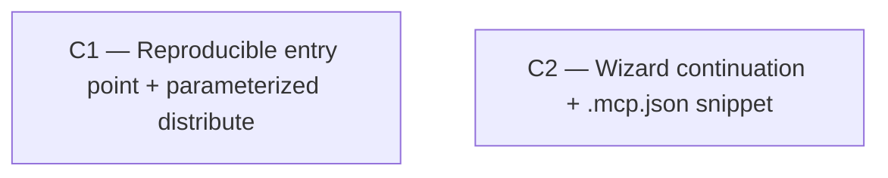

# Vision — Setup & Distribution UX (2026-06-02)

**Scope:** how a new operator/team stands up the PM system from a clone and connects their AI
agents + client repos. **Horizon:** the next 2 campaigns (this is a small, coherent arc, not a
6-month subsystem rewrite). **Method:** vision skill (propose → adversarial verify); the survivors
below passed the Phase-2 kill gate.

## Where we are

The product runs, but onboarding is tribal knowledge gated behind one person's machine:

- **Install** lives only in `CLAUDE.md` (Quick Start) — AI-agent-oriented, dense. **No root
  `README.md`, no `docs/SETUP.md`** (confirmed absent).
- **First-run** is a real web wizard (`packages/web/src/pages/setup-page.tsx`) — but it **stops at
  creating the admin account** (~205 lines, one step). No "create your first project," no "connect
  your agents."
- **Agent/MCP connection** is undocumented hand-assembly: the operator must know to go to
  `settings/users` (the pool/token UI *does* exist — see below), copy a secret, and hand-write a
  `.mcp.json` from the dense `CLAUDE.md` "MCP Server Setup" section. There is **no `.mcp.json`
  generator**.
- **Distribute to a client** is **only `distribute.bat`** — gitignored, **not in the repo**,
  hardcoded to `D:\code\game_one\...`, and `.bat`-only (a non-Windows operator cannot deploy). Not
  reproducible from a clone.
- **The integrator** is well covered by `docs/integrator-deployment.md` (§3 install, §12 30-min
  checklist) + `packages/integrator-ref/README.md`. This arc **links to** that, never duplicates it.
- **One live client** (game_one). This single-client reality is the dominant constraint — it kills
  speculative "scale to many clients" work (see Rejected, below).

**Named gaps this arc closes:** (1) no reproducible, cross-platform entry point (README/SETUP
missing; deploy is a local Windows-only gitignored script); (2) no in-product path from "admin
created" to "an agent is connected" (the pieces exist but aren't wired into a journey or a
copy-paste config).

## The arc

Two campaigns. They are **concurrency-eligible** — run together or C1 first.

### C1 — Reproducible setup entry point + parameterized distribute

- **Goal:** A clone-to-running operator can stand up the PM and deploy to a client from any OS,
  following committed docs and one parameterized script.
- **Tier:** S (foundation — every other onboarding surface links into `SETUP.md`).
- **Why this order:** `SETUP.md` is the artifact C2's wizard and the integrator guide both point at;
  the parameterized `distribute.mjs` is what makes the deploy reproducible off origin. Nothing
  blocks it; it helps everything.
- **Removes:** `distribute.bat` as the *sole/local/Windows-only* mechanism (it survives as a thin
  local wrapper or is replaced by config).
- **Adds:**
  - `README.md` (root) — human getting-started: what this is, install, run, where to go next.
  - `docs/SETUP.md` — the full journey (install server → first-run admin → create project →
    **connect agents** → **optional integrator**, the last linking to `integrator-deployment.md`
    §3/§12, not duplicating it).
  - `scripts/distribute.mjs` — cross-platform (the bundle scripts are already `.mjs`), parameterized
    by a gitignored `distribute.config.json` (`{ targets: [{ name, mcpDest, integratorDest, docsDest,
    workerDocDest }] }`) + a committed `distribute.config.example.json`.
- **Tests:** a smoke test that `node scripts/distribute.mjs --config <tmp>` bundles + copies into a
  temp target dir (assert the 4 artifacts land); a fresh-clone dry-run of `SETUP.md`'s commands
  (manually or a CI lint that the referenced scripts/paths exist).
- **Scope:** small-medium (~3 new files + a script; README/SETUP are PR-sized but share one journey,
  so they stay inside this campaign — not their own tiers).
- **Risk register:** the "vendored bundle into the client repo" model is one opinion — keep it
  (it gives byte-exact control), but `SETUP.md` should name the `npx` alternative as a future option
  so the doc doesn't pretend vendoring is the only way. Mitigation: a one-paragraph "distribution
  models" note.
- **Cost of not doing it:** high — onboarding a second client or teammate means reverse-engineering
  `CLAUDE.md` + editing a gitignored `.bat` with hardcoded paths on Windows only. The deploy is not
  reproducible from origin today.

### C2 — Wizard continuation + `.mcp.json` snippet (reuse the existing pool/token UI)

- **Goal:** A first-run admin is walked from "account created" to "an agent is connected," ending
  with a copy-paste `.mcp.json` — no hand-assembly from docs.
- **Tier:** A (user-visible onboarding).
- **Why this order:** independent of C1's code; only a documentation cross-link couples them
  (`SETUP.md` references the wizard's connect step). Smaller than it looks — see Removes.
- **Removes:** the "MCP config is tribal knowledge" gap — the error-prone manual assembly of
  `PM_API_URL` + `PM_POOL_NAME`/`PM_POOL_SECRET` (or `PM_API_TOKEN`).
- **Adds:**
  - Post-admin **wizard steps** in `setup-page.tsx`: "create your first project" → "connect your
    agents" hand-off.
  - A **`.mcp.json` snippet renderer** (a small component) that assembles the connection config from
    a chosen pool/token and offers copy-to-clipboard. **Reuses** the existing
    `settings/users-page.tsx` + `hooks/use-agent-pool.ts` machinery (pool create, secret rotate,
    `useCreatePoolAgents`, token `TokenDialog`) — this campaign does **not** rebuild that UI.
- **Tests:** web tests for the new wizard steps (admin → project → connect) and the snippet renderer
  (selecting a pool/token produces the correct `.mcp.json` text; copy works), matching the existing
  `*.test.tsx` mock-the-hooks pattern.
- **Scope:** small-medium (the heavy CRUD already exists; the deltas are wizard steps + one snippet
  component).
- **Risk register:** the wizard can *show* config + instructions but cannot run the client-side
  bundle copy (that's `distribute.mjs`/`distribute.bat`) — be explicit in the UI copy that this step
  produces config, then point at `SETUP.md` for the deploy. Security: minting/showing secrets in-UI
  is the **established** pattern here (`TokenDialog`, "shown once") — no new surface, but `SETUP.md`
  should state tokens are LAN-trust, not internet-grade.
- **Cost of not doing it:** medium — the manual path works but is undocumented; the snippet removes
  the most error-prone hand-assembly step in onboarding.

## Sequencing DAG



No hard edges. C1 and C2 are **concurrency-eligible**: C1 touches root docs + `scripts/`; C2 touches
`setup-page.tsx` + a new component. Their only coupling is a doc cross-link (SETUP.md ↔ the wizard
connect step), reconciled at the end.

```
depends_on:
  C1: []
  C2: []
concurrency_pairs: [(C1, C2)]
phase_pins: []
```

**Rationale:** the draft's implied serial chain was wrong. C2's apparent dependence on C1 is purely
documentation cross-linking, not code — so they run in parallel. There are no other real edges; the
campaigns that *would* have introduced edges (C3/C4) were parked/killed.

## Cross-campaign invariants

- `pnpm typecheck` / `pnpm lint` / `pnpm test` stay green at every commit (the bar just established
  this session).
- `distribute.bat` behavior for game_one is preserved (C1's `distribute.mjs` must reproduce the
  current 4-artifact copy; the existing local `.bat` keeps working until the operator migrates to
  the config).
- The resolver and the rest of the train are untouched — this is onboarding/DX only.

## Out-of-scope for this arc (parked / killed)

- **C3 — `pm init` scaffolding CLI — PARKED.** Speculative for one client and largely redundant
  with C2's wizard (which produces the `.mcp.json`) + C1's `distribute.mjs` (which places the
  integrator bundle + can drop a run script). Real trigger to revisit: a **second** client where
  copy-paste-from-wizard proves too manual. No code today justifies a third config-generation
  surface.
- **C4 — Published `npx` artifacts — KILLED.** Premature and fights the architecture:
  `@pm/mcp-server` and `@pm/integrator-ref` are `version: 0.0.0`, `private: true`, with
  `@pm/shared: workspace:*` deps — `npx`-publishing needs un-privating + real semver + a release
  process + resolving the private workspace dep. That is a **versioning/release** campaign wearing a
  UX hat, with **zero external consumers** and a cost of *giving up* the byte-exact vendored-bundle
  control that works today. If it ever returns it is "publish & version the packages," not part of a
  setup-UX vision.

## Recommended single starting point

**C1.** Tier S, no blockers, closes the most concrete observed gaps (no README, no SETUP, a
gitignored/hardcoded/Windows-only deploy), and produces `SETUP.md` — the artifact C2 and the
integrator guide both link into. If acting immediately, start here; C2 can run in parallel.

## Open questions (commander authority)

- **`distribute.bat` fate:** keep it as a thin gitignored wrapper that calls `distribute.mjs` with
  the local config, or retire it for `distribute.config.json`? Default (commander, if user
  unavailable): keep a 2-line wrapper so the muscle-memory `distribute.bat` invocation still works.
- **README depth:** a lean pointer-to-SETUP.md, or a fuller standalone? Default: lean README that
  links to SETUP.md, CLAUDE.md, and the integrator guide — avoid duplicating CLAUDE.md.
- **Wizard "connect agents" step — pool-secret vs API-token default:** the snippet can emit either.
  Default: offer pool-secret (matches game_one's `.mcp.json` + the auto-claim in
  `mcp-server/src/index.ts`), with API-token as the alternative.

---

### Rejected by verifier (Phase 2)

- **C4 (npx publish)** — KILLED: premature; packages are `0.0.0`/`private`/`workspace:*`; it is a
  release campaign, not UX; zero external consumers; trades away vendored-bundle control.
- **C3 (`pm init` CLI)** — PARKED: speculative at one client; redundant with C2 wizard + C1
  `distribute.mjs`; revisit on a real second-client trigger.
- **C2 rescoped** — the verifier found the agent-pool/token management UI already exists
  (`settings/users-page.tsx` + `use-agent-pool.ts`), shrinking C2 from "build the connect-agents
  page" to "wizard steps + `.mcp.json` snippet, reusing the existing UI."
