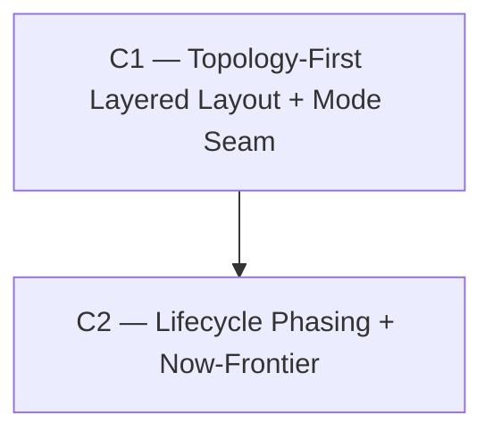

# Vision — Topology-First Epic Roadmap Layout

**Date:** 2026-06-03
**Scope:** Re-found the epic roadmap visualization (`packages/web` `epic-graph-layout.ts` + `epic-roadmap-canvas.tsx` + the satellite pure modules) on a **dependency-topology layout** instead of a calendar-time axis. A prerequisite epic always sits left of its dependent, edges are short and low-crossing, "now" is a **completion frontier** (not a date), and done/active/future read at a glance. The existing time-on-x engine is **demoted to an optional secondary retrospective mode**, not deleted.
**Architect role:** Information-visualization / graph-layout systems architect.
**Status:** ACTIVE (Phase-2 verified — see bottom).

---

## Where we are

The epic roadmap shipped via the prior arc (`vision-20260602-epic-timeline-visualization.md`: C1 Epic Graph Model → C2 Timeline-DAG View → C3′ Dashboard-as-DAG-hero, all SHIPPED). That arc delivered the **data** (epic→epic edges, derived + explicit, with provenance; per-epic `health`; cycle detection) and the **render** (ReactFlow nodes with completion-fill, dependency edges, hover chain-highlight, category accents, recency recede, collapsible Past/Backlog rails). It is good and it works.

But its **layout engine made one decision that this arc reverses**. From `epic-graph-layout.ts:13-17`, verbatim:

> Dependency-aware lane biasing / crossing-minimization is **DELIBERATELY deferred** … Time wins on x; dependency order is carried by edge direction … rather than baked into the lane geometry here.

Concretely, today:

- **x is owned by time.** Each node is placed by `representativeTime = time_window.end ?? time_window.start` (NaN-guarded; `epic-graph-layout.ts:81-90`), mapped through a linear `TimeScale.toX`. The `created_at` → `target_date` semantics live at the **server**, which sets `time_window: { start: created_at, end: target_date ?? null }` (`epic-graph.service.ts:175`) — so in practice x = `target_date ?? created_at`, but the layout module only ever sees `time_window`.
- **y is greedy interval-coloring** (`epic-graph-layout.ts:207`) whose only goal is "no two nodes overlap horizontally in a lane." It **never reads the edge set.**
- **Dependencies affect rendering only, never placement.** A `blocks` edge whose prerequisite lands right of its dependent is *flagged* (`backwardsEdges`) and drawn amber+curved — but the layout is never corrected.

### The named failures this arc kills

1. **Topology is invisible in the geometry.** The user's core need — "if A → B (B blocked by A), B is to the right of A, close by, with a short edge crossing few others" — is **not** an invariant today. It holds only by accident when calendar dates happen to agree with dependency order.
2. **The axis collapses on real data.** game_one's ~49 epics mostly have **no `target_date`**, so `representativeTime` falls back to `created_at`; they were all created in a tight deployment window, so every node maps to ≈ the same x. The timeline degenerates into one vertical pile ordered by greedy lanes — dependencies have **zero** visible layout effect. This is exactly the symptom the user reported.
3. **"Now" is a calendar lie.** `MilestoneGuides` draws a "Today" line at `scale.toX(nowMs)`, and `recedeOpacity` (`epic-graph-recency.ts:66`) fades nodes by `activity_recency` (wall-clock age). But work here happens in **bursts** — a flurry over two days, then nothing for a week. Calendar position and calendar-age fade both encode noise, not project state. The user's actual question — "where are we now, what's done, what's still future/not-implemented" — is a **lifecycle** question, not a date question.
4. **Long, crossing edges.** Dependency-agnostic lanes mean a prerequisite and its dependent can land in arbitrarily distant lanes → long edges that cross unrelated nodes and each other. There is no crossing-minimization anywhere in the pipeline.

### What the data model already gives us (verified, no server work needed)

- **Edges are already typed and provenance-tagged** (`epicGraphEdgeSchema`: `from`=prereq, `to`=dependent, `dependency_type ∈ {blocks, relates_to}`, `provenance ∈ {derived, explicit}`).
- **Cycles are already detected server-side** (`detectCycles`, Kahn's) and surfaced as `hasCycle` + `cycles` on the payload. The layered engine can consume this directly to break back-edges for ranking.
- **Per-epic lifecycle signal already exists**: `health ∈ {not_started, on_track, at_risk, blocked, done}` (`EPIC_HEALTHS`) + `status` + `taskSummary {total, done, byStatus}`. The "now frontier" is a *rendering* of data we already serve.
- **The layout is a pure, deterministic client function** with ~30 unit tests pinning its invariants. This is the entire surface to change — the contract to the server is untouched.

---

## The arc

**Two campaigns.** This is a focused re-founding of one subsystem (the layout engine + its rendering), not a multi-subsystem sprawl — so the honest arc is short and I will not pad it. C1 replaces the *geometry* (topological correctness: A-left-of-B, short low-crossing edges) behind a mode seam that preserves the time view as a secondary mode. C2 replaces the *semantics of "now"* (lifecycle frontier instead of calendar). C1 is shippable and valuable alone; C2 enhances it.

> **Design north-star (user-set, 2026-06-03):** *"I don't need to see a pile of epics completed on the same date. I need to see how they relate to each other, what comes first, what comes next, where we are now, and which parts are still in the future (not implemented yet)."* Topology owns x; lifecycle owns emphasis; calendar is demoted to a curiosity mode.

---

### C1 — Topology-First Layered Layout + Mode Seam (the geometry replacement)

- **Goal:** Replace the time-x / greedy-y engine with a **layered DAG layout** — x from dependency rank (a prerequisite is *always* strictly left of its dependent), y from a crossing-minimized within-layer ordering — making short, low-crossing dependency edges a structural invariant. Preserve the existing time engine as an opt-in **"Timeline" mode** behind a layout-mode seam; **"Structure" mode is the new default.**
- **Tier:** S (foundation — everything visual downstream is drawn in the coordinate space this defines).
- **Why this order:** C2's frontier and lifecycle emphasis are rendered *in structure-mode coordinates*; they cannot exist until the coordinates do. C1 also forces the `MilestoneGuides` / `TimeScale` reconciliation (the moment x stops being time, those break) — so the mode seam must be installed here, not bolted on later.
- **Removes:**
  - Time as the **primary** x driver. `representativeTime`-on-x stops being the default path (it survives, renamed, inside Timeline mode — see *Adds*).
  - The dependency-agnostic greedy interval-coloring as the **primary** y assignment (survives in Timeline mode only).
  - The *calendar* meaning of `backwardsEdges` — re-semanticized (see below), not deleted.
- **Adds:**
  - `lib/epic-graph-layered-layout.ts` — the new pure engine. A **Sugiyama-style pipeline**: (1) build the `blocks` sub-DAG (exclude `relates_to` from ranking — it is a non-sequencing relationship), DAG-ify by excluding cycle back-edges (consume the server's `cycles`); (2) **rank assignment** (tight-tree / longest-path) → x; (3) **crossing-minimized ordering** within each layer (median heuristic + transpose); (4) **coordinate assignment** → y. Deterministic: pure function of `(ids, blocks-edges)` with stable id tie-breaks, no `Date.now`/`Math.random` — same determinism contract and test style as the existing module.
  - A **layout-mode seam**: `computeEpicGraphLayout(nodes, edges, { mode: "structure" | "timeline", ... })`. `"timeline"` = today's engine preserved verbatim (renamed `computeTimelineLayout`); `"structure"` = the new engine; **default `"structure"`**. `LayoutResult` gains a discriminant so `scale: TimeScale` is present **only** in timeline mode.
  - Canvas mode toggle (segmented "Structure | Timeline") in the full roadmap view; the compact dashboard-hero embed defaults to Structure with no toggle (keep it clean).
  - `MilestoneGuides` + the "Today" line gated to **timeline mode only** (they are inherently calendar artifacts); `yTop`/`ySpan` recomputed from `positions` (mode-agnostic) so the canvas needs no scale in structure mode.
  - **Re-semanticized `backwardsEdges`** → cycle/upstream-contradiction back-edges (a `blocks` edge that points against rank). The existing amber+curved `getEdgeStyling` path renders them unchanged — now signalling a *dependency* contradiction (a genuine cycle), which is far more meaningful than a calendar one.
- **Timeline-mode-only constructs that must be explicitly fenced (not carried into structure mode):**
  - **`NodePosition.t`** (`epic-graph-layout.ts:48`, the per-node representative-ms) is a calendar artifact. In the discriminated `LayoutResult`, `t` is **timeline-mode-only** (absent/meaningless in structure mode). Do not let it leak into the structure shape.
  - **The entire `unscheduledIds` / Backlog-zone subsystem** (`LayoutOptions.unscheduledIds` + the future-zone math at `epic-graph-layout.ts:108-201`, the canvas memo at `epic-roadmap-canvas.tsx:197-212`, and the 8 `"backlog zone"` tests at `epic-graph-layout.test.ts:249-344`) is a **timeline-mode** construct (it carves the right 25% of the *time axis* for unscheduled epics). It has **no analog in structure mode** — structure mode's "future" work is handled by C2's *separate* lifecycle Backlog rail (`future`/`not_started`), a different mechanism. **There are deliberately two backlog concepts**: timeline-mode's `unscheduledIds` future-zone (preserved) and structure-mode's lifecycle rail (C2.P4). C1 must gate the canvas's `unscheduledIds` memo to timeline mode so it never feeds the structure engine, and the 8 backlog-zone tests migrate under timeline mode (they are not structure invariants).
- **Tests:**
  - **New structure-mode suite** (`epic-graph-layered-layout.test.ts`): prerequisite strictly left of dependent for every `blocks` edge; rank monotonic along chains; `relates_to` never constrains rank; cycle back-edge excluded from ranking and emitted as a back-edge; determinism across shuffled node/edge input (mirror the existing "case 3" shuffle test); finite geometry on degenerate inputs (empty, single, all-`relates_to`, full cycle); a fixed fixture with a known minimal crossing count.
  - **Timeline-mode regression:** the existing ~30 *pure-layout* `epic-graph-layout.test.ts` cases (including the 8 backlog-zone cases) move under timeline mode **verbatim-green** — the preserved engine must not regress one assertion. *(Note: the `epic-roadmap-canvas.test.tsx` and E2E suites are NOT verbatim-safe — they encode calendar-recency behavior that C2 deliberately changes; those migrate in C2, see below.)*
  - **E2E** (`epic-roadmap.spec` update): roadmap renders with prerequisites left of dependents; the mode toggle flips Structure ↔ Timeline.
- **Scope:** Large. ~6–8 files (new layered engine + tests, layout-module seam + contract change, canvas toggle + MilestoneGuides gating, test migration). LOC ~900–1300. 6 phases.
  - **P1** — Mode seam (pure refactor): rename current engine `computeTimelineLayout`; `computeEpicGraphLayout` dispatches on `mode`, **default still `timeline`** this phase so all ~30 tests stay green; introduce the discriminated `LayoutResult`. No behavior change. *(Contract stable for C2 to read the shape — but structure not yet default.)*
  - **P2** — Rank assignment: `blocks` sub-DAG + cycle-aware DAG-ification + tight-tree/longest-path rank. Unit-tested in isolation (A.rank < B.rank; relates_to ignored; back-edge excluded).
  - **P3** — Crossing-minimized ordering: median heuristic + transpose within layers. **This phase is an explicit `dagre`-vs-hand-rolled DECISION GATE** (not just an impl): pre-commit an *objective* crossing count for a fixed reference fixture (a 3-layer graph with two unavoidable crossings → assert exactly 2, so "good enough" is falsifiable, not vibes); implement median+transpose; **if the first honest attempt fails that crossing fixture OR the determinism shuffle test, adopt `@dagrejs/dagre` for ordering+coordinates** and keep the hand-rolled rank + cycle pre-processing (dagre needs a DAG anyway, so the cycle work is owned regardless). Unit-tested either way against the same fixture + determinism gate.
  - **P4** — Coordinate assignment: x from rank (even layer spacing), y from ordering (barycenter-aligned lanes, no overlap). Full structure-mode `positions` emitted. *(Structure coordinate space exists — C2.P2 unblocks here.)*
  - **P5** — Flip default to `structure`; wire the canvas mode toggle; gate `MilestoneGuides`/`TimeScale` to timeline mode; recompute `yTop`/`ySpan` from positions. Migrate the ~30 time tests under timeline mode.
  - **P6** — Back-edge re-semantics (cycle back-edges → amber/curved reuse). **Verify ReactFlow handle geometry on a true reversed edge:** the node hard-codes `Handle target=Left` / `source=Right` (`epic-node.tsx:77-78`), which assumes left→right flow. Normal structure edges become *more* correct under this (prereq is now guaranteed left). But a re-semanticized cycle back-edge runs *right→left* and will attach source-Right→target-Left across the reversed span — confirm the smoothstep routing reads as a deliberate contradiction loop, not backwards spaghetti (adjust handle selection / edge `type` for reversed edges if needed). Cycle-warning banner still fires; empty/loading/single-node states; E2E + full sweep.
- **Risk register:**
  - *Crossing-minimization quality vs. build-it-ourselves — the highest bug-density risk in the arc.* Median+transpose (transpose convergence, sweep direction, determinism-safe tie-breaks) and coordinate assignment (avoiding diagonal drift) are each a real correctness trap. **Mitigation:** the C1.P3 decision gate makes this *objective and front-loaded* — a pre-committed crossing-count fixture + determinism shuffle test; failing either on the first honest attempt triggers immediate adoption of **`@dagrejs/dagre`** (synchronous, deterministic, network-simplex ranking + median crossing-min + Brandes-Köpf coordinates; the canonical ReactFlow pairing) for ordering+coordinates, keeping the hand-rolled rank+cycle pre-processing. The prior arc rejected dagre *as a renderer* (`vision-20260602:97`); that objection dies once we own only positions and abandon time-x, so dagre is a first-class fallback, not a last resort. Note dagre does **not** eliminate the cycle work — it also requires a DAG — so the cycle pre-processing is owned either way.
  - *Determinism / jitter across refetches.* Positions must be byte-stable or the graph "jumps." **Mitigation:** pure function, inputs sorted with id tie-breaks before ranking; reuse the existing shuffle-determinism test pattern; pin any third-party layout version.
  - *Cycles break ranking.* Longest-path/tight-tree require a DAG. **Mitigation:** consume the server's `cycles` to choose back-edges to exclude from ranking; render them as the re-semanticized amber back-edges; the cycle-warning banner already exists.
  - *Contract change ripples.* `LayoutResult.scale` becoming mode-conditional touches `MilestoneGuides`, `yTop/ySpan`, and tests. **Mitigation:** the P1 seam makes the discriminated shape land *before* any behavior change, so downstream reconciliation is mechanical and test-covered.
- **Cost of not doing it:** The user's primary, explicitly-stated need stays unmet — the roadmap keeps showing "a pile of epics on the same date" with dependencies invisible in the geometry. Every epic added to game_one (already 49 and growing) deepens the pile. The dependency-edge data the prior arc built (C1 Epic Graph Model) goes on being under-exploited: we store and draw edges but never *lay out* by them.

---

### C2 — Lifecycle Phasing + the Now-Frontier (the "where are we" semantics)

- **Goal:** Make done / active / future legible at a glance and render a **completion frontier** — "now" as the boundary between shipped and not-yet-shipped work — replacing the calendar-recency fade with a **lifecycle**-driven emphasis. Answers the user's "where are we now, and what's still future" directly.
- **Tier:** A (user-visible; the second half of the request).
- **Why this order:** The frontier and lifecycle emphasis are drawn in structure-mode coordinates and only make sense once topology owns x (a calendar pile has no meaningful frontier). Depends on C1.
- **Removes:**
  - **Calendar `recedeOpacity` as the emphasis driver in structure mode.** Fading by wall-clock age is the exact signal the user rejected for bursty work. It survives in *timeline* mode (where calendar age is the point) but no longer governs the primary view.
  - The **calendar-age gate** on the Past rail in structure mode (`partitionEpics`: `done AND activity_recency < 45-day cutoff`). In structure mode "past" = *done*, regardless of how recently the last task moved.
- **Adds:**
  - `lib/epic-lifecycle.ts` — pure `lifecycle(node) ∈ {done, active, future}` (done = `health: done` / `status: completed`; future = `not_started`; active = the rest), plus an **actionable-now** predicate (an `active` epic whose every `blocks`-prerequisite is `done` — the work that is *actually* startable right now). Unit-tested.
  - **Lifecycle node emphasis** in structure mode: `done` receded/desaturated (the "behind us" zone), `active` at full emphasis, `future`/`not_started` outlined/lighter ("not implemented yet"). Drives the node's opacity/treatment from lifecycle, not `activity_recency`.
  - **Now-frontier overlay**: a subtle structure-mode background band/contour bracketing the actionable-now set — the at-a-glance "you are here." Composes with (does not fight) the existing category accents.
  - **Lifecycle-gated rails** in structure mode: Past rail = collapsed `done` epics; Backlog rail = `future`/`not_started`; the live canvas = `active` + the actionable frontier.
- **Tests:** lifecycle truth table (`done`/`active`/`future` from health × status); actionable-now predicate (prereqs-all-done) including the cycle/blocked edge cases; component tests (done node desaturated, future node outlined, active node full — *independent of* `activity_recency`); frontier overlay brackets exactly the actionable set; structure-mode Past rail gated on `done` not calendar; E2E asserting the frontier renders and future epics are visually distinct. **Migrate the calendar-coupled tests this campaign changes:** `epic-roadmap-canvas.test.tsx`'s `"collapses done-and-old epics"` case (`:224-230`, which asserts the *calendar* 45-day `partitionEpics` gate hides "Ancient epic") must be re-written for the structure-mode lifecycle gate; re-check the E2E past-rail-absent assertion (`tests/e2e/05-epic-timeline.spec.ts:86-95`) — its premise (fresh ⇒ not past) still holds in structure mode (fresh epics aren't `done`), but it's coupled to `partitionEpics` semantics this campaign edits, so re-verify rather than assume-green.
- **Scope:** Medium. ~4–6 files (lifecycle helper + tests, canvas emphasis wiring, frontier overlay component, rail re-gating, recency module touch). LOC ~400–700. 4 phases.
  - **P1** — `epic-lifecycle.ts` + actionable-now predicate (pure, fully unit-tested). No render change yet.
  - **P2** — swap structure-mode node emphasis from `recedeOpacity` to lifecycle; keep calendar recede in timeline mode. *(Unblocks at C1.P4 — needs structure coordinates rendering.)*
  - **P3** — now-frontier overlay component + legend affordance; reconcile with category accents.
  - **P4** — lifecycle-gate the Past/Backlog rails in structure mode; migrate the calendar-coupled `epic-roadmap-canvas.test.tsx` past-gate test + re-verify the E2E past-rail assertion; tests + E2E.
- **Risk register:**
  - *Topology doesn't perfectly stratify status.* A `not_started` epic with no prerequisites legitimately ranks far left, beside `done` work. **Mitigation:** this is *correct and informative* (unblocked future work that simply hasn't started) — the frontier is a **contour over appearance**, not a hard vertical cut; lifecycle styling carries the signal regardless of x. Documented as intended, not a bug.
  - *Two emphasis systems (lifecycle vs. category accent vs. dimmed-chain-hover) stacking into mud.* **Mitigation:** lifecycle drives base opacity/treatment, category drives the left border accent, hover-chain drives the transient dim — orthogonal channels, same discipline the canvas already uses; component-test the combinations.
  - *Re-gating rails changes what's hidden by default.* A done-but-recent epic moves from "active canvas" to "Past rail." **Mitigation:** the rail is one click to expand (already built); the change *is* the intent (done = behind us); verify via E2E that nothing live is hidden.
- **Cost of not doing it:** C1 alone gives correct geometry but leaves "now" encoded by calendar — the user still can't answer "where are we / what's left" without mentally filtering. The bursty-work mismatch (the explicit motivator) stays unaddressed; the roadmap shows *structure* but not *progress through that structure*.

---

## Sequencing DAG



**Phase pins (partial dependencies):**

```
C2.P1 (pure lifecycle helper) has NO layout dependency — can start any time alongside C1.
C2.P2+ (rendering in structure space) unblocked when C1 reaches P4 ("coordinate assignment — structure positions emitted").
```

**Adjacency list (machine-readable):**

```
depends_on:
  C1: []
  C2: [C1]
concurrency_pairs: []
phase_pins:
  - {downstream: C2, upstream: C1, unblock_phase: P4, note: "C2.P1 is layout-independent and may start immediately; C2.P2 needs structure coordinates"}
```

**Rationale.** The single edge C1 → C2 is real and load-bearing, not defensive: C2 renders the now-frontier and lifecycle emphasis *in the coordinate space C1 defines*, and re-points the rails against the structure-mode layout — none of which exists until C1 ships its coordinate pass. The one genuine parallelism (C2's pure lifecycle helper depends on no geometry) is captured by the phase pin rather than a false concurrency edge, since C2's *visible* output still waits on C1.P4.

---

## Cross-campaign invariants

Hold green at every commit across both campaigns:

- **Timeline mode never regresses.** The preserved time engine + its ~30 tests stay verbatim-green; demotion is non-destructive.
- **Structure layout is pure + deterministic** — no `Date.now`/`Math.random`/`new Date`; identical output across shuffled input (the existing determinism test pattern is the gate).
- **Prerequisite-left-of-dependent is an invariant** in structure mode for every `blocks` edge that isn't a cycle back-edge — this is the headline correctness property, asserted in the layered suite.
- **The server contract is untouched** — no `epic-graph` payload change, no migration; this arc is entirely client-side layout/render.
- **`pnpm test` + `pnpm typecheck` + `pnpm lint` green**; the `@pm/shared` canonical-Zod split is irrelevant here (no schema change) but must not be disturbed.
- **Per-epic `taskSummary`/`health` remain the single lifecycle source** — C2 derives from them, never forks a second completion calc.

---

## Out-of-scope for this arc (parked — next-arc material)

- **Drag-to-link / drag-to-reschedule on the graph** — authoring epic dependencies or dates by dragging. A mutation-UX campaign; this arc is read-layout only. (Already parked by the prior vision.) Park.
- **Server-side rank precomputation / caching** — ranking tens of nodes client-side is instant; premature. Revisit only if a project exceeds hundreds of epics (also the parked virtualization trigger). Park.
- **`relates_to` as a layout-influencing signal** — beyond an optional ordering tie-break, using soft "related" edges to pull lanes together is legibility tuning, deferred until the hard `blocks` topology proves out. Park.
- **Velocity-based forecasting / projected completion** — still no velocity model; the frontier shows *where we are*, not *when we'll finish*. Park (carried over from prior vision).
- **A blended "time-AND-topology" hybrid x** (e.g. rank as primary, calendar as a within-rank tie-break) — interesting, but mixing the two axes risks re-introducing the very ambiguity this arc removes. Keep the two modes cleanly separate for v1; revisit only if users ask for it. Park.

---

## Recommended single starting point

**C1 — Topology-First Layered Layout + Mode Seam.** It is the foundation: it delivers the user's primary need (A-left-of-B, short low-crossing edges) on its own, it is self-contained pure-lib + render work with no server risk, and it installs the mode seam that makes the whole arc non-destructive. C2 cannot draw a frontier in coordinates that don't yet exist. Invoke: `/campaign roadmaps/vision-20260603-epic-roadmap-topological-layout.md`.

Start **C2.P1 (the pure lifecycle helper) opportunistically in parallel** — it has no layout dependency and feeds C2's later phases.

---

## Open questions (commander authority)

When the user is unavailable, the commander resolves using the campaign's stated quality criteria — don't pause:

- **`dagre` vs. hand-rolled layered engine (THE decision).** dagre = best-in-class crossing-min + coordinate assignment, synchronous + deterministic, canonical ReactFlow pairing, at the cost of one layout dependency. Hand-rolled = zero-dep, full control over the frontier/mode/cycle semantics, continuity with the "own our pure layout" ethos, at the cost of reimplementing median+transpose+coordinates. *Resolution rule (now an OBJECTIVE gate, not a preference):* default to **hand-rolled** for rank + cycle pre-processing; at **C1.P3**, attempt hand-rolled ordering+coordinates against a **pre-committed crossing-count fixture + determinism shuffle test** — if the first honest attempt fails either, **adopt `@dagrejs/dagre`** for ordering+coordinates immediately (no second hand-rolled attempt). This converts "default to hand-rolled" from vibes into a falsifiable switch: the small graph scale favors owning the code, but median+transpose is the arc's biggest correctness trap, so the gate must be real. The cycle pre-processing is hand-rolled regardless (dagre needs a DAG too).
- **Rank algorithm: longest-path vs. tight-tree.** *Resolution rule:* prefer **tight-tree** (minimizes total edge length → shorter, closer edges, directly serving the user's "close by" ask); fall back to longest-path only if tight-tree adds complexity disproportionate to the gain at this scale.
- **Frontier visual form: background zone vs. node-only treatment.** *Resolution rule:* prototype the subtle background band in C2.P3; keep it only if it reads cleaner than lifecycle node-styling alone — never let it compete with the nodes for attention.
- **Mode toggle placement + persistence.** Per-view local state vs. persisted preference. *Resolution rule:* start with per-view local state defaulting to Structure; persist only if the user asks. Compact dashboard-hero embed shows Structure with no toggle.
- **Keep the calendar "Today" line at all?** In structure mode it has no x to attach to. *Resolution rule:* drop it in structure mode (it lives in timeline mode); the now-frontier replaces its job.

---

## Phase-2 adversarial verification

**Verdict: REVISE → folded → APPROVE.** A fresh adversarial verifier (opus, mandate: kill campaigns) read the draft against all eleven cited source files. **No campaign was killed, no tier changed, the C1→C2 DAG edge and its phase-pin were confirmed real.** The verifier confirmed both campaigns kill *named, observed* problems (the "DELIBERATELY deferred" comment at `epic-graph-layout.ts:12-17`; the verified axis-collapse mechanism `representativeTime = end ?? start` + server `time_window`; the calendar-recency fade the user explicitly rejected for bursty work) and confirmed the central architecture call — **"topology owns x, status owns appearance only"** — is correct (status-on-x swimlanes would *break* the prereq-left-of-dependent invariant for an unblocked `not_started` epic that legitimately ranks at 0).

It returned **five required edits, all now folded in** (one re-synthesis pass):

1. **Citation fix** — `representativeTime` is `time_window.end ?? start` in the layout module; the `created_at`/`target_date` mapping is at the *server* (`epic-graph.service.ts:175`). Corrected.
2. **Load-bearing omission: `NodePosition.t` + the entire `unscheduledIds`/Backlog-zone subsystem** (`epic-graph-layout.ts:108-201`, canvas memo `:197-212`, 8 tests `:249-344`) — a *timeline-mode* construct with no structure analog, creating **two distinct backlog concepts**. Now explicitly fenced as timeline-mode-only and reconciled against C2's separate lifecycle rail.
3. **Load-bearing omission: ReactFlow handle geometry on reversed cycle back-edges** — the node hard-codes `Handle Left/Right` (`epic-node.tsx:77-78`); a right→left cycle edge attaches backwards. Added as an explicit C1.P6 check.
4. **Test-honesty: `epic-roadmap-canvas.test.tsx:224-230` (calendar past-gate) + the E2E past-rail assertion are NOT verbatim-safe** — C2 changes that behavior. "Verbatim-green ~30 tests" narrowed to the *pure-layout* suite; canvas/E2E migration moved into C2.
5. **Hardened the dagre gate** — C1.P3 is now an objective `dagre`-vs-hand-rolled decision gate with a *pre-committed* crossing-count fixture, so "good enough" is falsifiable rather than rationalized.

The verifier's strongest pro-dagre argument (median+transpose is the arc's highest bug-density work; the prior arc's dagre rejection was "as a renderer" and dies once we own only positions) is reflected in the hardened gate — hand-rolled remains the default at this graph scale, but the switch is now real.

## Rejected by verifier

None — no campaign killed. The speculation that *would* have been campaigns (hybrid time+topology x, `relates_to`-as-layout, drag-to-link, server-side rank, velocity forecasting) was pre-parked in *Out-of-scope* and confirmed correctly next-arc rather than padding. The arc remains **two campaigns** — the verifier explicitly confirmed it neither splits further (C1's phases are genuinely sequential) nor merges (the geometry/semantics seam between C1 and C2 is real).
