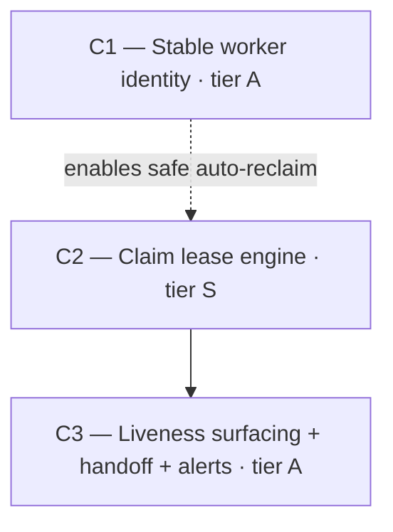

# Vision — Claim Liveness & Heartbeat (epic/task/proposal claims)

**Date:** 2026-06-06
**Scope:** Liveness for epic/task/proposal claims — an agent must be able to tell, without a shadow of a doubt, whether a claimed work item is being **actively worked right now** vs. left hanging (agent died, machine rebooted, MCP session dropped, work abandoned). Stale claims must be reclaimed **automatically and safely**, never stomping live work.
**Architect role:** Systems architect of the agent-coordination subsystem (claims, leases, identity, reclaim).
**Prior vision on this scope:** none (fresh).
**Status:** verified (Phase-2 adversarial pass applied — arc cut 4→3 campaigns, see "Rejected by verifier").

---

## Where we are

The PM suite coordinates 1–3 humans + N AI agents over a claim model that has **a holder but no heartbeat**. Verified against current `main`:

### The claim model (today)
- A claim is a bare pointer: `tasks.assigneeId` / `epics.assigneeId` / `proposals.claimedBy` (nullable FK → `users.id`). No `claimed_at`, no lease, no heartbeat, no expiry. **Set = owned forever** until an explicit release or a force-claim.
- `claim-helpers.ts::deriveClaimStatus()` returns exactly `unclaimed | claimed_by_you | claimed_by_other` — there is **no liveness dimension**. A reader cannot distinguish "actively held" from "abandoned 3 days ago."
- `assertClaimOk()` gates AI-agent writes on holding the claim (humans bypass). So a stranded claim doesn't just confuse pickup — it *locks* the work item against every other agent until a human force-claims it. (It is also **liveness-blind**: a pure `claimedBy === actor.id` check — load-bearing for C2/C3.)
- `forceClaim()` (shipped 2026-05-31) is the **only** recovery: a reason-required, audited takeover. It is manual and human-triggered for the cross-agent case.

### The liveness machinery that exists but does not work
- `agent_claims` table — a per-AI-agent **pool-identity** lease (`claimed_at`/`heartbeat_at`/`expires_at`, `CLAIM_TTL_MS = 1h`). This leases the *worker identity slot* (`claimAgent(pool, secret)` → a user row + token), **not the work item**. Heartbeated via `POST /agent-pools/.../heartbeat`.
- `reclaimStaleTasks(hours)` — frees tasks that are `in_progress` AND whose holder's pool lease expired AND `started_at` older than 4h. **But** its only caller is `cleanExpiredClaims()`, and `cleanExpiredClaims()` **has zero callers in the entire repo** → the reclaim sweep is **dead code that never runs**. Expired `agent_claims` rows are GC'd only incidentally, inside the next `claimAgent()`.
- Net effect: **nothing is ever auto-reclaimed.** Claimed work hangs indefinitely. This empirically matches the reported pain — many 0/n epics and a/b epics all "assigned," none provably active.

### The proxies agents are forced to use (the danger)
With no liveness signal, agents infer "is someone working this?" from:
- `pm_awareness_check` → in-progress tasks by status (status ≠ liveness).
- "0/n complete" / "no tasks finished yet" → completion ≠ activity.
- `pm_get_my_work` → only the caller's own in-progress tasks.

All three are **false-positive-prone**: a crashed agent's task stays `in_progress` with 0/n forever, so two agents read it as "someone's on it" *or* "stale, I'll grab it" with no way to be sure → double-pickup or permanent stall. (`pm_pick_next_task` confirms the gap — it claims only `status='ready' AND assignee_id IS NULL`; it cannot skip-live or reclaim-stale today.)

### The deferred root cause (load-bearing)
`project-force-claim` memory documents the real incident: **unstable worker identity**. An MCP reconnect (`/mcp reconnect`) runs `claimAgent()` again and grabs a *different* free pool agent → a **new `users` row** (the client's `_claimedUserId` is in-memory only, churned on every reconnect) → every in-flight claim strands under the dead identity, and the new identity gets `409 CLAIM_DENIED`. Force-claim is the graceful recovery; the cause was deferred. **A lease keyed to `users.id` strands at exactly the same seam** — and worse, a naive lease could *falsely reclaim* live work when the same human-driven agent reconnects under a new id. Identity stability is the safety prerequisite for turning auto-reclaim *on*.

### Named bug classes still alive
1. **Claims have no liveness at all** — static pointer, owned forever.
2. **Liveness is invisible to readers** — `claim_status` has no live/stale axis; agents use dangerous proxies.
3. **Epics are never reclaimed** — even the (dead) sweep only ever targeted tasks; the reported pain is *epics*.
4. **Not-started claimed work is never reclaimed** — the (dead) sweep required `in_progress` + `started_at`; a 0/n claimed epic/task is invisible to it.
5. **Reclaim is dead code** — `cleanExpiredClaims` is never invoked.
6. **Stranded-claim-on-reconnect** — unstable identity locks work against all agents until a human force-claims.

---

## The arc

**Three campaigns.** C2 is the lone foundation (the lease spine). C1 is an independent safety fix that unblocks *one phase* of C2. C3 surfaces the signal and folds in operator handoff/alerts.

### C1 — Stable worker identity
- **Goal:** A worker re-binds to the **same `users` row** across reconnect / reboot / token refresh, so claims (and their leases) never strand under a dead identity.
- **Tier:** A (independent fix — NOT foundation; nothing hard-depends on it, it only makes one C2 phase safe).
- **Why this order / placement:** This is the deferred root cause (`project-force-claim`). It touches code **disjoint** from the lease engine (client identity binding, not the server lease), so it is concurrency-eligible with C2. Its payoff is the safety precondition for C2's "auto-reclaim on by default" phase: stable identity prevents false-reclaiming live-but-reconnected work and makes the stranded-claim bug class (#6) structurally impossible.
- **Removes:** the `claimAgent()` "grab any free pool agent → mint a new user row + token" drift on every reconnect; the in-memory-only `_claimedUserId` churn in `api-client.ts`.
- **Adds:** a durable **worker key** (stable across process restarts — e.g. persisted `{pool, machine, slot}`, a worker-supplied stable id, or a server-issued durable handle) that a `bindWorker`/`claimAgent` path resolves to the *same* `users` row, refreshing its token instead of allocating a new agent. The MCP client persists and re-presents the key. `agent_claims` becomes the binding lease for that stable identity.
- **Tests:** reconnect re-binds the same `userId` (regression for the exact Worker 1→Worker 3 incident); an in-flight claim survives a reconnect with no `CLAIM_DENIED`; force-claim still works for a *genuine* cross-worker handoff; two distinct workers on one pool still get distinct stable identities (no collision).
- **Scope:** medium (client `api-client.ts` + MCP pool binding + server `agent-pool.service::claimAgent`/token path; small migration if the worker key is persisted server-side). ~3 phases.
- **Risk register:** (a) *Two agent processes on a shared host* must derive distinct keys; mitigate with a slot/PID-stable component + a server-side uniqueness guard that falls back to allocate-new on collision. (b) *Back-compat with static `PM_API_TOKEN` users* — they already have stable identity; the bind path must no-op for them. (c) *Security* — the worker key must be paired with the pool secret, never a bare claim, so it can't impersonate another worker.
- **Cost of not doing it:** every reconnect during long work keeps stranding claims and locking items behind `CLAIM_DENIED`; C2's auto-reclaim cannot be turned on safely (it will false-reclaim reconnected-but-live work); force-claim stays a routine chore instead of rare break-glass.

### C2 — The claim lease engine (foundation)
- **Status: shipped (2026-06-06, shadow/long-grace).** See `docs/design/phase-c2-claim-lease-engine.md`.
- **Goal:** Make a claim a **lease**: it lives only while the holder is provably alive, renews **automatically from real activity**, and is swept back to *available* when it goes stale — uniformly for tasks, epics, and proposals, at **any** status including not-started.
- **Tier:** S (the spine — the signal everything else consumes).
- **Why this order:** C3 has nothing to surface until the live/stale signal exists. It generalizes the proven merge-lock lease pattern already running in production on the train.
- **Removes:** bare-pointer claim semantics (claim becomes lease-backed); the dead `cleanExpiredClaims()` / `reclaimStaleTasks(4h, in_progress-only, tasks-only)`.
- **Adds:**
  - A unified **`claim_leases` table** keyed by `(entity_type, entity_id)` with `holder_id`, `claimed_at`, `heartbeat_at`, `expires_at`, `last_activity_at`, optional `session_id` — **one** lease mechanism, **one** sweep, **one** derivation (chosen over per-entity lease columns: infinite-budget favors the single structural mechanism over three parallel ones; epics/tasks/proposals genuinely share the lease lifecycle). *Named `claim_leases`, not `claims`, to avoid collision with the existing `agent_claims` pool-lease table.* `assigneeId`/`claimedBy` stay as the durable holder pointer; the lease carries liveness.
  - `renewClaimLease(holder, entity)` wired into the **`assertClaimOk` seam** — which already runs on *every* AI write (claim, start, report_progress, update, transition, comment, link_git_ref, merge-request submit). **Renew-on-action** so liveness derives from work, not from remembering to ping; this single seam covers the dominant case with no per-callsite discipline.
  - **Self-stale safety (the load-bearing authz rule):** when the holder's *own* lease has lapsed mid-work, a write must **renew, never 409**. `assertClaimOk` becomes liveness-aware **only against *other* agents** — never against the holder. A slow-but-legit agent can never be locked out of its own task. (Explicit test below.)
  - `sweepStaleClaims()` modeled on `merge-lock::sweepExpired` — **opportunistic at the top of read/claim ops** (byte-matching merge-lock, which has *no* scheduler; the PM server has no in-process scheduler beyond the SSE keepalive). A claim nobody reads is a claim nobody contends; the opportunistic sweep fires exactly when an agent tries to pick up. Reclaim frees the lease to *available*, writes an **audit row** (mirrors force-claim accountability), and emits an SSE event. Fail-safe: missing/legacy lease data, clock skew, or any ambiguity → treat as **live-with-grace**, never reclaim.
  - *(deferrable, late phase)* a **transparent client/MCP heartbeat** for genuinely long *quiet* gaps (build/think with zero PM writes), keyed to the C1 stable identity and folded into the pool-lease ping. **Ship renew-on-action first; add this only if quiet-gap false-reclaims are actually observed** (shadow→on discipline).
- **Tests:** a claim expires without heartbeat; any holder action renews it; **the holder writes after its own lease lapsed → renew, never 409** (self-stale regression); the sweep frees a stale **not-started epic** (headline case) and a stale proposal; the sweep **never** frees a live lease (grace + fail-safe regression); every reclaim writes one audit row and emits an SSE event.
- **Scope:** large (shared enums + migration + new `claim.service` lease/sweep + `renewClaimLease` at the `assertClaimOk` seam). ~5 phases (transparent heartbeat is the optional 6th).
- **Risk register:** (a) *False reclaim of live work* — the cardinal sin; mitigated by generous default TTL/grace, fail-safe-to-live, the self-stale rule, and (until C1 ships) a shadow/long-grace mode that logs would-reclaims without acting. (b) *Renew coverage* — centralizing renewal in `assertClaimOk` (one seam) removes the per-callsite gap. (c) *Sweep cost* — opportunistic-on-read is O(1) per op like merge-lock.
- **Cost of not doing it:** the core problem remains unsolved — claims hang forever, double-pickup stays possible, the human keeps manually surveying 0/n epics to guess what's dead.

### C3 — Liveness everywhere a decision is made (agent + operator)
- **Goal:** Replace the dangerous proxies with a first-class **claim_state** (`unclaimed | live | stale | yours`) surfaced on every read used to decide pickup; make pickup tools act on it; and give the human director stale-claim visibility, alerts, and a clean handoff — so nobody hand-surveys 0/n epics again.
- **Tier:** A (the user-visible win — "without a shadow of a doubt"). Hard-depends on C2.
- **Why this order:** `claim_state` derives from C2's lease; the alert consumes C2's sweep event; handoff composes the shipped `forceClaim`.
- **Removes:** reliance on completion-/status-proxies inside `pm_pick_next_task` and `pm_awareness_check`; the manual human survey of "which assigned epics are actually dead."
- **Adds:**
  - A `claim_state` enum in `@pm/shared`; `deriveClaimState()` (supersedes `deriveClaimStatus`) computed from the lease; threaded through `pm_list_epics` / `pm_get_epic` / `pm_list_tasks` / `pm_get_task` / `pm_get_my_work` / `pm_awareness_check` views + MCP renders (human-readable "live, heartbeat 2m ago" / "stale, last seen 3d ago"), identity-masked like the merge-lock view (never leak another agent's raw id).
  - `pm_pick_next_task` skips **live**-claimed and may atomically **reclaim-then-claim** a **stale** one (`WHERE holder IS NULL OR lease expired` + `changes === 0` race check — the merge-lock idiom); `pm_awareness_check` reports live vs stale in-flight.
  - Web badges on board / roadmap / epic views (stale affordance).
  - *(final phase)* an edge-triggered **stale-claim alert** (in-app SSE banner + Discord webhook) using a `*_notified` debounce latch mirroring `train_state.stuckNotified`.
  - *(final phase)* explicit **handoff** primitives — `release-to` (hand a claim to a named worker) and `request-takeover` — thin wrappers composing the audited `forceClaim`.
- **Tests:** a stale-claimed epic shows `claim_state: stale` in list/get; `pick_next_task` skips a live claim and atomically takes a stale one; two agents racing to reclaim-then-claim the same stale item → exactly one wins; `awareness_check` distinguishes live from stale; a project with a stale claim raises exactly one alert (edge-triggered) and re-arms on resolution; `release-to` transfers the lease with an audit row; MCP renders never leak raw holder ids.
- **Scope:** large (shared enum + view builders + MCP renders + web badges + alert latch + handoff endpoints). ~4–5 phases.
- **Risk register:** (a) *Race on reclaim-then-claim* — atomic claim idiom (above). (b) *Over-eager pickup of barely-stale work* — pickup uses a stricter staleness margin than the sweep, so a just-lapsed lease isn't grabbed mid-action. (c) *Alert noise* — edge-trigger + debounce + a past-grace threshold (like `train.stuck`'s 600s).
- **Cost of not doing it:** even with a working lease, agents still can't *see* it — proxy behavior and double-pickup persist; the human keeps reactively noticing hanging epics; C2's value is stranded.

---

## Sequencing DAG



**Phase-pin annotations:**
```
C2 ships in shadow/long-grace mode independently. C2's "enable auto-reclaim by default
(aggressive TTL)" phase unblocks when C1 ships ("stable identity re-binds across reconnect").
```

**Adjacency list:**
```
depends_on:
  C1: []
  C2: []
  C3: [C2]
concurrency_pairs: [(C1, C2), (C1, C3)]
phase_pins:
  - {downstream: C2, upstream: C1, unblock_phase: "enable-auto-reclaim-by-default"}
```

**Rationale:** C1 (client identity binding) and C2 (server lease engine) touch disjoint files and are fully concurrency-eligible — C1 is not a hard predecessor, only the safety gate for C2's auto-reclaim-on phase (hence the dashed phase-pin, not an edge). C3 hard-depends on C2 because `claim_state` is *derived* from C2's lease and the stale alert consumes C2's sweep event. C1 and C3 share no files (concurrency-eligible). There are no other real edges; nothing is sequenced "to feel safe."

---

## Cross-campaign invariants (green at every commit)

- **Authz preserved, now lease-aware:** AI agents must hold a **live** claim to write; humans bypass. Liveness is enforced **only against other agents** — a holder's own lapsed lease **renews on write, never 409s** (the self-stale rule).
- **Fail-safe-to-live:** any ambiguity (missing lease data, legacy rows, clock skew) is treated as *live* — the system **never** reclaims work it isn't sure is dead. Default-closed against stomping.
- **Force-claim always available:** the audited manual takeover remains the break-glass for genuine handoffs; auto-reclaim never replaces it, only reduces its frequency.
- **Every reclaim/handoff is accountable:** a sweep-reclaim or handoff writes an audit row, exactly like `force_claim`.
- **No claim queue:** unlike merge-lock (one contended `main`), claims are not a single resource — contention resolves by picking *other* ready work. Deliberately no queue (see parked).
- **No new scheduler:** sweeps are opportunistic-on-read (merge-lock parity); the server has no in-process scheduler and this arc does not add one.
- **Suite stays green:** `pnpm test` 10/10, typecheck 6/6, lint 0 errors at every commit.

---

## Out-of-scope for this arc (parked → next vision)

- **Claim queues / waitlists** — agents pick other work instead of queueing on a contended item.
- **A periodic background sweep driver** — only needed if a stale claim that is *never read* is shown to matter; opportunistic-on-read covers every contention path. Revisit only with evidence.
- **Cross-machine session migration** — handing an in-flight worktree to another host. Liveness only frees the *claim*, not the working tree.
- **Productivity vs. liveness** — detecting "alive but not making progress." This arc proves *alive*, not *productive*.
- **Per-subsystem locks beyond labels** — `pm_awareness_check` already covers area-level coordination via labels.

---

## Recommended single starting point

**C2 — the claim lease engine.** It creates the live/stale signal the whole problem is missing; ship it first in shadow/long-grace mode (safe even before C1), then turn auto-reclaim on once C1 lands. It is the spine: C3 is a surfacing layer over it, and C1 is the safety anchor that lets it run hot. If only one campaign ships, this is the one that converts "claimed = owned forever" into "claimed = provably alive."

---

## Open questions (commander authority)

- **Lease TTL + grace defaults.** Merge-lock uses 5min (a build). Task/epic work is long with quiet gaps; pick a heartbeat TTL ≥ a few× the natural action interval (likely 15–30min) with grace ≈ 2× and a stricter pickup margin. *Rule when the user is unavailable:* the commander errs **generous** — favor not-stomping live work over fast reclaim; tune from observed session cadence.
- **Proposals scope.** Proposals have a lighter `claimedBy` + discuss workflow; default is to lease them too, but the commander may scope C2 to tasks+epics first and fold proposals into a later phase if the discuss flow complicates renewal.
- **Worker-key shape (C1).** Client-derived `{pool, machine, slot}` vs. a worker-supplied stable id vs. server-issued durable handle. *Rule:* pick the option that survives a process restart on a shared host without collision and pairs with the pool secret; prefer the server-issued durable handle if client persistence proves unreliable.

---

## Rejected by verifier

- **C4 — "Operator visibility & safe handoff" (dissolved into C3).** The original draft had a 4th campaign for stale surfacing + alerts + handoff. The Phase-2 verifier killed it as padding: its stale badge was *already* C3's web badge; its alert was a single `train_state.stuckNotified`-style latch; its `release-to`/`request-takeover` were thin wrappers over the already-shipped `forceClaim` — and the draft itself flagged it "lowest-urgency... agents already unblocked by C1–C3." A campaign whose author calls it optional and which reuses another campaign's primary artifact is one-PR-per-piece work, not a tier. Its three pieces became the final phases of C3.
- **C2 periodic sweep driver (cut to parked).** The draft assumed a periodic reclaim driver. Verified: the server has **no in-process scheduler** (only the SSE keepalive `setInterval`), and merge-lock — the cited prior art — is *purely* opportunistic-on-read. Default is now opportunistic-on-read only; a background driver is parked pending evidence that never-read stale claims matter.
- **C2 transparent client heartbeat (demoted to optional late phase).** Renew-on-action via the `assertClaimOk` seam (which runs on every AI write) covers the dominant case; the always-on client heartbeat was mild gold-plating. It ships only if quiet-gap false-reclaims are observed.
- **C1 retiered S→A.** The draft called C1 "foundation," but it touches files disjoint from C2 and nothing hard-depends on it (the DAG uses a phase-pin, not an edge) — it is an independent safety fix, not the spine. Only C2 is tier-S.
