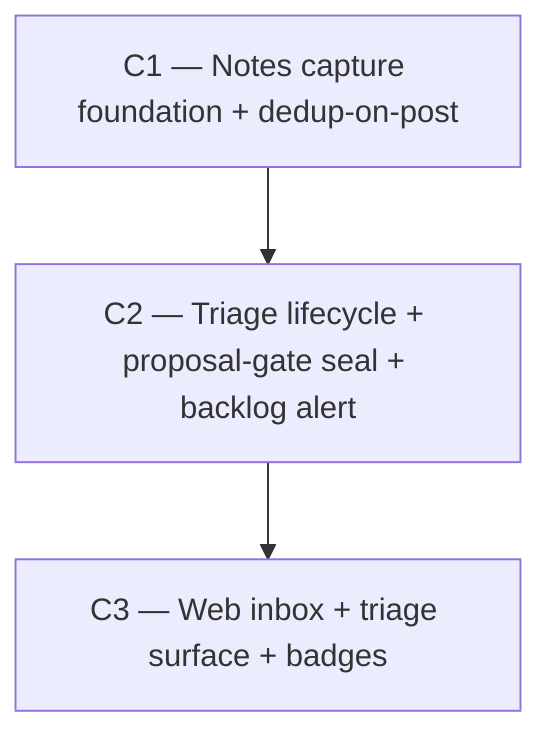

# Vision — Notes / Findings Inbox (a triage lane for ownerless observations)

**Date:** 2026-06-09
**Scope:** A lightweight, cheap-to-create, owned-by-nobody, needs-triage **observation** primitive for the PM system — the "check this out please?" lane an agent (or human) uses when it notices something potentially wrong/interesting mid-flight but does not want to stop and investigate. Distinct from the deliberate proposal → epic → task flow.
**Architect role:** Systems architect of the PM data/workflow domain.
**Status:** APPROVED (Phase 2 adversarial verify applied — REVISE incorporated; arc collapsed 4→3 campaigns, migration numbering corrected, three load-bearing gaps closed. See "Verifier disposition" at bottom).

---

## Where we are

The PM system has a deliberately **top-down** work model: a human authors a **proposal**, an AI decomposes it into **epics** and **tasks** (`feedback-design-process`, CLAUDE.md). That model is excellent for *planned* work and is guarded by a load-bearing invariant — **humans own the proposal gate; AI never creates epics/tasks directly without a proposal behind them.**

What recently shipped around the edges of the work model:

- **Claim liveness arc (C1+C2+C3, 2026-06-06).** Claims became TTL leases (`claim_leases`), a first-class `claim_state`, an edge-triggered stale-claim alert (`claims_alert_state` latch → SSE banner + Discord), and stomp-safe handoff primitives. This arc established the **reusable on-read edge-triggered alert idiom** this vision leans on directly.
- **Merge train 7.1–7.6.1.** Brought the action-centric `audit_log`, the `train_state` latch pattern, the `integrator_health` on-read staleness model, and the `alerts-listener.ts` outbound-Discord mechanism. All reusable.
- **FTS5 search.** External-content virtual tables (`proposals_fts`, `tasks_fts`, `comments_fts`) kept in sync by AFTER INSERT/UPDATE/DELETE triggers, unioned by rank in `search.service.ts`. Adding a searchable class is a well-trodden path.

**The named gap.** There is **no inbox for unplanned signal.** When an agent notices something off while holding task X, the observation has three bad fates today:

1. **Dropped** — the agent moves on; the knowledge is lost.
2. **Misfiled** — jammed into a `pm_add_comment` on whatever task happened to be open. Comments are *owned* by exactly one `taskId`/`proposalId` (schema.ts L305–306), carry a `commentType` but **no status lifecycle**, and are **not independently listable or triageable** — `search.service.ts:204–254` surfaces a comment only by FTS body, never as a queryable class. The signal is invisible the moment that task closes.
3. **Over-escalated** — forced into a full human-authored proposal the agent is neither motivated nor equipped to write mid-flight.

The missing primitive is a **first-class, ownerless, triageable observation**: cheap to create, anchored to *where* it was found without being *owned* by it, and carrying its own lifecycle (`open → triaged`). Comments cannot serve this (owned + no lifecycle + not a queryable class); proposals are the wrong altitude (heavyweight, human-authored). **A new entity is the right structural answer**, and its triage path *feeds* proposal creation — strengthening the proposal gate rather than routing around it.

### The named failure mode this vision must design against

The killer for any inbox is the **write-only junk drawer**: easy to post to, nobody triages, signal-to-noise collapses, the feature dies. Two structural mitigations, both reusing existing muscle — and (per the Phase-2 revise) each folded into the campaign that *owns the surface it touches* rather than split off as its own tier:

- **Dedup-on-post** via FTS5 — surface similar *open* notes at post time so a second reporter appends instead of duplicating. Lives in **C1** (it augments C1's own create endpoint).
- **Edge-triggered backlog-age alert** — reuse the `claims_alert_state` latch idiom exactly: fire once when the oldest untriaged note crosses an age threshold, re-arm on drain, deliver to SSE banner + Discord. Lives in **C2** (an untriaged backlog is a triage-lifecycle metric).

---

## The arc

Three campaigns, foundation-first, strictly linear: **C1 → C2 → C3.** (The Phase-2 verifier dissolved the original standalone "inbox-health" campaign — its two halves shared nothing but a theme and each belonged in a surface-owning campaign. See disposition at bottom.)

> **Migration numbering (verified).** Latest applied migration is `0023_claims_alert_state` (journal idx 23, `db/index.ts` applies migrations by reading `meta/_journal.json`, **not** by globbing `*.sql` — every hand-authored `.sql` needs a matching journal entry `{idx, tag}` or it silently won't run). This arc's migrations are therefore **`0024`** (notes table), **`0025`** (triage columns + provenance), **`0026`** (`notes_alert_state` latch).

---

### C1 — Notes capture foundation (+ dedup-on-post)

- **Goal:** Ship the ownerless `note` entity end-to-end — persistence, anchor model, search, dedup-on-post, and the agent-facing capture path — so an observation is recorded in one cheap call, deduped against open notes, and read back by anyone.
- **Tier:** S (foundation).
- **Why this order:** Everything else operates on the entity. Triage (C2) transitions its state and alerts on its backlog; the web surface (C3) renders it. Nothing can precede it. C1 alone delivers standalone value: agents post (deduped), humans read via API.
- **Removes:** Nothing (purely additive). Retires the *practice* of misfiling observations as orphan comments.
- **Adds:**
  - `@pm/shared`: `NOTE_KINDS` (`bug | question | idea | tech_debt | wtf | observation`), `NOTE_STATUSES` (`open | triaged`), `NOTE_ANCHOR_TYPES` (`task | epic | proposal | none`), plus the `Note` Zod schema and create/list/patch DTOs (canonical Zod-3, route-local Zod-4 mirror per the established split).
  - `schema.ts`: `notes` table + migration **`0024`** (+ journal entry). Columns: `id`, `projectId` (FK), `kind`, `status` (default `open`), `title`, `body`, `anchorType`/`anchorId` (nullable, **not** an FK — the house heterogeneous-target idiom used by `audit_log.targetType/targetId` schema.ts:741–745 and `claim_leases.entityType/entityId` schema.ts:995–996), `codeLocator` JSON `{path, line?, commitSha?}` (nullable), `severity` (nullable), `authorId` (FK users), `createdAt`/`updatedAt`. Indexes: `(projectId, status)`, `(anchorType, anchorId)`, `(projectId, kind, status)`.
  - `note.service.ts` + `routes/notes.ts` (OpenAPIHono): create, get, list (filter by `status`/`kind`/`anchor`), patch (body/kind/severity **while open**). `activity_log` rows on create/update.
  - **`enrichActivityEntries` `note` branch** (`activity.service.ts` L84–187 currently switches only on `task|epic|proposal|project`) — without it, note activity entries render title-less in the feed and `pm_check_updates`. Add the branch (or, if scope bites, explicitly defer with a TODO — but the cheap right answer is to add it here while the entity is fresh).
  - **Dedup-on-post:** `findSimilarOpenNotes(projectId, title+body, limit)` (FTS5 over `status='open'` in-project). The create response gains `similar: [...]`; `pm_post_note` renders them so the poster can append/skip. **Advisory, never blocking** — a hard dup-block would suppress a real second finding worded differently (FTS5 similarity is lexical, not semantic — `search.service.ts` token-quotes, it does not embed). An optional `dedupe_ack` lets the caller post past similars deliberately.
  - FTS5: `notes_fts` (title, body) virtual table + 3 sync triggers (`fts.ts`/`fts-triggers.ts`) + a `note` branch in `search.service.ts` and the `/search` route.
  - SSE: `note.created` / `note.updated` events (`EVENT_NAMES`), auto-forwarded via `onAll`.
  - MCP: `pm_post_note` (the worker-facing capture tool — kind, body, optional anchor + code locator; renders `similar` for dedup), `pm_list_notes`, `pm_get_note` + `api-client` wrappers.
  - **Authz:** posting is open to **any authenticated user** (human or pool agent) — ownerless-to-post *is* the feature.
- **Tests:** Service unit (create/list/filter/patch + open-only patch guard); FTS round-trip (post → search finds it; delete → gone); dedup unit (near-duplicate surfaces, distinct does not); activity-feed enrichment (a note renders with a title); REST contract (OpenAPI envelope); MCP tool render. Suite moves from "no notes" to "notes capturable + deduped + searchable + legible in the feed."
- **Scope:** Medium. ~10 files (shared schema, schema.ts, migration+journal, note.service, routes/notes, fts/fts-triggers, search.service, activity.service, mcp post/list/get, api-client). ~800–1000 LOC. 5 phases (P1 shared → P2 schema/migration → P3 service/REST/activity → P4 FTS/search/dedup → P5 SSE/MCP).
- **Risk register:**
  - *Anchor-as-soft-reference* — `anchorId` is not an FK (deliberate), so a deleted target dangles. **Mitigation:** the anchor is a soft historical fact ("found near X"); C3 renders a dangling anchor as "(removed)". Documented as deliberate, mirroring `audit_log.targetId`.
  - *FTS trigger drift* — a 4th content table is one more trigger trio. **Mitigation:** mechanical, proven for 3 tables; reuse verbatim.
- **Cost of not doing it:** The entire vision is blocked. The misfiling pain continues: every cross-cutting observation is lost or buried in a soon-dead comment thread — unmeasurable signal leakage, the latent-defect knowledge a small AI-heavy team can least afford to drop.

---

### C2 — Triage lifecycle + proposal-gate seal (+ backlog-age alert)

- **Goal:** Give a note a triage destiny — `open → triaged(promoted | dismissed)` — where **promote-to-proposal** (provenance-linked) is the canonical AI-reachable path and **promote-to-task** is a human-gated escape hatch for the trivially-clear; structurally guarantee notes never auto-spawn epics/tasks; and fire an edge-triggered alert when the untriaged backlog ages out.
- **Tier:** A (user-visible workflow + structural seal).
- **Why this order:** Depends on C1 (the entity + its `open` state + the FTS/aggregate it reads). It is the half that makes a note more than a fancy comment: the triage state machine + provenance back-link convert raw signal into governed work while *preserving* the proposal gate, and the backlog alert keeps the inbox from rotting.
- **Removes:** Nothing. Closes the gap between "raw signal" and "planned work" without a bypass.
- **Adds:**
  - `@pm/shared`: `NOTE_TRIAGE_OUTCOMES` (`promoted | dismissed`); state-transition validation.
  - `notes` columns (migration **`0025`** + journal): `triagedAt`, `triagedBy` (FK users — the accountability datum), `triageOutcome`, `promotedProposalId` / `promotedTaskId` (ON DELETE SET NULL). Reciprocal nullable `sourceNoteId` on `proposals` and `tasks` (provenance both directions; additive + defaulted null ⇒ existing creates byte-identical).
  - Service + REST: `POST notes/{id}/dismiss` (reason required), `POST notes/{id}/promote-to-proposal` (creates a proposal carrying `sourceNoteId`, transitions the note to `triaged(promoted)`), `POST notes/{id}/promote-to-task` (**human role only**, records `triagedBy`). Terminal-state guards (a triaged note is immutable).
  - **The structural invariant**, encoded not as callsite discipline: the *only* code paths that set `sourceNoteId` are the two promotion endpoints; promote-to-task is gated to `type === "human"` (the real house idiom — `claim-helpers.ts:101`). No AI-reachable path spawns an epic/task from a note. A dedicated invariant test asserts this and stays green from C2 onward.
  - **Authz (explicit — ownerless cuts both ways):** promote-to-proposal is AI-reachable (it only mints a proposal — the human-owned artifact agents already create via `pm_create_proposal`). **Dismiss** requires the note's **author or a human** — an arbitrary agent must not be able to bury another's signal; a human director may dismiss anything. Promote-to-task is human-only.
  - **Backlog-age alert:** `notes_alert_state` latch table (migration **`0026`** + journal, one row/project, mirrors `claims_alert_state` schema.ts:1036–1052 exactly) + on-read `computeNotesHealth(projectId)` (open count + oldest-untriaged age) modeled precisely on `claims-health.service.ts`. `NOTE_BACKLOG_ALERT` event, edge-triggered (fire once per episode on the rising edge, re-arm on drain — `staleClaimsNotified` precedent), delivered to SSE banner (`onAll`) **and** Discord (`alerts-listener.ts` `formatAlert` branch). Aggregate-only payload (count + oldest age). REST `GET projects/{id}/notes/health` returns the aggregate and fires the alert as a side effect (the `computeClaimsHealth` pattern).
  - SSE: `note.promoted` / `note.dismissed`. MCP: `pm_dismiss_note`, `pm_promote_note_to_proposal` (promote-to-task stays human-only — no MCP tool).
- **Tests:** State-machine unit (legal/illegal transitions, terminal immutability); provenance round-trip (promote → proposal has `sourceNoteId`, note has `promotedProposalId`); **the invariant test** (no AI path produces a task/epic with a `sourceNoteId`); authz tests (AI promote-to-task → 403; non-author agent dismiss → 403; human dismiss ok); alert edge-trigger unit (fires once, re-arms on drain — clone `claims-alerts.test.ts`); non-fatal emission (a Discord/settings throw never breaks the read — `alerts-listener` NOTE-2).
- **Scope:** Medium. ~8 files + 2 migrations. ~700–900 LOC. 6 phases (P1 state machine → P2 dismiss+authz → P3 promote-to-proposal+provenance → P4 promote-to-task+invariant+human-gate → P5 `notes_alert_state`+`computeNotesHealth`+alert+health REST → P6 MCP/SSE).
- **Risk register:**
  - *Gate erosion via promote-to-task* — the one place the proposal gate could leak. **Mitigation:** human-role hard gate + audit (`triagedBy`) + the explicit invariant test; for trivially-clear items only, documented.
  - *Promoted-target deletion* — `promotedProposalId`/`promotedTaskId` are `ON DELETE SET NULL`, and tasks/epics have hard-delete routes (`tasks.ts:365`, `epics.ts:254`). A promoted note can lose its forward pointer. **Mitigation:** the reciprocal `sourceNoteId` on the surviving side reconstructs the link; a promoted note whose target was deleted renders "(promoted target removed)". State this; do not pretend it cannot happen.
  - *Alert noise* — **Mitigation:** edge-trigger latch (once per episode) + generous default age threshold (7 days oldest-untriaged), operator-tunable in project settings alongside the existing webhook/alert block.
- **Cost of not doing it:** Notes become a write-only comment-with-extra-steps — the junk drawer, minus even the alert. Without a governed promotion path, signal rots in `open` forever or agents hand-create tasks from notes and quietly erode the proposal gate. This campaign *is* the governance and the rot-prevention.

---

### C3 — Web inbox + triage surface + anchored-note badges

- **Goal:** Give humans an ergonomic console — an inbox to scan/filter/search, one-click triage, the live backlog banner, and badges that surface anchored notes on the entities they reference.
- **Tier:** A (user-visible).
- **Why this order:** Depends on C2 (triage endpoints to wire + the backlog alert to surface). The director is the primary triager, so the web surface is where the proposal-gate decision actually happens day to day.
- **Removes:** Nothing.
- **Adds:**
  - `api-types` regen + `use-notes` TanStack Query hooks.
  - Inbox page at `/projects/$projectId/notes` (TanStack Router under `appLayoutRoute`): list, filter by kind/status/anchor, FTS search box, kind chips, severity styling. Dangling anchors render "(removed)"; promoted notes whose target was deleted render "(promoted target removed)".
  - Triage actions UI: promote-to-proposal, promote-to-task (rendered human-only), dismiss-with-reason — wired to C2.
  - Backlog-age **banner** in `app-layout` (reuse the existing stale-claim/train-alert banner stack, driven by the C2 `NOTE_BACKLOG_ALERT` SSE event) + live SSE updates on the inbox list.
  - Anchored-note **badges** on task-detail / epic-detail / proposal-detail ("3 open findings reference this") linking to the inbox filtered by anchor. *(This is the defensible trim if budget bites — see cost note.)*
- **Tests:** Component/render tests for the inbox + triage actions (clone `train-dashboard-page.test.tsx`); badge-count derivation; an E2E happy path (post a note via API → appears in inbox → promote → proposal exists with provenance).
- **Scope:** Medium–Large. ~8–10 files (router, inbox page, hooks, app-layout banner edit, 3 badge integrations, api regen). ~800–1000 LOC. 5 phases (P1 hooks/api → P2 inbox page → P3 triage actions → P4 banner + live SSE → P5 badges).
- **Risk register:**
  - *Badge query cost on hot detail pages* — **Mitigation:** the `(anchorType, anchorId)` index makes the count a single indexed query; fetch lazily alongside existing detail loads.
  - *Banner duplication* — multiple alert banners competing in `app-layout`. **Mitigation:** reuse the existing banner stack; the notes banner is one more entry, not a new mechanism.
- **Cost of not doing it:** Triage is API-only — which in practice means the human side of "humans own the proposal gate" has no surface to exercise it, and the backlog drains only by agent goodwill. *(Honest caveat: the inbox + banner carry this cost; the **badges** are a discoverability nicety, not load-bearing — they are the defensible cut if C3 must shrink.)*

---

## Sequencing DAG



**Phase-pin annotations:**

```
C3 (P1–P3, P5) unblocked when C2 reaches P4 ("promote-to-proposal/task endpoints exist") — the inbox + triage UI + badges need the entity (C1) + the promote/dismiss endpoints, not the alert.
C3 P4 ("backlog banner") unblocked when C2 reaches P5 ("NOTE_BACKLOG_ALERT wired to SSE").
```

**Adjacency list (machine-readable):**

```
depends_on:
  C1: []
  C2: [C1]
  C3: [C2]
concurrency_pairs: []
phase_pins:
  - {downstream: C3, upstream: C2, unblock_phase: P4}
  - {downstream: C3, upstream: C2, unblock_phase: P5}   # banner specifically
```

**Rationale.** The arc is strictly linear after the Phase-2 fold. C2 depends on C1 because triage transitions and the backlog aggregate both operate on the `note` entity + FTS index C1 defines. C3 depends on C2 because the inbox wires C2's triage endpoints and surfaces C2's backlog banner; the phase pins let C3's bulk (inbox + triage UI + badges) start once C2's promote/dismiss endpoints exist (P4), deferring only the banner to the alert event (P5). There is no concurrency pair — the original C2∥C3 concurrency disappeared when the standalone health campaign was dissolved (its dedup half folded into C1, its alert half into C2), which the verifier judged cleaner than a cross-campaign edge that reached back to mutate a predecessor's endpoint.

---

## Cross-campaign invariants

Must hold green at every commit across all three campaigns:

1. **The proposal gate.** No AI-reachable code path creates an epic or task carrying a `sourceNoteId` (or otherwise) directly from a note. Promote-to-proposal is the only AI promotion; promote-to-task is human-role-gated. (The dedicated invariant test in C2 P4 is the guard; green from C2 onward.)
2. **Existing FTS search stays correct.** `proposals_fts` / `tasks_fts` / `comments_fts` and the unioned `search()` ranking are unchanged; `notes_fts` is purely additive.
3. **Read paths never throw on note side effects.** Alert emission + Discord delivery are fire-and-forget and fully guarded (the `alerts-listener.ts` NOTE-2 discipline + `computeClaimsHealth` precedent) — a webhook/settings failure can never 500 a note read or post.
4. **Deletion is graceful, in both directions.** A dangling soft-anchor (deleted target) renders "(removed)", never errors. A promoted note whose target task/proposal was hard-deleted renders "(promoted target removed)" and relies on the reciprocal `sourceNoteId` for reconstruction. **Project deletion** must account for `notes`, their `notes_fts` rows, and the project's `notes_alert_state` row (follow whatever cascade/guard policy proposals already use — match it, do not invent a new one).
5. **The full existing suite (1650+ tests) stays green**; SSE stream integrity holds as `note.*` events join via `onAll`.

---

## Out-of-scope for this arc (parked — next-arc material)

- **Triage analytics block** (time-to-triage p50/p95, dismiss rate, promote rate) — mirrors the train metrics block; valuable once there's triage *volume* to measure, speculative before then.
- **AI-assisted auto-triage** — an agent suggesting promote/dismiss with a confidence. Useful later; premature before the human-gated path is proven and there's labeled triage history to learn from.
- **Note-to-note linking / clustering** — "these 5 wtfs share a root cause." Real, but a second-order convenience that needs the base inbox in use first.
- **Cross-project / global inbox** — a workspace-wide findings view. Out of altitude for v1 (notes are project-scoped like proposals).
- **Note attachments** (screenshots, log files) — storage/upload is its own concern; v1 is text + code locator.

---

## Recommended single starting point

**C1 — Notes capture foundation.** It is the foundation everything depends on, and it delivers standalone value the moment it lands: agents post observations via `pm_post_note` (deduped against open notes) and they become first-class, searchable, anchored records instead of lost signal. Invoke `/campaign roadmaps/vision-20260609-notes-findings-inbox.md` and pick C1.

---

## Open questions (commander authority)

Resolve in-campaign using the stated quality criteria when the user is unavailable — do not pause:

1. **Entity name + kind taxonomy.** Recommended: entity `note`, kinds `bug | question | idea | tech_debt | wtf | observation`. If the user prefers `finding` or a trimmed kind set, the commander adopts it — the data model is identical. (`wtf` is deliberately retained: the low-barrier "something's off, can't articulate it yet" bucket; naming it lowers the cost of posting.)
2. **Backlog-age threshold default.** Recommended 7 days oldest-untriaged before the alert fires; operator-tunable in project settings (alongside the existing webhook/alert settings).
3. **Dismiss authz precision.** Recommended: note author **or** any human director may dismiss. If the user wants dismiss restricted to humans only (agents may only promote, never bury), the commander tightens it — default is author-or-human.
4. **Dedup strictness.** Recommended advisory-only (surface similars, never block). If the user wants a soft confirm-to-post-dup step, add `dedupe_ack`; never a hard block.

---

## Verifier disposition (Phase 2)

Adversarial verify returned **REVISE**; all items incorporated into this (final) revision:

- **C3 (original "inbox-health seal") dissolved** — its two halves shared only a theme. Dedup-on-post folded into **C1** (it augments C1's own create endpoint — a campaign that reaches back to mutate a predecessor's just-shipped response shape belongs in that predecessor). Backlog-age alert folded into **C2** (an untriaged backlog is a triage-lifecycle metric). Arc collapsed 4 → 3 campaigns; the thin C2∥C3 concurrency pair disappeared. **This is a merge, not a kill — no work was dropped, only re-homed.**
- **Migration numbering corrected** — `0023` is taken (`0023_claims_alert_state`, journal idx 23); arc uses `0024`/`0025`/`0026`, each requiring a matching `meta/_journal.json` entry (Drizzle applies by journal, not by `*.sql` glob).
- **Three load-bearing gaps closed** — (a) promoted-target deletion render + project-deletion story (invariant #4); (b) `enrichActivityEntries` `note` branch added to C1 (else notes are title-less in the feed); (c) explicit post/dismiss/promote authz in C1+C2 (ownerless-to-dismiss would let any agent bury another's signal).
- **C4→C3 cost honesty** — the inbox + banner are load-bearing; the badges are flagged as the defensible trim.

**Verifier confirmed as correct, shipped as-is:** the new-entity decision (a `comments.commentType='note'` overload would inherit the owned-by-one-`taskId` model the vision must escape and pollute a shared table), advisory-not-blocking dedup (FTS5 is lexical, a hard block suppresses real second findings), the FTS reuse, the edge-triggered alert clone, the proposal-gate invariant test, the SSE `onAll` auto-forward, and the soft-anchor heterogeneous-target idiom.

**No campaigns rejected outright** — the arc was tightened (4→3) and hardened, not cut.
