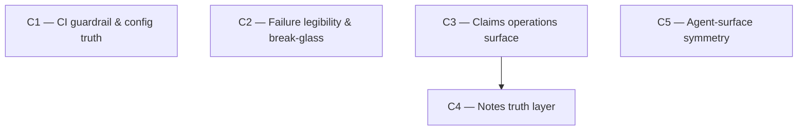

# Vision — Repo-wide quality consolidation (bugs, legibility, surfaces)

**Date:** 2026-06-10
**Scope:** whole repo — server, web, mcp-server, integrator-ref, shared, infra.
**Derived from:** a multi-agent review (5 parallel reviewers + direct spot-verification of every load-bearing claim) run 2026-06-10. Several reviewer claims were **killed on verification** and do not appear here (web error-state divergence — every list page already renders an explicit `{error && …}` block; `.env.example` lease-knob staleness — the knobs are present and commented; a claimed web type hole — typecheck is green).
**Relation to prior visions:** extends (does not supersede) `vision-20260606-claim-liveness-heartbeat.md` and `vision-20260609-notes-findings-inbox.md` — both fully shipped. This is the consolidation arc that pays down what those capability arcs deferred.

**Hard constraint:** the campaign `roadmaps/roadmap-20260610-notes-followups-hardening.md` is EXECUTING right now on branch `campaign-notes-followups-hardening` (P1 done @ 75fdb7b; P2–P4 in flight). Its scope — openapi drift-guard, drizzle snapshot rebuild, dedup OR-fallback, E2E stabilization — is off-limits here. Every campaign below assumes it lands.

---

## Where we are

Shipped and stable: the full merge train (7.1–7.6.1), claim liveness arc (C1–C3), notes inbox arc (C1–C3), setup/distribution UX, epic roadmap DAG, integrator config UI. ~1456 server tests; typecheck/lint green; all branches merged to main @ bb4052b and pushed.

What the review found still alive, by class:

1. **The repo is unguarded at the merge boundary.** `.github/workflows/` contains only gitleaks (`security.yml`) and tag-triggered npm publish (`release.yml`). No CI job runs typecheck/lint/test/build on push or PR — the brand-new openapi drift-guard only fires locally. `release.yml` builds and publishes without running a single test. Verified by reading both workflow files.
2. **Operator blind spots and missing break-glass exits.** Verified: `assertMemberLandableViaGroup` (merge-group.service.ts:1117) 409s on `groupId` presence *regardless of group state*, so a member of a `rejected`/`partially_landed` group has **no force-land path at all** — the R1 break-glass doesn't exist exactly where a human most needs it. `releaseLock` failure on the integrator is warn-and-continue (batch.ts ~1114) — the lane then stalls on the staleness sweep with no health surfacing. `claim-lease.service reclaimOne` silently skips null-project entities; `findSimilarOpenNotes` swallows FTS errors with no log; the MCP api-client discards non-JSON error bodies. Small verified correctness warts: `user.service.count()` loads all rows (user.service.ts:273); `POST /auth/setup` is check-then-create non-transactional. Medium-confidence: batch.ts:680 passes pickup-time-cached `resolvedFrom` to `maybeOpenResolution` instead of re-reading fresh.
3. **Shipped capabilities with no human surface.** The C3 handoff primitives — `release-to`, `request-takeover` — exist on REST + MCP but have **zero** web UI (verified: only `api-types.d.ts` mentions them). The stale-claim alert is a 4-second toast with no action and no page that lists stale claims. Claim badges exist on board/epics/roadmap but not on the task list or task detail.
4. **The notes truth layer was parked, and this arc is its named trigger.** The running campaign's roadmap parks server-side anchor enrichment + FTS search wiring with trigger "…OR the next time the notes list schema is opened for another reason." A consolidation arc opening that surface is that occasion. Today, a dangling anchor renders as a fake-valid short id — indistinguishable from a real one.
5. **The agent surface is asymmetric.** Agents can WRITE epic dependencies (`pm_link_epic_dependency`) but cannot READ the topology (no epic-graph/list-dependencies tool, while `epicGraphSchema` + the REST endpoint exist for the web). No `pm_list_labels` despite a `label_name` task filter. `claimState` mirrors in mcp api-client are inconsistent across Task/Proposal/Epic summaries.
6. **Config/docs truth drift (small, verified).** `PM_SESSION_SECRET` appears in `.env.example`, CLAUDE.md's env table, and `docs/design/high-level-design.md:1306` but is read **nowhere** in code (verified by grep across all packages). `.env.example` lacks `PM_POOL_SECRET`/`PM_POOL_NAME` (documented in mcp-server README only) and `PM_WEB_DIST_PATH`. Vitest is split 3.x/4.x across packages. The web bundle is a single 1.2 MB chunk (vite warns on every build).
7. **One observed timing-flaky test.** A full-suite run on 2026-06-10 under heavy machine load failed exactly one test: `integrator-ref tests/batch.test.ts:1101` — a wall-clock overlap assertion ("latest-start < earliest-end for ≥2 members") that requires real concurrency to materialize within the run. 292/294 integrator tests passed; all other packages green. This assertion will flake on slow shared CI runners — mapped to C1.

---

## The arc

Five campaigns. C1 is the structural seal everything else merges under; C2–C5 close, in order of urgency: operator recoverability, the claims human surface, the notes truth layer, and agent-surface symmetry.

---

### C1 — CI guardrail & config truth (Tier S, foundation)

**Goal:** every push to main is structurally verified (typecheck/lint/test/build in CI, tests before publish), and every config artifact tells the truth.

**Why this order:** first because every other campaign in this arc — and the in-flight one — merges under it. The openapi drift-guard that just shipped is only as good as the CI that runs it; today that CI does not exist.

**Removes:** dead `PM_SESSION_SECRET` from `.env.example` + CLAUDE.md env table + `docs/design/high-level-design.md:1306` (verified unused; document the actual auth mechanism in its place); the vitest 3.x/4.x split (unify on one major); the wall-clock concurrency-overlap assertion in `integrator-ref tests/batch.test.ts:1101` (observed flaking under load 2026-06-10 — replace with an instrumented concurrency probe, e.g. an in-flight counter peak inside the fake verify step, that proves overlap without depending on scheduler timing).

**Adds:**
- `.github/workflows/ci.yml` — on push/PR: `pnpm install --frozen-lockfile` → `typecheck` → `lint` → `test` → `build`. A separate `e2e` job (Playwright, ~12 min) added once the in-flight campaign's P4 lands 20/20 — **phase-pinned externally** (see DAG).
- `release.yml` verify gate: `typecheck` + `test` steps before the publish steps.
- `.env.example` completion: `PM_POOL_SECRET`, `PM_POOL_NAME`, `PM_WEB_DIST_PATH` (commented, with the same one-line discipline the lease knobs already use); CLAUDE.md env table synced.
- A docs-truth micro-pass: fix any CLAUDE.md claims falsified by the last two arcs (light touch — no restructuring).

**Tests:** CI itself is the test — a deliberately-broken PR must go red on each gate (typecheck error, lint error, failing unit test, drift-guard violation). Release workflow validated via `workflow_dispatch` dry-run or act, not a real tag.

**Scope:** small (2 workflow files, 2 config files, ~5 package.json bumps; 3–4 phases).

**Risk register:**
- *CI runs on ubuntu; the repo is developed on Windows.* Line-ending footguns are known here (the openapi `.gitattributes eol=lf` fix exists for exactly this). Mitigation: the drift-guard's byte assertions already normalize; run the suite once in CI early in the campaign and fix what surfaces — that is the campaign working as intended, not a blocker.
- *Vitest unification could destabilize integrator-ref/mcp-server suites* (currently on a different major). Mitigation: unify in its own phase, full suite gate; if a real incompatibility appears, document the split as intentional in both package.jsons and stop — documentation beats a forced upgrade. Coordination: land this phase when C2/C4 are not mid-flight adding server tests, to avoid test-infra churn under concurrent campaigns.
- *E2E in CI doubles feedback latency.* Mitigation: separate non-blocking job initially; flip to required after a week of green.

**Cost of not doing it:** every campaign in this arc (and every future one) merges on the honor system; the multi-agent workflow this project exists to support is exactly the workflow most likely to push a red commit unnoticed. One broken main during a 3-campaign concurrent arc costs more rework than this entire campaign.

---

### C2 — Failure legibility & break-glass completeness (Tier A)

**Goal:** no failure path in the train or server is silent, and every stuck state a human can encounter has a visible cause and an audited exit.

**Why this order:** these are the highest-severity verified findings — a `partially_landed` group member is currently recoverable only by manual git surgery on the host, which is precisely what Phase 7.4 promised to eliminate.

**Removes:** the unconditional `groupId != null → 409` in the force-land path (replaced by a group-state-aware guard) **and, jointly, the `status !== "integrating" → 409` transition guard for that case** — the two guards must widen together or the change is a no-op: a partial-group's stuck outer member has status `rejected` (see the `markPartiallyLanded` sequencing, merge-group.service.ts:993-996), so it would still 409 at train.service.ts:705 after the group guard alone is relaxed. Also removes: the warn-and-continue-only handling of `releaseLock` failure; the silent `catch → []` / silent-skip patterns named below.

**Adds:**
- **Group-state-aware force-land** (train.service.ts:698+705 + merge-group.service.ts:1117). The widened legality matrix, explicitly:
  - non-grouped member: unchanged — `integrating` → force-landable; `rejected`/anything else → 409 (today's behavior, byte-identical).
  - grouped member, group `forming`/`integrating`: 409 `GROUPED_MEMBER` (the atom is live — unchanged).
  - grouped member, group terminal (`rejected`/`partially_landed`), member status `rejected`: **force-landable** — reason-required, audited `force_land` with the group id in the payload. This is the new recovery path.
  - an `orphaned`-marked inner member: stays 409 (its landed SHA already exists; recovery is roll-forward or incident resolution, not force-land).
  Consistent with force-land's existing contract: PM records the operator-asserted `landedSha` and never runs git, so the never-advance-unverified-gitlink invariant is untouched. Operator guide §15 updated with the partially-landed-group recovery runbook.
- **Lane-stuck-on-failed-release surfacing:** when the integrator's `releaseLock` fails, record it on the next heartbeat payload (or a dedicated health flag) so `GET .../integrator/health` and the train dashboard show *why* the lane is idle, instead of a log line on a remote host.
- **`resolvedFrom` fresh re-read** at the conflict seam (batch.ts:680): re-fetch the request before `maybeOpenResolution`; non-fatal on fetch error (skip resolution, log) — makes the no-recursion invariant airtight rather than pickup-snapshot-dependent.
- **Verify-cache config guardrail:** PATCH-time validation warning (and an Integrator settings page hint) when `cache_mode: "on"` while any step has empty/absent `cache_key_inputs` — the documented false-pass precondition becomes visible at the moment it's configured, not after an incident.
- **Silent-swallow eradication (slot-ins):** warn-log in `findSimilarOpenNotes` catch (**phase-pinned**: this function is being rewritten by the in-flight campaign's P3 — do not touch until P3 lands); warn-log when `reclaimOne` skips a null-project entity; mcp api-client preserves non-JSON error bodies via `res.text()` fallback; `user.service.count()` → SQL `COUNT`; `POST /auth/setup` made transactional (check-and-create atomically).

**Tests:** new route tests for the full force-land legality matrix above (each row, including orphaned-inner → 409 and the non-grouped rows proven byte-identical); integrator test for heartbeat-after-failed-release; resolver test that a mid-flight `resolved_from` write blocks resolution; config-PATCH warning test; unit tests for each de-silenced path. Existing 7.x invariant suites stay green untouched.

**Scope:** medium (~10 files across server + integrator-ref + mcp-server, plus the Integrator settings page in web for the cache-config hint; 5 phases).

**Risk register:**
- *Force-land semantics for terminal groups must not re-break group atomicity.* The guard change is read-only on group state; members of live groups remain untouchable. The one real design question — should force-landing the last stuck member auto-resolve the group's incident? — is a commander decision (recommended: yes, `human_resolved`, same transaction).
- *Heartbeat payload change touches the integrator↔PM contract.* Additive optional field only; old integrators keep working (the route schema must tolerate absence).

**Cost of not doing it:** the next `partially_landed` incident on game_one requires SSH + manual git against a live train — the exact failure mode 7.4 was built to retire; silent FTS/reclaim failures quietly corrode trust in liveness and dedup data, which gets misdiagnosed as "the feature doesn't work."

---

### C3 — Claims operations surface (Tier A, user-visible)

**Goal:** humans can see every claim's liveness in one place and act on it — the shipped release-to/request-takeover primitives get their missing web surface.

**Why this order:** highest-leverage user-visible gap. The C3-liveness arc shipped the entire claims state machine and alerting, then stopped one step short: the alert is a 4-second toast pointing nowhere, and the handoff primitives are invisible to the people they were built for.

**Removes:** the dead-end stale-claim toast (gains an action); the raw epic-ID text input in the promote-to-task dialog (replaced by a picker); over-broad cross-project invalidations in `use-notes.ts`.

**Adds:**
- **Claims panel** (`/projects/{id}/claims` or a board-adjacent panel): all claimed tasks/epics/proposals with `claim_state` (live/stale/yours), holder (humans may see holders — `assigneeId` is already the human-facing pointer), and age. Built from existing list endpoints + `claim_state` filters; add a thin aggregate endpoint only if composition proves too chatty (commander judgment).
- **Handoff actions:** release-to (worker picker) and request-takeover buttons wired to the existing REST endpoints, with the stomp-safety semantics surfaced in the UI copy (live → notify-holder; stale → auto-grant). Stale-claim toast gains "View claims →".
- **Claim badge parity:** `ClaimStateBadge` on task-list-page and task-detail-page (it already exists on board/epics/roadmap).
- **Epic picker** in the promote-to-task dialog (combobox over `useEpics`, replacing free-text ID entry).
- **Slot-ins:** project-scoped invalidation keys in `use-notes.ts`; route-level code-splitting (TanStack lazy routes) to retire the 1.2 MB single-chunk vite warning.

**Tests:** component tests for the claims panel states (live/stale/yours/empty) and both handoff dialogs; an E2E flow — claim → stale (injected) → takeover auto-grant — following the existing E2E idiom; badge render tests on task list/detail; bundle-split smoke (build emits >1 chunk).

**Scope:** medium (1 new page + 2 dialogs + hooks + badges; ~5 phases).

**Risk register:**
- *Identity masking vs. the panel.* `claim_state` is deliberately holder-masked; the panel must source holder names from entity `assigneeId` (human-facing by design), not from the lease layer. Keep the layers distinct or the masking invariant erodes.
- *Worker picker needs a users/agents listing* — an admin users endpoint exists for settings; reuse, don't invent.
- *Code-split can break deep-link first-paint* — verify each lazy route renders standalone in E2E.

**Cost of not doing it:** stale-claim alerting trains operators to ignore it (un-actionable alerts are noise); humans fall back to force-claim for routine handoffs — audit noise and a stomping risk the takeover primitive exists to prevent; an entire shipped capability (handoff) sits unused.

---

### C4 — Notes truth layer: anchor enrichment + server-side search (Tier B)

**Goal:** every anchor and promoted-target on a note renders truthfully ({exists, title} from the server — "(removed)" when gone), and inbox + command-palette search use the server FTS that already exists.

**Why this order:** this is the parked bundle from the running campaign, and its own roadmap names this arc's condition: "the next time the notes list schema is opened." After C3 (which touches the same web files), this campaign opens that surface once and does both halves, exactly as the parking rationale prescribed.

**Removes:** the three client-side entity maps in notes-page (50-cap, the source of fake-valid dangling ids); client-side `notes.filter(...includes(q))` search; the command palette's client-side-only search path.

**Adds:**
- `enrichNotes()` in note.service `list`/`getById` (mirroring the `enrichActivityEntries` precedent — batched `inArray` per entity type): `anchor: {exists, title}` + `promotedTarget: {exists, title}`; route schema + `openapi:export` regen (now drift-guarded, per the in-flight campaign's P1).
- A generic `search()` wrapper in web `api.ts`; hybrid inbox (structured filters via list, free-text via `/search?entity_type=note`) with the documented join strategy for rendering full cards from `{entityId, …}` hits; command palette adopts the same wrapper.
- Truthful dangling rendering: "(removed)" with the dismiss-vs-keep affordance that implies.

**Tests:** service tests for enrichment (existing/missing/mixed anchors, batching); route schema tests; drift-guard green after regen (the structural seal doing its job); web tests for "(removed)" rendering and hybrid search; palette search parity test.

**Scope:** medium (note.service + route + openapi regen + notes-page/palette refactor; ~4 phases).

**Risk register:**
- *Search hits aren't full Note rows.* Named in the parking note: resolve by hydrating hits through the list endpoint (ids filter) or a one-shot batched get — decide by measuring, not by taste.
- *Enrichment cost on large inboxes* — batched `inArray` per type, and the `(anchor_type, anchor_id)` index already exists.

**Cost of not doing it:** dangling anchors keep rendering as plausible ids — humans and agents navigate to dead ends and silently lose trust in the inbox; the trigger condition (note volume) arrives *after* the damage is normalized.

---

### C5 — Agent-surface symmetry (Tier B)

**Goal:** an AI agent can read everything it can write — epic-dependency topology and labels become readable, and liveness fields surface uniformly across all entity renders.

**Why this order:** last because it's the smallest and depends on nothing; concurrent-eligible with everything.

**Removes:** the liveness blind spot in the proposals tool renders — `tools/proposals.ts:50,93` renders `claimStatusLabel` only, while the epics and tasks tools render the liveness-aware `claimStateLabel`; unify on the liveness-aware render. (Note: the *type mirrors* are fine — `claimState?` is present on all three summaries in api-client.ts:176/407/924; the gap is render-only.)

**Adds:**
- `pm_get_epic_graph(project_id)` — read tool over the existing epic-graph REST endpoint (`routes/epic-graph.ts`, already consumed by the web roadmap view); renders nodes + dependency edges + status so an agent can see topology before calling `pm_link_epic_dependency`. Today `pm_get_epic` renders **no dependency information at all** — the asymmetry is total, not partial.
- `pm_list_labels(project_id)` — wraps the existing `GET /projects/{projectId}/labels` (labels.ts:98); kills blind `label_name` filtering (tools/tasks.ts:46).
- Render/description polish, concretely scoped: `pm_get_proposal`/`pm_list_proposals` adopt `claimStateLabel`; merge-request tool descriptions state explicitly that MRs are integrator-owned, not claimable; an audit pass over the tool renders confirming every render includes the entity ids needed for follow-up calls (fix any that don't, as part of this campaign — not a standing obligation).

**Tests:** mcp-server tool tests (the existing tools.test.ts harness) for both new tools + the proposals liveness render.

**Scope:** small (mcp-server tools + tests only; ~3 phases). This sits at the floor of campaign-hood; if planning shrinks it further, the commander demotes it to slot-ins on C2 (which already touches mcp api-client.ts) rather than running it standalone.

**Risk register:**
- *Epic-graph render size on big projects* — render compactly (one line per epic + edge list); no pagination needed at this team scale, but cap with a count header so truncation is visible, never silent.

**Cost of not doing it:** agents keep linking epic dependencies blind (the asymmetry invites cycles and duplicated edges that humans then untangle on the roadmap view); blind label filtering produces silent empty results agents misread as "no tasks."

---

## Sequencing DAG



**Phase pins (external):**
```
C1's E2E CI job unblocked when the in-flight campaign (roadmap-20260610-notes-followups-hardening) reaches P4 ("E2E stabilization", 20/20)
C2's findSimilarOpenNotes warn-log slot-in unblocked when the in-flight campaign reaches P3 ("dedup two-pass OR-fallback") — it rewrites that exact function
C4 assumes the in-flight campaign's P1 (openapi drift-guard) — already landed @ 75fdb7b
```

**Adjacency list:**
```
depends_on:
  C1: []
  C2: []
  C3: []
  C4: [C3]
  C5: []
concurrency_pairs: [(C1,C2), (C1,C3), (C1,C4), (C1,C5), (C2,C3), (C2,C4), (C2,C5), (C3,C5), (C4,C5)]
phase_pins:
  - {downstream: C1, upstream: roadmap-20260610-notes-followups-hardening, unblock_phase: P4, scope: "E2E CI job only — the rest of C1 starts immediately"}
  - {downstream: C2, upstream: roadmap-20260610-notes-followups-hardening, unblock_phase: P3, scope: "findSimilarOpenNotes warn-log slot-in only — the rest of C2 starts immediately"}
```

**Rationale:** the only hard edge is C3 → C4: both rewrite `notes-page.tsx` and `use-notes.ts` (C3 adds the epic picker — which lives inside notes-page.tsx — and fixes invalidation keys; C4 refactors the same page's anchor rendering and search) — concurrent execution would conflict in-file, and C3 first means C4's refactor lands on the corrected query-key idiom. C1 is sequenced *first by recommendation* but has no inbound code dependency — it touches only workflow/config files, so it is concurrency-eligible with everything (its value is maximal when it lands before the others merge, which is an ordering preference, not a DAG edge). C2 lives in server/integrator-ref files untouched by C3/C4/C5 (its one web touch is the Integrator settings page, which no other campaign opens). C5 touches mcp-server only after the verifier killed the shared enum move, so the (C4,C5) pair is genuinely safe — C4 edits the canonical `shared/src/schemas/note.ts`, which C5 no longer opens.

**Coordination note for the commander:** one campaign (notes-followups-hardening) is already executing in this working tree. Any campaign from this vision started before it completes must run on its own branch from a fresh base and must not touch `packages/server/tests/openapi-drift.test.ts`, `packages/server/src/db/migrations/meta/`, `note.service.ts` dedup internals, or `tests/e2e/` until it lands.

---

## Cross-campaign invariants (green at every commit)

- `pnpm typecheck`, `pnpm lint`, `pnpm test`, `pnpm build` — and from C1 onward, the same four in CI.
- The openapi drift-guard test (any route/schema change ships its regenerated `openapi.json` in the same commit — C4 is the first big exercise of this seal).
- Merge-train safety defaults unchanged: `cache_enabled: false`, `cache_mode: off`, `resolver.enabled: false`, `PM_LEASE_MODE=shadow`, `parallelism: 1`. No campaign here flips an operator posture.
- The masked-claim-state invariant: no claim_state payload ever carries a holder id (C3's panel reads holders from entity assignee fields, never the lease layer).
- E2E 20/20 once the in-flight P4 lands; no new flake-masking (no added retries/sleeps).

## Out-of-scope for this arc (parked)

- **LFS-aware orphan-recovery roll-forward** (deferred from xrepo-hardening; recovery is fail-loud today so the failure mode is bounded escalation, not corruption). Trigger: the first `orphaned_inner` incident on an LFS-bearing repo.
- **Semantic verify-failure resolution** (7.6 v2 deferral) — conflict-only remains the resolver contract.
- **CLAUDE.md restructuring** (the merge-train section is a context-cost wall for every agent session). Real, but high-risk-of-information-loss work that deserves its own deliberate pass. Trigger: agent-context cost pain or the next major subsystem addition.
- **Notes inbox pagination/virtualization** — C4 fixes search and truth; raw list volume is fine at current scale. Trigger: >1000 notes/project.
- **PM_LEASE_MODE=on flip** — operator decision, explicitly not a campaign (C1-liveness made it safe; the posture change is the user's call).
- **Auth/session hardening** — C1 removes the dead `PM_SESSION_SECRET` and documents the actual mechanism; a deeper auth audit (token rotation, session expiry) is next-arc material if LAN-multi-user usage grows.

## Recommended single starting point

**C1.** It is the smallest campaign in the arc and the only one that makes every *other* campaign — including the one executing right now — safer to land. Until it ships, the project's celebrated verify discipline exists only inside campaign processes, not in the repo itself.

## Open questions (commander authority)

Resolution rule: when the user is unavailable, the commander resolves using the campaign's stated quality criteria and the cross-campaign invariants — don't pause.

1. **C1:** ubuntu-only CI vs. a windows-latest matrix leg. Recommended: ubuntu-only blocking + windows non-blocking weekly (the dev machine is Windows; CI's job is to catch the *other* OS).
2. **C2:** does force-landing the last stuck member of a `partially_landed` group auto-resolve its `orphaned_inner`/group incident? Recommended: yes, `human_resolved`, same transaction, one audit row.
3. **C3:** claims panel as its own route vs. a board-adjacent drawer. Recommended: own route (linkable from the alert toast), drawer later if usage wants it.
4. **C4:** search-hit hydration strategy (ids-filter list call vs. batched gets) — measure both on a seeded 500-note project, pick the simpler one that's fast enough.
5. **C5:** epic-graph render format (adjacency list vs. indented tree) — pick whichever the existing roadmap-layout tests suggest agents parse more reliably; no new format invention.

---

## Rejected by verifier (Phase 2 record)

- **NOTE_* enum move from schemas/ to constants/** (was a C5 item): cosmetic churn tied to no observed bug — fails the speculation standard — and it was the *sole* source of a real (C4,C5) file collision on `shared/src/schemas/note.ts`, where the canonical noteSchema and the enums live in the same file. Killed; the (C4,C5) concurrency pair is safe as a direct result.
- **"claimState mirrors inconsistent across api-client summaries"** (was a C5 claim): false as stated — all three summary types carry `claimState?` (api-client.ts:176/407/924). The real gap is render-only (`tools/proposals.ts:50,93` uses `claimStatusLabel` while epics/tasks use the liveness-aware `claimStateLabel`); C5 was re-pointed at the render.
- **Authz-at-service-boundary campaign** (considered in Phase 1, never drafted): the train's break-glass code *deliberately* bypasses ai_agent-gated service functions (train.service.ts:675 does its own `requireAdmin`), so a blanket relocation of authz into services contradicts the existing, intentional layering — and no incident has ever been observed from route-level enforcement. Verifier concurred with the omission.
- **Review-agent claims killed before drafting** (recorded so they aren't re-reported by future reviews): web error-state divergence (every list page renders `{error && …}`); `.env.example` lease-knob staleness (present, commented); a web `variables.projectId` type hole (typecheck green); claim badges missing from the *board* (present — the real gap is task list/detail); "setup race" reviewer scenario as originally described (the atomic-UPDATE claim paths are safe; the real race is only in `/auth/setup` first-admin creation, which C2 fixes).
