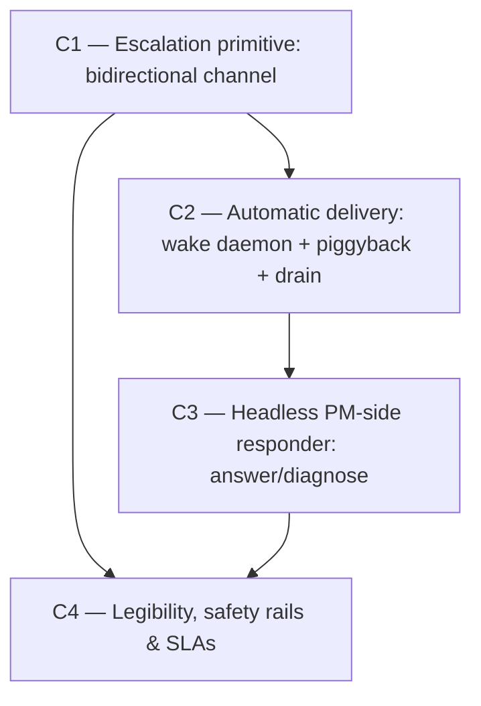

# Vision — Agent-to-Agent Escalation Channel (cross-team, no-human-relay)

**Date:** 2026-06-13
**Scope:** Reliable, structured, bidirectional communication between client-repo
agents (game_one workers) and the PM-team agents — eliminating the two-human-hop
relay that today carries platform complaints (MCP tooling / merge train /
integrator failures), reactions, and instructions.
**Author role:** Systems architect of cross-process agent coordination.
**Status:** PROPOSED — Phase-2 adversarial-verified (REVISE applied; verdict + the
campaigns the verifier killed are recorded at the foot).

---

## Where we are

The PM monorepo already has every substrate this needs — but no channel that
connects them across the team boundary.

**Shipped and load-bearing:**

- **Notes inbox** (`packages/server/src/services/note.service.ts`, vision
  `vision-20260609-notes-findings-inbox.md`) — an *ownerless, one-directional*
  capture surface (bug/question/idea/…), with FTS dedup, triage lifecycle, an
  enrichment layer, and an edge-triggered backlog alert. Explicitly **"no claim,
  no comments"** — no thread, no addressee, no reply, no lifecycle past
  `open→triaged`. The closest prior art; structurally one-way.
- **Comments** (`routes/comments.ts`, `COMMENT_TYPES` in
  `constants/enums.ts`) — typed, metadata-carrying, threaded *onto tasks /
  proposals*. The threaded-message shape we reuse; bound to work items, not to a
  cross-team conversation.
- **SSE event stream** (`routes/events.ts`, `events/event-bus.ts`) — `onAll`
  fan-out of every domain event to subscribers. **But agents are not event-loop
  consumers**: a Claude Code worker runs in discrete prompt-driven turns with no
  always-on listener, so an SSE frame never reaches the agent's reasoning on its
  own. This premise is the spine of C2 — and we apply it honestly this time (the
  *agent* needs an out-of-band wake, exactly like the integrator daemon exists
  because agents aren't listeners).
- **Discord out-of-band alerts** (`events/alerts-listener.ts`) — one-way, to
  *humans*. Good for "page a human", wrong as an agent transport.
- **7.6 / 7.6.1 headless resolver** (`packages/integrator-ref/src/resolver-runner.ts`,
  `resolver-pool.ts`, `reclaim-resolutions.ts`) — a **proven** bounded headless
  agent: spawns `claude -p` against a status-sentinel contract
  (`PM_RESOLUTION_STATUS_PATH`), wall-clock + token budget, `SIGTERM→SIGKILL` via
  `killTree`, an **injectable runner seam** for tests, runs **off the lane lock**
  in its own pool, with a **reclaim sweep** for stranded sessions. The template
  for both the PM-side responder (C3) and the client-side wake daemon (C2).
- **C1 stable worker identity** (`PM_WORKER_KEY`,
  `docs/design/phase-c1-stable-worker-identity.md`) — a durable address per
  worker across reconnect/reboot. The **precondition for directed messaging** and
  the key the client-side wake daemon polls on.
- **Claim-lease engine** (C2 liveness) + **automation recursion guard**
  (`MAX_AUTOMATION_DEPTH = 3`, `_automationDepth` propagation in
  `automation.service.ts`) — liveness/reclaim and loop-depth seals reused verbatim.

**The named gap (the bug class this arc closes):** there is **no bidirectional,
directed, durable channel** between a client-repo agent and the platform-team
agents. The current process is a **lossy two-human-hop relay**:

```
client agent hits a problem
  → complains to its human
    → human forwards complaint + reasoning to PM-team agents
      → PM agents react (instructions, or code changes)
        → human relays the reaction/instructions back
          → client agent acts
```

Concrete accumulating pain (the user reports this has happened **several times**):
coordination latency bounded by human availability (hours–days), lossy paraphrase
across two relays, **no durable audit trail** of platform issues, no dedup (the
same MCP-tooling complaint is re-litigated from scratch each time), and no
liveness/SLA on whether a complaint was ever answered.

---

## The arc

Four campaigns, foundation-first. C1 installs the channel (and **alone removes the
human as the transport**); C2 makes the client *notice* replies automatically —
including the dormant/ended-worker case, via a client-side wake daemon; C3 makes
the PM side *respond* automatically (answer/diagnose); C4 makes the loop legible
and safe. Auto-implementing code changes, and a self-improving knowledge base, are
explicitly **parked to a follow-on vision** (see foot) — they are speculation
until C3 has run in shadow and produced real data.

### C1 — Escalation primitive: the bidirectional, directed, durable channel
- **Goal:** A client agent can raise a typed, directed, durable issue to the
  platform team and exchange a threaded conversation with it — entirely
  agent-to-agent, no human in the transport.
- **Tier:** S (foundation).
- **Why this order:** every other campaign consumes this entity and its events.
  Nothing can be delivered (C2), auto-answered (C3), or observed (C4) until the
  channel and its lifecycle exist.
- **Removes:** the human-relay *process* (replaced; documented in
  `docs/worker-pm-workflow.md` + a new client-facing section); the temptation to
  overload the deliberately-ownerless notes primitive with threading/addressing.
- **Adds:**
  - `escalations` table + `escalation_messages` thread table (new migration). An
    escalation carries: `kind` (`bug_report | question | request | blocked`),
    `title`, `body`, optional `code_locator` + `anchor` (reuse note shapes), an
    **origin** dimension (`origin_repo`, `origin_worker_key` — from
    `PM_WORKER_KEY`), a **target** (project / team), a **lifecycle**
    (`open → acknowledged → answered → resolved`, plus `needs_human`), and a
    `severity`. Messages reuse the comment shape
    (`{body, commentType, metadata, authorId}`) and carry a **monotonic per-thread
    sequence number** (the ordering contract C2's delivery cursor rides on).
  - `@pm/shared` Zod schemas (canonical Zod-3 + route-local Zod-4 mirror, the
    established split) + OpenAPI.
  - REST surface (`routes/escalations.ts`) + service
    (`services/escalation.service.ts`).
  - **Symmetric MCP tools** (client and PM agents call the same set):
    `pm_raise_escalation`, `pm_reply_escalation`, `pm_get_escalation`,
    `pm_list_escalations`, `pm_resolve_escalation`, `pm_escalate_to_human`.
  - `escalation.*` SSE events (`opened / acknowledged / replied / resolved /
    needs_human`), `onAll`-forwarded with additive id projection.
  - An `audit_log` row per message/transition (reuse the append-only audit table).
  - **Cross-project authz model (explicit):** an escalation crosses a team/project
    boundary that notes never do. A pool worker authenticated against *any*
    project may RAISE an escalation targeting the platform project (this is the
    intended cross-team report path); REPLY is open to the origin author, any
    PM-side holder, or any human; RESOLVE is restricted to the origin author or a
    human (mirror the note-dismiss `author-or-human` rule, `note.service.ts:334`),
    plus the PM-side holder under a claim-lease. Specified and tested in C1, not
    deferred.
- **Tests:** server route + service tests (lifecycle state-machine; cross-project
  authz matrix; cross-project isolation; per-thread sequence monotonicity), shared
  schema tests, MCP tool tests against a stub API, and a round-trip integration
  test (client raises → PM replies → client reads → resolve).
- **Scope:** large. ~12–16 files. P1 schema/migration → P2 service+lifecycle+authz
  → P3 REST → P4 MCP (both sides) → P5 SSE+audit → P6 docs+e2e seal.
- **Risk register:**
  - *New-entity-vs-extend-notes ambiguity* → notes stay byte-identical; the
    escalation entity is additive and *composes* note/comment shapes rather than
    mutating them. (Verifier confirmed: extending notes would break their
    ownerless/terminal-on-triage contract — a separate entity is the honest reuse.)
  - *Cross-team authz* → the explicit matrix above; modeled on note-dismiss +
    claim-lease.
- **Cost of not doing it:** the relay stays human-gated forever; no audit trail of
  platform issues ever accrues; every later campaign is impossible.

### C2 — Automatic delivery: the client notices replies with zero human prompting
- **Goal:** An originating agent becomes aware of a reply **without a human
  prompting it** — including when its worker session has *ended* — the crux of
  "how does the agent notice, automatically."
- **Tier:** A (user-visible behavior; the headline mechanism of the whole arc).
- **Why this order:** C1 makes replies exist and be readable; C2 makes them
  *arrive*. C3 (the auto-responder) is undemonstrable and useless until a reply
  can be automatically noticed, so **C3 hard-depends on C2**.
- **Removes:** the human as the *notifier* ("go check PM").
- **The honest model (three surfacing paths; the daemon is the structural one):**
  A Claude Code worker only reasons during prompt-driven turns and has no always-on
  listener. Therefore **no worker-side mechanism alone can guarantee noticing** —
  the structural guarantee must live in an always-on out-of-band process, exactly
  as the integrator daemon exists because agents aren't listeners.
  1. **Client-side wake daemon (the structural mechanism — ADD):** an always-on
     process on the client host, holding each worker's `PM_WORKER_KEY`, that polls
     (or server-long-polls — the blocking wait belongs *here*, where blocking is
     free, never in a worker tool call) for undelivered directed replies and, on
     arrival, **starts a fresh worker turn** seeded with the reply. This is what
     makes noticing structural for the **idle-but-alive** *and* the **ended/dormant**
     worker (the common "submit-a-merge-and-walk-away" case). It is the direct
     analog of the integrator/responder daemon and reuses the same spawn/budget
     utilities. Shippable as part of the game_one distribute bundle (alongside the
     per-worker `PM_POOL_*` / `PM_WORKER_KEY` it already emits).
  2. **Piggyback (opportunistic, best-effort — keep, demoted):** any `pm_*` tool
     response appends an `📬 unread reply(s)` envelope when the caller's identity
     has undelivered directed messages. Zero-cost surfacing for the *already-active*
     worker; capped to top-N + a "call pm_check_messages for the rest" tail.
     **Explicitly NOT the guarantee** — it only fires on a tool call inside a live
     turn.
  3. **Drain `pm_check_messages` (explicit pull — keep):** the `pm_check_updates`
     precedent (`updates.ts`), for a loop-boundary pull.
  - Optional out-of-band **Discord ping** *only* for `needs_human` escalations
    (human re-enters for approval/awareness, **never** as the transport).
  - Backed by a per-identity **delivery cursor** keyed off the C1 per-thread
    sequence number (a delivered message is never re-surfaced; "have I seen all
    replies" is answerable).
  - **DROPPED by the verifier:** a worker-facing blocking `pm_await_reply` tool.
    A server-side long-poll inside a worker's synchronous MCP tool call **freezes
    the agent's entire turn** for up to the timeout (and a C3 reply can take
    *minutes* — a whole headless session), burning context on a blocked pipe. The
    blocking wait is correct only in the wake daemon, never in the agent's tool loop.
- **Tests:** wake-daemon test (an injected unread reply for an identity triggers a
  worker-turn spawn; none when empty); piggyback-injection test (envelope appears
  iff unread directed messages exist; absent → byte-identical legacy response);
  cursor-advance test (delivered message not re-surfaced); drain-tool test.
- **Scope:** medium–large. Wake daemon (client-side, reuses spawn utils) + delivery
  service + cursor + MCP piggyback wrapper + drain tool. P1 cursor+outbox+sequence
  → P2 wake daemon (the structural core) → P3 piggyback wrapper → P4 drain tool →
  P5 Discord needs-human bridge + bundle wiring.
- **Risk register:**
  - *Wake daemon spawns a worker turn that has nothing else to do* → mitigation:
    seed the turn with the reply + the originating escalation context so it acts
    immediately; rate-limit wakes per identity.
  - *Piggyback noise* → top-N cap + cursor advance.
- **Cost of not doing it:** the client only learns of a reply when its human says
  to look — the human stays the *notifier* even though the channel is
  bidirectional. The arc fails its headline goal, and the ended-worker case (the
  common one) is never covered at all.

### C3 — Headless PM-side responder: auto-react without a human (answer/diagnose)
- **Goal:** A new escalation is triaged, investigated, and **answered** (or
  escalated to a human) automatically by a bounded PM-side agent — closing the
  loop with no human in the transport.
- **Tier:** A (the autonomous reaction the user asked for), large.
- **Why this order:** hard-depends on C1 (entity/events) and C2 (its replies must
  be automatically noticeable). Built on the **proven, verified** 7.6 resolver
  machinery, generalized from "resolve a git conflict" to "respond to an
  escalation."
- **Scope boundary (verifier-enforced):** C3 is **answer/diagnose ONLY**. The
  responder may reply with diagnosis + instructions/workarounds, or **open a
  proposal** for the platform team, or **escalate to a human**. It does **NOT**
  author code that lands — *auto-implement via the merge train is carved out to a
  follow-on arc* (a different, higher risk class that must not ship under cover of
  the safe half).
- **Removes:** the human as the *reactor* (in `on` mode) for answerable
  escalations — diagnosis/workarounds/answers no longer wait on PM-agent human
  availability.
- **Adds:**
  - A **PM-side responder daemon** (mirror `integrator-ref`'s process model — the
    PM server **never** spawns Claude or runs git). It subscribes to
    `escalation.opened`, **claims** the escalation via the claim-lease engine (one
    responder per escalation), and spawns a bounded headless Claude **in the PM
    repo** reusing `resolver-runner`'s exact contract: `claude -p`, a status
    sentinel (`answered | needs_human | give_up`), wall-clock + token budget,
    `SIGTERM→SIGKILL` via `killTree`, an **injectable runner** for tests, an
    isolated **responder pool**, and a **reclaim sweep** for stranded sessions
    (the 7.6.1 mechanism).
  - **Safety discipline (repo idiom):** `responder.enabled` **default false**;
    `responder.mode: off | shadow | on` **default shadow** — shadow *drafts* the
    reply and routes it to a human for approval (Discord) instead of auto-sending.
    The discipline is **shadow → observe answer quality → on**.
  - **Permanent human-approval boundary (not just a shadow rung):** certain
    escalation classes **always** route through a human approval gate even at
    `on` — `needs_human`, high-severity, and anything the responder flags
    low-confidence. `on` removes the human for *routine answerable* escalations,
    not universally. This boundary is a named config, not an emergent property of
    the mode flag.
  - **Runaway seals:** responder-authored messages carry a flag and **never
    re-trigger a responder** (mirror 7.6 `resolved_from` + `MAX_AUTOMATION_DEPTH`);
    one-active-responder-per-escalation lease; global concurrency cap + per-window
    spawn budget; the kill-switch.
- **Tests:** injectable-runner tests scripting each outcome
  (answered / needs_human / give_up / timeout / spawn_error) — no real Claude
  binary; lease-contention test (one winner); no-recursion test (a responder reply
  does not enqueue another responder); reclaim-sweep test; shadow-mode test (reply
  drafted, not auto-sent); approval-boundary test (a high-severity escalation
  routes to human even in `on`).
- **Scope:** large. New responder daemon module (sharing the integrator-ref
  runtime) + service wiring + config schema + tests. P1 daemon skeleton +
  queue/claim → P2 responder-runner (reuse) → P3 answer outcome → P4
  needs_human/give_up + escalate → P5 shadow mode + approval boundary → P6
  no-recursion + reclaim seals.
- **Risk register:**
  - *An autonomous agent answering wrongly* → default shadow (human-approved),
    answer-only (no code mutation), permanent approval boundary for risky classes,
    full audit trail, kill-switch.
  - *Stranded `responding` sessions* → the 7.6.1 reclaim sweep, reused.
  - *Spawn storms from an escalation flood* → concurrency cap + spawn-rate budget +
    C4 dedup folding duplicates into one thread (one spawn).
- **Cost of not doing it:** the PM side reacts only at human cadence; the channel
  is bidirectional but the *response* stays human-bottlenecked. This is the
  campaign that delivers the "automatic flow" — correctly gated behind shadow and
  an answer-only boundary.

### C4 — Legibility, safety rails & SLAs
- **Goal:** The channel and its autonomous responder are observable, rate-limited,
  dedup'd, and self-alerting — a human can audit every exchange and is paged when
  an escalation goes unanswered. This is the gate that makes the `shadow → on` flip
  responsible.
- **Tier:** A.
- **Why this order:** you cannot responsibly run C3 in `on` without observability,
  rails, and dedup.
- **Removes:** blind spots — silent unanswered escalations, duplicate-complaint
  re-investigation, unbounded responder spend.
- **Adds:**
  - Web **dashboard** (`/projects/{id}/escalations`) + per-escalation **timeline**
    (open → ack → messages → resolve/needs_human), reusing the train-dashboard /
    note-inbox web patterns.
  - **Metrics** (on-read): time-to-first-response p50/p95, auto-resolve rate,
    human-escalation rate, reopen rate, responder budget utilization, open-backlog
    age.
  - **Edge-triggered unanswered-SLA alert** (`escalation.sla_breached`, latched,
    re-arms on resolution — `train.stuck` / `note.backlog_alert` parity) → SSE
    banner + Discord.
  - **Anti-spam:** client-side rate limit + **FTS dedup** (the
    `findSimilarOpenNotes` precedent, `note.service.ts:502`) auto-linking a
    duplicate complaint to the existing open thread instead of opening a new one
    (and short-circuiting a responder spawn).
  - The C3 runaway seals surfaced as tested, monitored invariants.
- **Tests:** dashboard component tests, metrics computation tests, edge-trigger
  latch test (fires once per unanswered episode, re-arms), dedup-link test
  (duplicate folds into the open thread, no second responder spawn).
- **Scope:** medium–large. Web pages + metrics service + alert listener + dedup.
  P1 dashboard+timeline → P2 metrics → P3 SLA alert → P4 dedup/rate-limit → P5 e2e
  seal.
- **Risk register:** *alert fatigue* → edge-triggered + latched (not per-tick), the
  established idiom.
- **Cost of not doing it:** `on`-mode C3 runs blind; unanswered escalations rot
  silently; the same complaint spawns a fresh investigation every time.

---

## Sequencing DAG



Adjacency list (for `/campaign`):

```
depends_on:
  C1: []
  C2: [C1]
  C3: [C1, C2]
  C4: [C1, C3]
concurrency_pairs: []
phase_pins: []
```

**Rationale for the edges:** C2/C3/C4 all read the `escalations` entity + events,
so each hard-depends on C1. **C3 depends on C2** (not concurrency-eligible — the
verifier's correction): a responder whose replies cannot be automatically noticed
is not demonstrable or useful, so the delivery path must land first. C4 depends on
C3 because the dashboard/metrics/SLA observe the responder and the rails bound it.
This arc is a straight chain C1 → C2 → C3 → C4 — no speculative parallelism.

---

## Cross-campaign invariants (green at every commit)

- Notes, comments, proposals, tasks, the merge train, the claim-lease engine, and
  the SSE projection stay **byte-identical** — the escalation channel is purely
  additive.
- The **PM server never spawns Claude and never runs git** — all headless work is
  daemon-side (the integrator/responder/wake-daemon split), preserving the
  server's purity.
- **Every escalation message and transition is audited** (append-only `audit_log`),
  with a **monotonic per-thread sequence** as the ordering contract.
- **A client agent never needs a human to notice a reply** — guaranteed by the C2
  **client-side wake daemon** (covers idle *and* ended workers), with piggyback +
  drain as opportunistic fast paths. (This is the corrected, honest invariant —
  piggyback alone does NOT guarantee it.)
- The responder is **fail-safe**: `off | shadow | on`, bounded budget,
  no-recursion, claim-leased, reclaimable, kill-switchable, **answer-only** (no
  code lands autonomously in this arc). `main` is never at risk.
- **PM-server-down fallback (named, load-bearing):** the escalation channel needs
  the PM server, which is exactly the dependency a "merge train / integrator
  failure" complaint may be unable to reach. When the server is unreachable the
  client agent **falls back to the human relay** for that one escalation (and the
  wake daemon retries delivery on reconnect). The human relay is the deliberate
  degraded-mode floor, not eliminated — it is demoted from the default path to the
  outage path.
- Identity handling matches existing idiom: directed messages key off the stable
  `PM_WORKER_KEY`; aggregate alerts are identity-masked like the notes/claim alerts.

---

## Out of scope for this arc (parked → next vision)

- **Responder auto-implement (old C3 P7)** — an autonomous agent authoring code
  that lands (through the verify-gated merge train) is a distinct, higher risk
  class. Park until C3 answer-only has run in shadow and earned trust; then design
  it as its own gated arc.
- **Knowledge base / self-improving answers (old C5)** — a `known_issues` KB +
  recurrence detector + auto-proposal-drafter is speculation until C3 shadow data
  shows *measured* recurrence. You cannot know which complaints recur, or whether
  the responder's answers are trustworthy, before C3 ships and C4 metrics accrue.
  Revisit as the first follow-on once that data exists.
- **Multi-client tenant isolation** — game_one is the only live client; design the
  origin/target dimension for N clients but do not build per-tenant isolation UI.
- **Discord-native two-way transport** — Discord stays a one-way human *notifier*;
  never the agent transport.
- **Responder acting on non-PM repos** — the responder operates only in the PM
  repo; fixing the *client's* code is the client agents' own job (they receive
  instructions via the channel).
- **Rich human web-authoring of escalations** — humans read/triage/approve in the
  dashboard; primary authors are agents.

---

## Recommended single starting point

**C1 — the escalation primitive.** It is the foundation every other campaign
consumes, and it *alone* removes the human as the transport: a client agent posts
directly, a PM agent reads and replies directly, the client reads the reply
directly. C2 then removes the human as the *notifier* (with the wake daemon as the
real structural mechanism), C3 removes the human as the *reactor* for answerable
escalations, and C4 makes it safe and legible. Invoke:
`/campaign roadmaps/vision-20260613-agent-to-agent-escalation-channel.md`.

---

## Open questions (commander authority)

- **Entity name** — `escalation` vs `inquiry` vs `thread` vs `signal`. Recommend
  `escalation`. Default to it when the user is unavailable.
- **Wake-daemon host** — a standalone client-side process vs folding into the
  existing game_one distribute-bundle launcher that already runs the worker pool.
  Recommend **folding into the bundle launcher** (it already emits per-worker
  `PM_WORKER_KEY`); a standalone process if the user wants isolation.
- **Responder host** — a new module sharing the `integrator-ref` runtime vs a fully
  separate process. Recommend **shared runtime** (same single-machine deploy, same
  pool/kill/reclaim utilities).
- **Wake granularity** — one wake daemon polling for all worker keys vs one per
  worker. Recommend **one daemon, all keys** (simpler, central rate-limit).

When the user is unavailable, the commander resolves these using the campaign's
stated quality criteria (fail-safe, reuse-over-reinvent, shadow-before-on) — do
not pause the campaign.

---

## Phase-2 adversarial verifier — verdict & kills

A fresh adversarial verifier (opus) attacked the draft against the cited
source-of-truth files. Verdict: **REVISE** — applied in full above. What it changed:

- **Killed the worker-facing blocking `pm_await_reply` tool** (was C2 mode 3). A
  server long-poll inside a worker's synchronous MCP tool call freezes the agent's
  whole turn for up to the timeout (a C3 reply can take minutes). The blocking wait
  was moved into the **client-side wake daemon**, where blocking is free.
- **Exposed the headline overclaim:** piggyback is *not* "structural automatic
  noticing" — it fires only on a tool call inside a live turn, so it never reaches
  an **ended/dormant worker** (the common submit-and-walk-away case). Added the
  **client-side wake daemon** as the true structural mechanism; demoted piggyback
  to an opportunistic fast path; corrected the cross-campaign invariant.
- **Carved auto-implement out of C3** into a parked follow-on arc (answer-only is a
  different risk class from code-that-lands).
- **Fixed the DAG:** C3 now hard-depends on C2 (removed the concurrency pair +
  phase-pin hack — a responder with no delivery is undemonstrable).
- **Dropped C5 (knowledge base)** as speculative for a one-client deployment with
  no responder shipped yet — parked until C3 shadow data shows measured recurrence.
- **Added load-bearing pieces:** explicit cross-project authz matrix (C1),
  per-thread sequence/ordering contract (C1→C2), PM-server-down human-relay
  fallback (invariant), and the permanent human-approval boundary for risky
  escalation classes (C3, distinct from the shadow rung).

**Verifier KEEP, unchanged in intent:** C1 (the new entity is honest reuse, not
parallel machinery — extending notes would break their ownerless/terminal
contract); C4 (standard observed-pattern observability + the dedup anti-storm seal).
