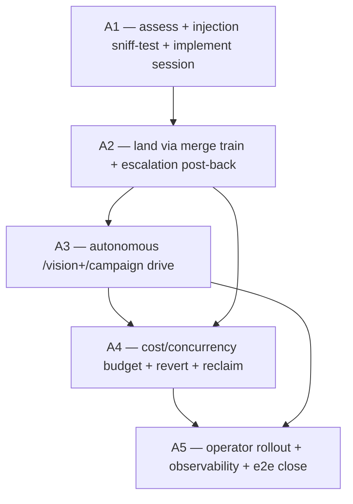

# Vision — Responder Auto-Implement (escalation → landed code fix; trust-first, autonomous drive)

**Date:** 2026-06-13 (rev 2 — trust-first)
**Scope:** Extend the C3 PM-side responder daemon (`@urtela/pm-responder`, today
answer/diagnose-only) so it can autonomously **implement and land code fixes** for
escalations — from a one-line bounded fix all the way to a **full multi-campaign
arc driven autonomously via the proven `/vision`+`/campaign` skills** — assess →
implement (bounded) OR drive a vision-campaign (systemic) → land via the
verify-gated merge train → resolve the escalation.
**Author role:** Systems architect of autonomous code-landing agents.
**Status:** **SHIPPED / COMPLETE** (2026-06-14) — all five campaigns (A1 assess+sniff+implement ·
A2 train-land+post-back · A3 autonomous `/vision`+`/campaign` drive · A4 budget+revert+reclaim+metrics ·
A5 operator rollout+dashboard/audit+e2e seal) delivered behind `auto_implement.enabled=false` with a
deliberate **shadow→on** graduation. Phase-2 adversarial-verified + the trust-first pivot history at
foot.

---

## Design stance — trust-first (the director's call, and it's correct)

We **trust the agents, the requests, and the autonomous drive+land.** The entire
agent-to-agent system is pointless otherwise — and we have just _proven it works_:
this very arc (the C1→C4 escalation channel) was driven to completion autonomously
by an agent via `/vision`+`/campaign`, with the merge-train verify gate protecting
`main` the whole way. So the responder should be able to do the same: for a
**systemic** escalation it runs the full `/vision` → adversarial-verify → `/campaign`
→ verify-gated lands pipeline **unattended**, exactly as a human-supervised drive
does.

A first draft of this vision proposed heavy human-approval gates (mandatory approval
for "sensitive paths", a parked autonomous drive). **That is rejected as
distrust-by-default.** Under trust-first, the guardrails are NOT human gates — they
are:

- **The structural floor (what makes trust safe to operationalize):** the
  **merge-train verify gate** — every land rebases onto live main and verifies the
  rebased tree _before_ fast-forwarding (`loop.ts:273-316`). A wrong autonomous
  change is caught by **verify**, not by a human. Main never breaks regardless of
  what the agent writes. This is why we can trust autonomous land at all.
- **A data-provenance tripwire (NOT agent-distrust):** a _cheap_ up-front
  "does this escalation look like a prompt-injection / abuse / hacking attempt?"
  **sniff-test** classifier. Yes → escalate to a human. No → **proceed with full
  trust.** This guards against hostile _data_ riding in via an escalation body
  (a quoted log/error/crafted "report") steering an otherwise-trustworthy agent —
  the confused-deputy problem, orthogonal to trusting our own pool agents. It is a
  tripwire, not a wall; the agent is otherwise trusted to act.
- **Operator rollout + kill-switch (NOT permanent human-in-the-loop):**
  `auto_implement.enabled` default false, and `mode shadow→on` is how the _operator_
  builds confidence and turns it on — not a standing approval queue. Once `on`, it
  is autonomous.
- **Resource governance + insurance (the residual that actually matters under
  trust):** a **spend + concurrency budget** (a multi-campaign arc is expensive; a
  flood of escalations each spawning an arc must be bounded for _cost_, not safety)
  and a **fast revert path** (trust-first means occasionally landing wrong; a cheap
  revert through the same verify-gated train beats gating everything up front).

**The conscious dependency:** autonomous land is only as good as the **verify
suite**. A wrong-but-green diff lands. The better verify is, the more trust is
justified — this is stated plainly so it's a deliberate, monitored dependency
(A4 surfaces land-success/revert rates), not a blind spot.

---

## Where we are

C1→C4 (shipped @ `aefac05`) gave the responder **answer/diagnose**. It cannot change
code: a code-fix escalation dead-ends at `answer` or `needs_human`.

**The decisive prior art (the spine):** the **7.6 merge-train conflict resolver**
already runs an autonomous code-writing-and-landing agent — bounded headless
`claude -p` in an **isolated worktree** (`resolver-pool.ts`/`resolver-runner.ts`),
edits files, commits + pushes a branch, **verifies in-session** (7.6.1), and
**resubmits to the train** with `resolved_from` (`resolution-outcome.ts:151-188`);
the train verify-gates the land. Auto-implement generalizes this from "reconcile a
conflict" to "implement a fix" — and, for systemic work, to "drive a whole
vision+campaign."

**The commander pipeline already exists and is proven:** this session's `/vision`
(adversarial-verified) + `/campaign` (per-phase plan→verify→execute, fresh agents,
verify-gated lands) is the exact machinery the responder will invoke autonomously
for systemic escalations.

**Confirmed in source:** task-less `pm_request_merge` (`merge_requests.taskId`
nullable, `schema.ts:535`); `resolvedFrom` self-FK (the no-recursion precedent);
`land()`/`reject()` only post side-effects when `taskId != null`
(`merge-request.service.ts:218-260, 1304-1333`) — so the escalation post-back is a
new code path (A2); the C3 responder runs read-only in `repoCwd` with no
worktree/push/MR client (`responder-runner.ts:118-124`) — A1 grafts that in.

---

## The arc

Five campaigns. A1: assess + injection sniff-test + a write-capable implement
session → verified branch. A2: land it via the train + post back to the escalation.
A3: the **autonomous `/vision`+`/campaign` drive** for systemic escalations (the
heavy capability — restored as first-class). A4: cost/concurrency budget + revert
path (the trust-first guardrails). A5: operator rollout + observability/audit + e2e + close.

**Delivered 2026-06-14:** the whole loop is sealed end-to-end — a client escalation →
autonomous bounded implement OR full `/vision`+`/campaign` drive → verify-gated train
land → resolved → the origin auto-notices via C2 (`main` structurally unbreakable). It
ships **OFF** (`auto_implement.enabled=false`) and graduates **shadow→on** deliberately;
answer-mode + A1–A4 + C1–C4 + the merge train stay byte-identical.

### A1 — Assess gate + injection sniff-test + write-capable implement session (→ verified branch, no land)

- **Goal:** Decide a code change is warranted, run the cheap injection tripwire, and
  for a bounded fix produce a locally-verified branch in an isolated worktree.
- **Tier:** S (foundation).
- **Why this order:** everything downstream needs a verified branch + the tripwire.
- **Removes:** the responder-runner read-only constraint _for the implement path_
  (answer mode stays read-only).
- **Adds:**
  - **The injection sniff-test (cheap, up-front):** a lightweight classifier pass
    over the escalation title/body/thread — "does this look like a prompt-injection /
    abuse / hacking attempt?" Yes → `needs_human` (escalate). No → proceed with full
    trust. (A bounded cheap check — a sniff-test, not a heavyweight gate. The
    escalation text is otherwise treated as a normal trusted request.)
  - **The assess gate:** classify → `implement{bounded}` (a localized fix the session
    implements itself) | `implement{systemic}` (route to A3's vision drive) | `answer`
    | `needs_human` | `give_up`.
  - **A write-capable implement session** in an **isolated worktree** (graft
    `resolver-pool`/`resolver-runner` write machinery into the responder): plan +
    edit + commit to `pm/escalation-<id>` + 7.5/7.6.1 in-session verify until green.
    Bounded by budget (PM repo; an `allowed_paths` allowlist as a _coarse_ blast-
    radius bound, not a per-path approval gate). Stops at branch-pushed+verified.
  - `auto_implement.enabled` (default false) — the write session spawns only behind
    it; absent ⇒ byte-identical to today.
- **Tests:** the sniff-test escalates an obvious injection attempt + passes a normal
  request; assess gate routes bounded/systemic/answer correctly; write session →
  verified branch (injected runner); allowlist bound; flag-off ⇒ no write session.
- **Scope:** large. P1 sniff-test + assess gate → P2 write-runner graft → P3
  worktree+branch+in-session verify → P4 allowlist + flag → P5 tests/seal.
- **Risk register:** _hostile data steering the agent_ → the sniff-test tripwire +
  the verify gate downstream; _unsupervised editing_ → isolated worktree, no land in
  A1, bounded budget; _a verify-passing-but-wrong diff_ → the named verify-quality
  dependency + A4 revert path (not a human gate).
- **Cost of not doing it:** the capability is impossible.

### A2 — Land via the verify-gated merge train + a real escalation post-back

- **Goal:** The verified branch lands through the train (never a direct push), and
  the land resolves the escalation back to the origin.
- **Tier:** S/A.
- **Why this order:** A1's branch is inert until it lands.
- **Adds:**
  - Submit a **task-less** merge request (`pm_request_merge`) for the branch +
    `verify_cmd`; `merge_requests.escalationId` nullable additive column (mirror
    `resolvedFrom`; new migration).
  - **The escalation post-back code path (new — `land()`/`reject()` skip side-effects
    when task-less today):** on LAND → post `landed_sha` + diff to the escalation
    thread, escalation → `resolved`, origin auto-notices via C2; on REJECT
    (verify-fail) → `needs_human` with the reject payload + branch preserved (no
    proven work discarded). Mirror in the integrator outcome handler.
  - **Resolver composition (trust-first):** a responder MR (escalationId≠null) that
    hits a rebase conflict MAY be auto-reconciled by the 7.6 resolver (we trust it) —
    **recommended: propagate `escalationId` through the resolution** so the post-back
    survives, keeping the loop fully autonomous. (Escalate-to-human-on-conflict
    remains the conservative fallback if propagation proves fiddly — commander's
    call, but the trust-first default is propagate.)
  - **No-recursion:** a responder-authored MR / its spawned escalations never
    re-trigger auto-implement.
- **Tests:** land→resolved+landed_sha+diff+origin-notified; reject→needs_human+branch
  preserved; task-less submit; the post-back path in land()/reject(); responder-MR
  conflict resolved + escalationId propagated (or escalate fallback); no-recursion;
  full-stack seal (assess→implement→submit→land→resolve→origin).
- **Scope:** medium–large. P1 escalationId migration+submit → P2 land post-back →
  P3 reject post-back+preserve → P4 resolver composition + no-recursion → P5 seal.
- **Risk register:** _a bad diff reaching main_ → structurally impossible (verify
  gate); _task-less MR black hole_ → the explicit post-back path.
- **Cost of not doing it:** A1's branches strand; the loop never closes.

### A3 — Autonomous `/vision`+`/campaign` drive for systemic escalations (the heavy capability)

- **Goal:** For an escalation that warrants more than a bounded fix, the responder
  autonomously runs the FULL proven pipeline — generate a vision (adversarial-
  verified), drive it as a campaign (per-phase plan→verify→execute, fresh agents),
  land each phase via the verify-gated train — unattended. The thing the director
  explicitly wants, and that we just proved works this session.
- **Tier:** A (the headline capability), **xl**.
- **Why this order:** depends on A1 (assess routes `systemic` here; the implement
  session is the per-phase executor) + A2 (each phase lands via the same train +
  post-back). It orchestrates many A1/A2-style lands under a vision.
- **Adds:**
  - A **drive session** that invokes `/vision` then `/campaign` (or the equivalent
    inline orchestration) from within the responder's bounded daemon context, in an
    isolated worktree, producing a vision file + driving its campaigns to landed
    commits. Reuses the commander pattern wholesale (the skills already exist).
  - Progress + resumability: the drive checkpoints (the campaign `*.progress.json`
    pattern) so a long arc survives a daemon restart (reclaim, A4).
  - The escalation tracks the arc: the vision's PM epic + tasks link back to the
    escalation; on arc completion the escalation resolves with the shipped summary;
    the origin auto-notices.
- **Tests:** assess→systemic spawns a drive session; the drive produces a vision +
  runs a (small, scripted/injected) campaign whose phases land via the train; the
  escalation resolves on completion; a mid-arc restart resumes (reclaim).
- **Scope:** xl. The largest campaign — embedding the commander pipeline as an
  autonomous daemon capability. P1 drive-session skeleton (invoke vision) → P2 run
  campaign phases (reuse A1/A2 per phase) → P3 checkpoint/resume → P4
  escalation↔arc linkage + close-on-completion → P5 seal.
- **Risk register:** _runaway cost / a never-ending arc_ → the A4 spend+concurrency
  budget + a max-arc-duration/phase cap (governance); _a bad phase landing_ → each
  phase is verify-gated (main safe) + the A4 revert path; _the drive getting stuck_ →
  the A4 reclaim sweep + escalate-to-human on budget exhaustion.
- **Cost of not doing it:** the responder can only do small fixes — the director's
  core ask (autonomous 6-month arcs shipping) is unmet.

### A4 — Cost/concurrency budget + revert path + reclaim (the trust-first guardrails)

- **Goal:** The guardrails that actually matter under trust-first: bound the spend,
  make undo cheap, recover stranded drives.
- **Tier:** A.
- **Why this order:** A3's autonomous drive is unsafe to run _for cost reasons_
  without a budget + a recovery/undo path; this gates turning A3 loose.
- **Adds:**
  - A **spend + concurrency budget** for auto-implement/drive (token + wall-clock +
    max concurrent arcs + max arc duration), shared with the responder's existing
    spawn-budget; on exhaustion → pause + escalate (governance, not distrust).
  - A **fast revert path:** a landed auto-fix/arc that's later judged wrong can be
    reverted by submitting a revert through the same verify-gated train (a
    one-command "undo this landed_sha"), surfaced on the dashboard.
  - **Reclaim** for stranded implement/drive sessions + submitted-but-unlanded MRs
    (mirror 7.6.1).
- **Tests:** budget exhaustion pauses+escalates; the revert path lands a revert via
  the train; reclaim recovers a stranded drive.
- **Scope:** medium. P1 budget → P2 revert path → P3 reclaim → P4 tests.
- **Cost of not doing it:** a flood of escalations could burn unbounded
  spend/concurrency; a wrong land has no cheap undo.

### A5 — Operator rollout + observability/audit + e2e seal + arc close

- **Goal:** Auto-implement + the autonomous drive are legible and audited; the
  operator rolls them out deliberately; the loop is sealed.
- **Tier:** A.
- **Adds:**
  - `auto_implement.mode off|shadow|on` (operator rollout): shadow = produce the
    branch/vision + diff/plan summary for the operator to observe (not a standing
    approval queue — a confidence-building rung) ; on = autonomous. enabled=false
    default.
  - **C4 dashboard surface:** auto-implemented + auto-driven escalations show the MR
    / vision-epic, `landed_sha`(s), diffs, train outcomes, the arc progress; metrics
    (auto-implement rate, land-success/reject/revert rate, mean-time-to-land,
    spend-per-arc); the audit chain (escalation ↔ MR/epic ↔ landed_sha).
  - **e2e seal:** assess → (bounded implement → land) and (systemic → drive → land)
    → resolve → origin, against the real server + train (injected runner/LLM step).
- **Tests:** dashboard/metrics; mode rollout (shadow observes, on autonomous);
  the e2e seal.
- **Scope:** medium–large.
- **Cost of not doing it:** `on`-mode runs blind; no operator confidence ramp.

---

## Sequencing DAG



Adjacency list (for `/campaign`):

```
depends_on:
  A1: []
  A2: [A1]
  A3: [A2]
  A4: [A2, A3]
  A5: [A4]
concurrency_pairs: []
phase_pins:
  - {downstream: A4, upstream: A3, unblock_phase: P1}
```

**Rationale:** A2 needs A1's branch. A3 (the drive) orchestrates A1-implement +
A2-land per phase, so it depends on both. A4 (budget/revert/reclaim) bounds A3's
autonomous drive (and A2's lands) — its budget work can begin once A3 reaches its
skeleton phase (pin). A5 (rollout/observability) sits last, observing everything.

---

## Cross-campaign invariants (green at every commit)

- **Main is never broken** — the responder NEVER pushes to main; every land
  (bounded fix OR campaign phase) is merge-train verify-gated.
- **Trust-first** — escalation requests are trusted; the only pre-gate is the cheap
  injection sniff-test (escalate-on-suspicion); the agent is otherwise trusted to
  implement, drive, and land autonomously.
- **Answer mode + C1/C2/C4/notes/merge-train byte-identical** — additive, flag-gated
  (`enabled=false`).
- **Cost is bounded, undo is cheap** — a spend/concurrency budget + a fast
  verify-gated revert path are the operative guardrails (governance + insurance, not
  human-approval gates).
- **Autonomous land quality tracks verify quality** — a stated, monitored dependency
  (A5 surfaces land-success/revert rates).
- **No proposal-gate violation** (task-less + escalation-linked MR); **no-recursion**.

---

## Out of scope for this arc (parked → next vision)

- **Auto-implement / auto-drive in client repos** (game_one) — PM repo only for v1
  (fixing client code is the client agents' job).
- **Cross-repo (7.3 merge-group) auto-implement** — single-repo PM only for v1.
- **A learned "warranted vs not" policy** — the assess gate is heuristic + the
  agent's judgment for v1; a trained policy is later.

---

## Recommended single starting point

**A1 — assess + injection sniff-test + implement session.** The foundation;
everything (including the A3 drive) routes through assess and executes through the
implement session. Ships behind `auto_implement.enabled=false`. Invoke
`/campaign roadmaps/vision-20260613-responder-auto-implement.md`.

---

## Open questions (commander authority)

- **The sniff-test implementation** — a cheap classifier prompt vs a keyword/pattern
  pre-filter feeding a classifier. Keep it cheap; escalate-on-suspicion; never block
  a normal request.
- **Bounded vs systemic threshold** — touched-file/effort estimate + the agent's
  judgment; default: lean bounded, route clearly-large to A3.
- **The drive's vision/campaign invocation** — invoke the actual `/vision`+`/campaign`
  skills vs an inline orchestration of the same pattern; commander picks the most
  robust.
- **Budget defaults** — token/wall-clock/concurrency/max-arc-duration; start
  generous-but-bounded; tune from A5 metrics.
- **Resolver composition** — propagate `escalationId` through resolution (trust-first
  default) vs escalate-on-conflict (fallback).

When the user is unavailable, the commander resolves trust-first (autonomy is the
default; the cheap injection tripwire + the verify gate + the cost budget + the
revert path are the guardrails; do not add human-approval gates).

---

## History — Phase-2 verifier + the trust-first pivot

The Phase-2 adversarial verifier (opus) correctly flagged that the _first_ draft's
risk register argued only "main never breaks" and missed **prompt injection** (the
escalation body is semi-untrusted input that can steer a code-landing agent; the
verify gate is blind to a backdoor-that-passes-verify). The first revision over-
corrected into heavy human-approval gates (mandatory approval for sensitive paths)
and _parked_ the autonomous drive.

**The director then set the trust-first stance (rev 2, this file):** trust the
agents and the autonomous drive+land — the system is pointless otherwise, and we
just proved the autonomous vision+campaign+verify-gated-land pipeline works (this
escalation arc itself). The injection concern is real but is a **data-provenance**
problem, handled by a _cheap sniff-test → escalate-on-suspicion_, not by distrusting
the agent. The heavy approval gates were removed; the full autonomous `/vision`+
`/campaign` drive was **restored as the headline campaign (A3)**; and the real
residuals under trust were reframed as **cost governance + a revert path + the
verify-suite-quality dependency** (A4) rather than human gates. The merge-train
verify gate remains the structural floor that makes trust safe to operationalize.
