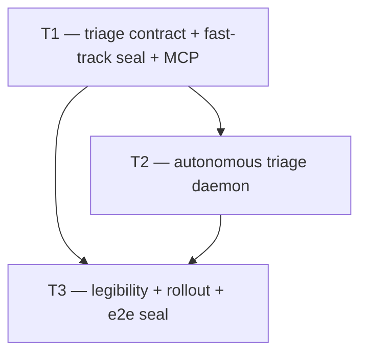

# Vision — Autonomous Notes-Inbox Triage (agent-driven merit review; proposal-gate preserved)

**Date:** 2026-06-28
**Scope:** Let a trusted per-project AI agent autonomously review the open-notes
backlog — check each note for merit and route it (promote to a normal proposal,
promote to a **fast-track** proposal that auto-breaks-down, dismiss, or defer to
a human) — relieving the human orchestrator of per-item review **without breaking
the wire-sealed proposal gate** (`note → task/epic` stays human-only; `sourceNoteId`
stays non-client-settable).
**Author role:** Systems architect of autonomous triage / human-AI workflow.
**Status:** Phase-2 adversarial-verified (REVISE → re-synthesized once; verifier
notes at foot).

## Readiness trigger (when to start)

The bottleneck is **user-reported from the live game_one deployment** ("after a few
weeks the open-observation list grows faster than wholly-human review/promotion can
sustain") — observed, not speculative. The concrete go/no-go signal for invoking
`/campaign` is the **existing backlog alert** (`NOTES_BACKLOG_THRESHOLD_MS` = 7d,
`notes_alert_state` latch, enums.ts:125–129) firing, and/or a standing open-note
count the director treats as past the human-review waterline. Land T1 (it ships OFF,
zero behavior change) whenever; graduate T2/T3 to `on` against that trigger.

---

## Where we are

The notes inbox shipped as the **Notes/Findings Inbox arc (C1–C4, 2026-06-09→10)**:
an ownerless, triageable "note" primitive (`bug|question|idea|tech_debt|wtf|
observation`) distinct from the `proposal→epic→task` lane, with FTS dedup at
capture, a web inbox, and a triage lifecycle. Today's triage surface
(`note.service.ts`):

- **States:** `open → triaged` (terminal). `triageOutcome ∈ {promoted, dismissed}`.
- **`dismiss`** — author-OR-human only; a non-author `ai_agent` gets 403 (the
  "anti-signal-burying" seal, `note.service.ts:334`).
- **`promoteToProposal`** — **no authz gate**: any caller, human or `ai_agent`,
  may promote a note to a proposal carrying `sourceNoteId` (`note.service.ts:362`).
- **`promoteToTask`** — **human-only, NOT MCP-exposed** (`note.service.ts:428`).
  The wire-seal: `sourceNoteId` is stripped from `POST /tasks` and `POST /proposals`
  bodies, and `promote-to-task` 403s for `ai_agent` with zero side effects
  (`note-proposal-gate.invariant.test.ts`).

This worked for the first days of use. **The observed, named problem:** after
weeks the open-note backlog grows faster than a human orchestrator can review and
promote. There is **no autonomous triage path** — every open note waits on a
human. The signal the inbox was built to capture is now silting up behind the
exact human bottleneck it was meant to surface to.

**The decisive prior art (the spine we reuse):**

- **`implementProposal` (`proposal.service.ts:607`)** already turns a proposal
  into epics+tasks in one transaction (tasks carry `proposalId`), claim-gated by
  `assertClaimOk` (`:630`) and blocked **only** from `in_progress|completed|
  rejected` (`:621`) — so it breaks a proposal down **directly from `open`**,
  without ever touching the human-only `accepted` transition. This is the
  **already-sanctioned AI→task route** ("AI handles breakdown"): an `ai_agent`
  can today do note → `promoteToProposal` (no authz gate) → claim →
  `implementProposal` → tasks, every hop legitimate, gate intact. **The keystone
  consequence (Phase-2 finding):** fast-track needs **no new server seal** — it is
  the *daemon's routing decision* to walk that existing chain, plus an advisory
  `fastTrack` label for provenance/UI. No bespoke accept-and-implement operation.
- **The responder daemon (`@urtela/pm-responder`)** — per-project poll → injectable
  **injection sniff** (`injection-sniffer.ts`, fail-safe tripwire) → bounded
  LLM session → **mode-gated** outcome routing (`off|shadow|on`) → REST write-back,
  with a spawn budget, reclaim sweep, and no-recursion seal (`loop.ts`). The
  triage daemon is this pattern pointed at notes instead of escalations.
- **`settings.autoImplement {enabled:false, mode:shadow}` composed with env
  `PM_AUTO_IMPLEMENT_ENABLED`** (`project.ts:321`) — the proven per-project,
  web-toggleable, ships-OFF rollout idiom. `settings.notesTriage` mirrors it.

So this arc is **mostly composition of proven machinery**; the genuinely new
work is (a) the note state machine gaining a human-deferral lane + reversibility,
(b) an **advisory fast-track proposal flavor** (a routing label over the existing
breakdown chain — no new server seal), and (c) the triage daemon's
merit-assessment brain.

---

## The arc

Three campaigns. **T1** lays the contract/state-machine/authz/MCP foundation
(the layer that lets *any* agent drive triage legibly through the API).
**T2** is the headline capability — the autonomous triage daemon. **T3** makes it
legible (web queue + audit), rolls it out (off→shadow→on), and seals it e2e.

### T1 — Triage contract, state machine, fast-track seal & MCP surface (foundation)

- **Goal:** Give the system a complete triage vocabulary an agent can drive
  end-to-end — a human-deferral lane, reversibility, the advisory fast-track
  proposal flavor, dismiss-authz for a trusted triage identity, the rollout
  settings block, and the MCP tools — with the proposal-gate invariant test still
  green.
- **Tier:** S (foundation).
- **Why this order:** every downstream consumer (the daemon T2, the web queue
  T3) writes through these endpoints/states.
- **Removes:** the `open→triaged`-only terminal assumption — `assertOpen`
  (`note.service.ts:43`, the single guard gating `update`/`applyTriage`/`dismiss`/
  `promoteToProposal`) becomes a **mutable-state predicate**: mutable =
  `{open, needs_human}`, terminal = `{triaged}`.
- **Adds:**
  - **`needs_human` note status** (3rd lane; `NOTE_STATUSES = [open, needs_human,
    triaged]`). It is **non-terminal**: a note the agent can't confidently decide
    parks here for a human, who then promotes/dismisses it. Modeled as a *status*,
    not a `triageOutcome`, precisely because the disposition is still pending
    (outcome stays `{promoted, dismissed}`, set only on the terminal `triaged`
    transition). **Precise semantics:** `applyTriage` accepts
    `{open, needs_human}→triaged` and rejects `triaged→*`; `open→needs_human` is a
    **separate status-only function** that sets status with **no** `triageOutcome`
    (the disposition is not yet decided). `dismiss`/`promoteToProposal` accept a
    `needs_human` note (so a human can act on the queue), not only `open`.
  - **Reopen / undo-triage** (`triaged|needs_human → open`, human-only) — makes
    every auto-decision recoverable; `triaged` is no longer a dead end. Clears
    triage metadata back to null (with an audit trail of the prior disposition).
  - **Advisory fast-track proposal flavor:** one field on proposals
    (`proposalKind ∈ {standard, fast_track}`, default `standard`). `promoteToProposal`
    accepts it. **It is a label + routing signal, NOT a server authz seal**
    (Phase-2 finding): the autonomous accept+breakdown the director wants is
    already reachable via the existing `promoteToProposal`→claim→`implementProposal`
    chain (which breaks down from `open`, no `accepted` needed). `fast_track`
    records "the triage agent judged this small/contained and the daemon will
    proceed to break it down"; `standard` records "left for human review". No
    bespoke `acceptAndImplementFastTrack` operation; no loosening of
    `PROPOSAL_TRANSITION_MAP`. Tasks born from breakdown carry `proposalId` →
    `sourceNoteId` is untouched; the wire-seal holds structurally.
  - **Dismiss authz widening for a trusted triage identity** — a non-author
    `ai_agent` may dismiss **iff** it is the project's designated triage identity.
    For v1, record that id in `settings.notesTriage` (cheapest — no schema
    migration, no new authz primitive; mirrors how the integrator got a dedicated
    daemon identity). A generalized `notes_triage` capability column is parked as a
    later generalization. The anti-signal-burying seal stays intact for ordinary
    worker agents.
  - **`settings.notesTriage {enabled:false, mode: off|shadow|on (default shadow),
    triageAgentId?}`** composed with env master `PM_NOTES_TRIAGE_ENABLED` (mirror
    the `autoImplementSettingsSchema` idiom exactly, `project.ts:321` — explicit-
    false ⇒ force-off-all; true/unset ⇒ defer to DB).
  - **MCP tools (the autonomous-drive surface the director asked for):**
    `pm_flag_note_needs_human`, an extended `pm_promote_note_to_proposal`
    (accepts `fast_track` + optional inline breakdown), `pm_reopen_note`
    (human), and a `needs_human` filter on `pm_list_notes`. `pm_dismiss_note`
    gains the identity-aware authz. **No** new note→task MCP tool — the gate holds.
  - Migration (new note status value + reopen-cleared columns + proposal flavor
    column), additive.
- **Tests:** the proposal-gate invariant test passes **unchanged**; state-machine
  unit tests for every legal/illegal transition incl. `open→needs_human`,
  `needs_human→triaged`, reopen, and `triaged→*` rejection; dismiss-widening
  allows the designated triage identity, still 403s an ordinary non-author agent;
  settings read tolerance + env composition; flag-needs-human round-trip.
- **Scope:** medium–large (leaner after the seal collapse). P1 note state machine
  (`needs_human` + reopen, `assertOpen`→mutable-predicate) + migration →
  P2 advisory proposal fast-track flavor → P3 dismiss-identity authz +
  `settings.notesTriage` + env → P4 MCP tools + invariant tests.
- **Risk register:** _migration-journal silent-skip_ (the repo's most-bitten
  incident — 2026-06-10 future-stamped `when` → per-request 500s; guards in
  `src/db/migration-journal.ts`) → stamp `when` with real `Date.now()`, monotonic,
  non-future; let `db:generate` author it; don't fight the boot guards;
  _state-machine regressions stranding notes_ → exhaustive transition tests +
  reopen escape hatch; _Zod-3 shared vs Zod-4 route-mirror drift_ (`project.ts:320`)
  → lockstep edit + a mirror-parity test.
- **Cost of not doing it:** the capability is impossible; the backlog stays
  human-bottlenecked.

### T2 — The triage daemon (autonomous merit assessment + decision execution)

- **Goal:** A per-project daemon that drains the open-notes backlog
  autonomously — polls open notes, sniffs for injection, runs a bounded LLM
  merit-assessment session, and executes the routed decision through T1's
  endpoints. **The thing that relieves the human review load.**
- **Tier:** A (headline capability).
- **Why this order:** depends entirely on T1's endpoints, states, and the
  fast-track seal — the daemon is a *client* of that contract.
- **Removes:** nothing (purely additive new package).
- **Adds:**
  - **`@urtela/pm-triager`** (a new daemon in the family, mirroring
    `responder-ref` structure: `loop.ts`, `api-client.ts`, `config.ts`,
    injectable runner + sniffer). One lane per `(project)`.
  - **Per-tick:** seed = open notes (oldest-first, not authored/triaged by self,
    not in-flight) → **injection sniff** (reuse the injectable `InjectionSniffer`
    seam; fail-safe = route `needs_human`) → bounded **assessment session** →
    decision.
  - **Decision space** (the agent's verdict): `promote_standard` (large/systemic
    → normal proposal, human reviews) | `promote_fast_track` (small/contained →
    fast-track proposal **+ an inline minimal breakdown** the session emits, since
    it already has the context) | `dismiss` (clear no-merit) | `needs_human`
    (low-confidence / genuinely a human's call) | `give_up`.
  - **The fast-track execution path (`on` mode):** promote to a `fast_track`
    proposal (`promoteToProposal`, no authz gate) → **claim it** (`assertClaimOk`
    requires the daemon to hold the claim before breaking down) → `implementProposal`
    with the session's small breakdown → tasks land in `backlog` for the worker
    pool, no human click. This reuses the **existing** sanctioned chain
    (note→proposal→breakdown); no new server operation. A `standard` promotion is
    NOT broken down — it is left `open`/discussing for human review.
  - **Mode gating (mirror the responder precedent faithfully):** `off` = inert;
    `shadow` = run the real assessment and **record the would-be decision** (to a
    side-log / metric row keyed by note, surfaced by T3) **but leave the note
    `open` and mutate nothing** — exactly as responder-shadow drafts without
    sending (`loop.ts:133`) and auto-implement-shadow builds a branch without
    landing (`loop.ts:1050`). Shadow does **not** flip notes to `needs_human` (that
    would silently drain `open` into a human-only queue and manufacture the very
    flood the arc removes — Phase-2 kill). `on` = execute the decision for real.
  - **Bias-to-reversible discipline (baked into the prompt + enforced):** dismiss
    is signal-losing → the agent dismisses only on *clear* no-merit and routes to
    `needs_human` whenever uncertain; never dismiss on low confidence.
  - **Safety seals (reuse responder precedent):** spawn-rate budget; reclaim
    sweep for stranded sessions; no-recursion (the daemon authors no notes and
    excludes self-authored / already-triaged); a cost/concurrency budget so a
    backlog spike can't run away.
- **Tests:** seed/sniff/assess/route happy paths; sniff `suspicious` ⇒
  `needs_human`, never assess; shadow records-and-defers, writes nothing
  destructive; on executes each decision; fast-track path = promote+accept+
  breakdown via the seal; dismiss bias (low-confidence ⇒ needs_human); budget +
  reclaim + no-recursion seals.
- **Scope:** large. P1 package skeleton + poll/seed → P2 sniff + assessment
  session (injectable runner) → P3 decision execution incl. the fast-track path →
  P4 mode gating + bias discipline → P5 budget/reclaim/no-recursion seals + tests.
- **Risk register:** _hostile note body steering the triage agent_ (notes are
  agent-authored, attacker-adjacent) → the injection sniff tripwire + the
  fact that the worst autonomous outcome is a *proposal/task*, itself verify-gated
  before it can reach main; _over-promotion flooding the proposal/task queue_ →
  the budget + the shadow rung to calibrate decision-mix before `on`; _the agent
  mis-sizing systemic work as fast-track_ → fast-track tasks are still verify-gated
  and reversible (reopen + revert), and T3 surfaces the decision-mix for operator
  calibration.
- **Cost of not doing it:** T1 is an unused contract; the backlog stays manual.

### T3 — Legibility, rollout, observability & e2e seal (close)

- **Goal:** Make autonomous triage legible and operator-controlled — the
  `needs_human` queue + fast-track badges + undo in the web inbox, the audit
  chain, the burndown/decision-mix metrics + alerts, the off→shadow→on rollout
  toggle, and a full e2e seal.
- **Tier:** A.
- **Why this order:** depends on T1 (states/fields/settings) and observes T2's
  output; the web surface can begin once T1's schema/migration lands (phase pin).
- **Removes:** nothing.
- **Adds:**
  - **Web inbox surface:** a `needs_human` queue/filter (the human-action lane),
    a fast-track-proposal badge, an **undo-triage** action (the reopen path), and
    an **auto-decision audit feed** per note (who/what triaged + `triageReason` +
    the resulting proposal/task link), with live SSE.
  - **`settings.notesTriage` web toggle** (the off→shadow→on rollout control, on
    the project settings page, mirroring the Integrator/auto-implement pages).
  - **Observability:** backlog burndown (open-note count over time), decision-mix
    (promote-standard / promote-fast-track / dismiss / needs-human rates) — read
    from the **shadow side-log** before `on`, so the operator calibrates the mix
    on real assessments without any note being mutated; triage latency; daemon
    heartbeat. The **backlog-stall alert reuses the existing
    `NOTES_BACKLOG_THRESHOLD_MS` + `notes_alert_state` latch** (enums.ts:125–129,
    Campaign C2 §P5 — already built); this campaign adds a triage-error/daemon-down
    alert alongside it (SSE + Discord, reuse the train/escalation plumbing).
  - **Audit chain:** note ↔ triage decision ↔ proposal/task ↔ reopen events,
    queryable as a timeline (reuse the activity-log/listeners precedent).
  - **e2e seal:** post note → daemon triages (injected LLM step) → assert each
    branch: fast-track → tasks created via breakdown; needs_human → queued for a
    human; dismiss → terminal with reason; reopen → back to open. Against the
    real server.
- **Tests:** the e2e seal above; web component/queue tests; metrics derivation;
  alert firing; mode-toggle gating (shadow observes, on executes) end-to-end.
- **Scope:** medium–large. P1 web needs_human queue + badges + undo → P2 settings
  toggle → P3 metrics + audit chain → P4 alerts → P5 e2e seal.
- **Risk register:** _autonomous triage running blind_ → this campaign is exactly
  the legibility that prevents that (shadow decision-mix before `on`); _undo not
  reaching a mis-triaged note that already spawned a proposal_ → reopen clears the
  note disposition; the spawned proposal/task is independently reviewable/
  cancelable (surfaced in the audit feed).
- **Cost of not doing it:** `on`-mode triage is an unobservable black box with no
  operator confidence ramp and no UI-level undo — the director's "human review"
  lane (`needs_human`) would have no home.

---

## Sequencing DAG



Phase-pin annotation:

```
T3 unblocked when T1 reaches P1 ("note state machine + migration") for the
web/states work; T3's e2e seal (P5) additionally needs T2 shipped.
```

Adjacency list (for `/campaign`):

```
depends_on:
  T1: []
  T2: [T1]
  T3: [T1, T2]
concurrency_pairs: [(T2, T3)]
phase_pins:
  - {downstream: T3, upstream: T1, unblock_phase: P1}
```

**Rationale:** T2 depends on T1 because the daemon writes exclusively through
T1's endpoints, states, and the fast-track accept seal — it has nothing to call
until they exist. T3 depends on T1 for the `needs_human` status, fast-track flavor
field, reopen path, and `settings.notesTriage` it renders/toggles. T3 and T2 are
**concurrency-eligible**: the web/observability surface reads T1's contract via
REST and can be built against fixtures while T2 is in flight; only T3's final
**e2e seal** truly needs T2 running (hence the phase pin lets T3's UI/metrics work
start at T1-P1, with the seal deferred). T3 lists `T2` in `depends_on` only for
that final seal.

---

## Cross-campaign invariants (green at every commit)

- **The proposal-gate invariant test stays byte-identical green.** `promoteToTask`
  remains human-only and MCP-absent; `sourceNoteId` stays non-client-settable. The
  *only* AI route from a note to a task is note→(fast-track)proposal→
  `implementProposal` breakdown — each hop already sanctioned.
- **Ships OFF.** `settings.notesTriage.enabled=false` default; env master can
  force-off-all. Disabled ⇒ the notes inbox + triage surface are byte-identical to
  today (additive columns, no behavior change).
- **The anti-signal-burying seal holds for ordinary agents.** Only a
  `notes_triage`-capable identity may dismiss a note it didn't author.
- **Shadow mutates nothing.** In `shadow`, the daemon records would-be decisions
  to a side-log only; no note changes status, no proposal/task is created.
- **`needs_human` is never auto-resolved.** Once an agent (in `on` mode) parks a
  note for a human, only a human transitions it out.
- **Every autonomous decision is reversible and audited** (`reopen` + `triagedBy`/
  `triageReason` + the audit chain).
- **Main is never broken** — fast-track-spawned tasks reach `main` only through the
  existing verify-gated merge train, like any other task.

---

## Out of scope for this arc (parked → next vision)

- **A learned "merit / fast-track-vs-systemic" policy.** The assessment is the
  agent's judgment + heuristics for v1; a trained/tuned classifier is later
  (T3's decision-mix metrics are the data that would seed it).
- **The triage agent auto-*implementing* the fast-track tasks itself.** Triage
  stops at creating well-formed tasks; implementation is the responder/worker
  pool's existing job (the auto-implement arc A1–A5). Keeping triage and
  implementation as separate daemons preserves the gate and the blast radius.
- **Triage-time cross-note merge/clustering** beyond the existing capture-time FTS
  dedup (e.g. "these 5 notes are one theme → one proposal"). Valuable, but a
  distinct capability; capture-time dedup already covers the common case.
- **Auto-tuning the shadow→on graduation** (auto-promote mode on a decision-mix
  SLO). Operator-driven for v1.

---

## Recommended single starting point

**T1 — triage contract + fast-track flavor + MCP surface.** It is the foundation
everything routes through (the `needs_human` lane, reopen reversibility, the
advisory fast-track flavor, the dismiss-identity authz, `settings.notesTriage`,
and the MCP tools), and it ships entirely behind `settings.notesTriage.enabled=
false` so it is safe to land before the daemon exists. Invoke
`/campaign roadmaps/vision-20260628-notes-triage-autonomy.md`.

---

## Open questions (commander authority)

- **Dismiss-authz mechanism** — a `notes_triage` capability/role column on the
  agent identity (recommended; mirrors how the integrator-daemon got a dedicated
  token) vs. recording the triage agent id in `settings.notesTriage`. Prefer the
  capability: it's an authz primitive, not config.
- **Fast-track threshold** — what the agent treats as "small/contained" (touched
  surface / single-task-able / no schema or cross-cutting change). Heuristic +
  the agent's judgment; lean conservative (route ambiguous to `promote_standard`
  so a human reviews, not `fast_track`).
- **Fast-track breakdown depth cap** — bound the inline breakdown (e.g. ≤ N tasks,
  no new epic); anything larger ⇒ `promote_standard`.
- **Shadow-mode disposition** — **resolved (Phase-2):** shadow writes a side-log
  decision row and leaves the note `open` (it must NOT flip notes to `needs_human`,
  which would manufacture a human-only backlog). T3's decision-mix reads that
  side-log.

When the user is unavailable, the commander resolves toward **reversibility and
the gate**: prefer `needs_human`/`promote_standard` over irreversible or
gate-skirting choices; never weaken the proposal-gate invariant; keep the arc
shipping OFF until T3's shadow metrics justify `on`.

---

## History — Phase-2 adversarial verifier

The opus verifier returned **REVISE** (scope sound, 3 campaigns right, DAG honest)
with five findings, all incorporated in this single re-synthesis:

1. **Shadow→`needs_human` killed** — it mutated `open` into a human-only queue,
   contradicting "needs_human is never auto-resolved" and manufacturing the exact
   review flood the arc removes. Shadow now records a side-log and leaves notes
   `open` (faithful to responder/auto-implement shadow precedent).
2. **`acceptAndImplementFastTrack` seal collapsed** — `implementProposal` already
   breaks down from `open` (claim-gated, never needs `accepted`), so the AI
   accept+breakdown path exists today. `fastTrack` is now an advisory label +
   daemon routing signal, not a server seal. T1 shed a phase.
3. **Readiness trigger added** — the problem is user-reported (not speculative);
   the existing `NOTES_BACKLOG_THRESHOLD_MS` alert is named as the go/no-go signal.
4. **Migration-journal honest-timestamp hazard** added to T1's risk register.
5. **Dismiss-authz** switched from a new capability column to a settings-recorded
   triage identity for v1 (cheaper; matches the integrator-daemon precedent).

Plus: T3 reuses the existing backlog-alert latch; the `needs_human` mutable-state
semantics (`assertOpen`→mutable-predicate; `applyTriage` accepts
`{open,needs_human}→triaged`) are pinned explicitly.
